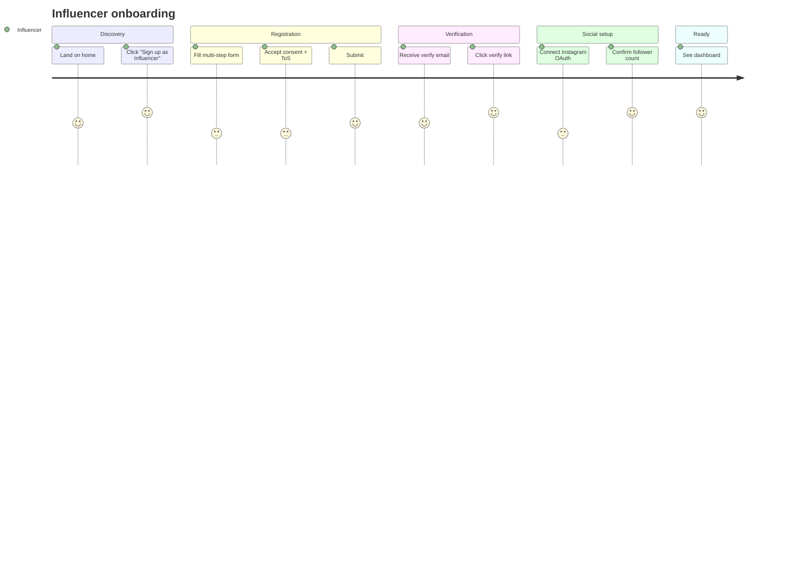
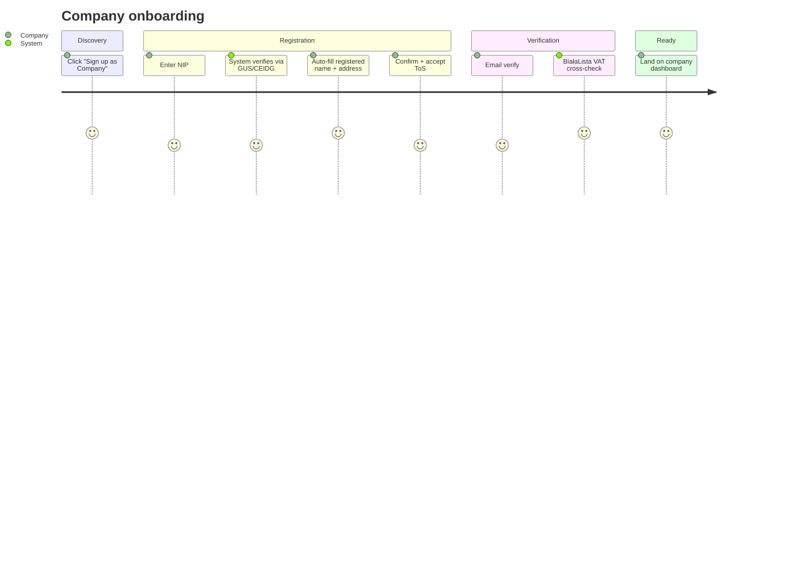
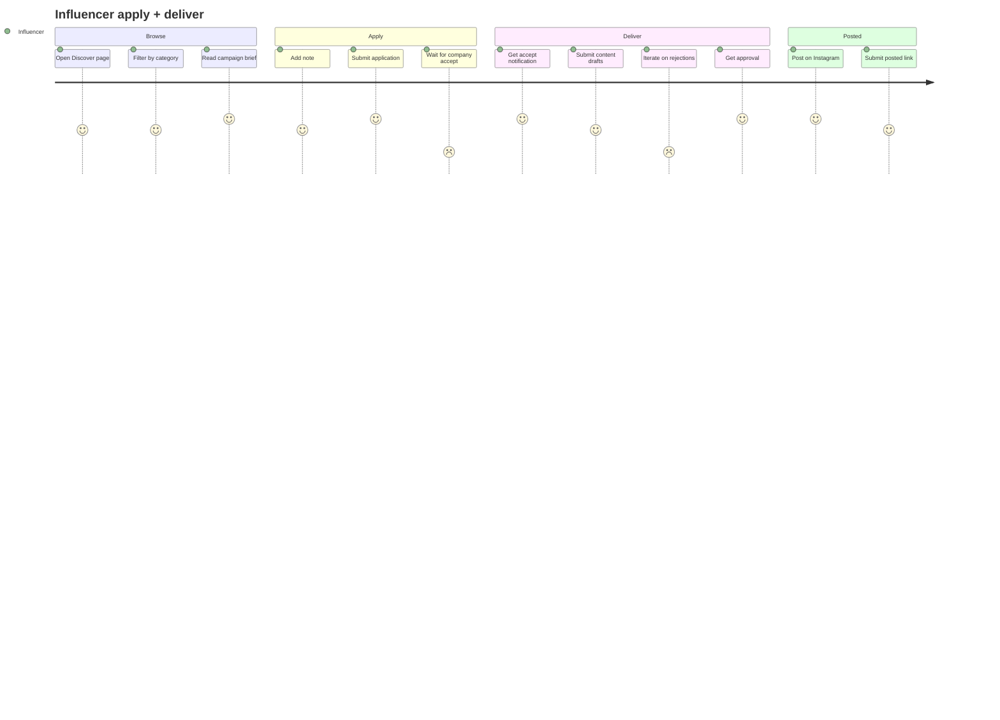
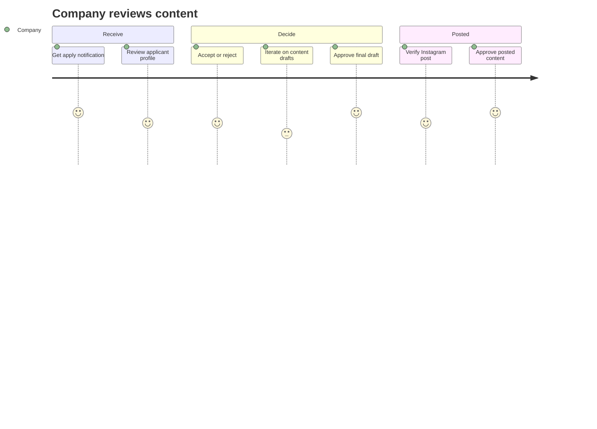
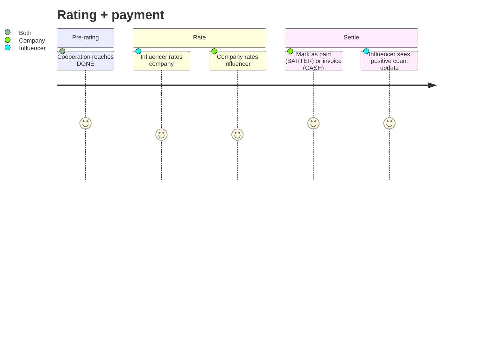
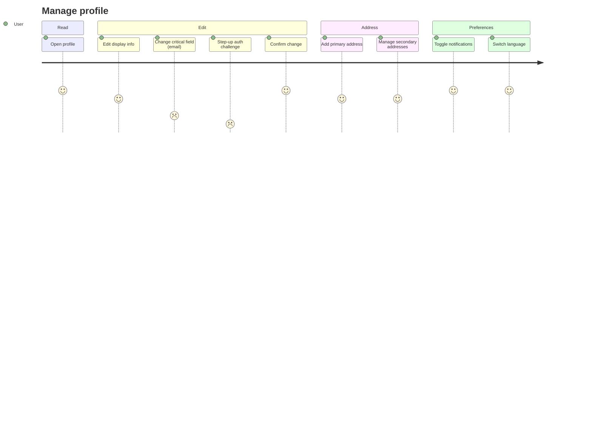
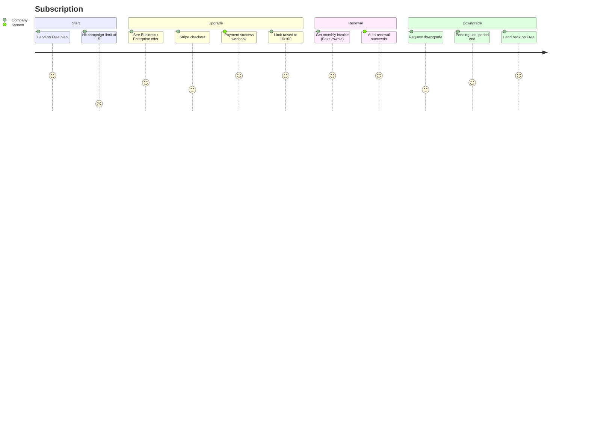
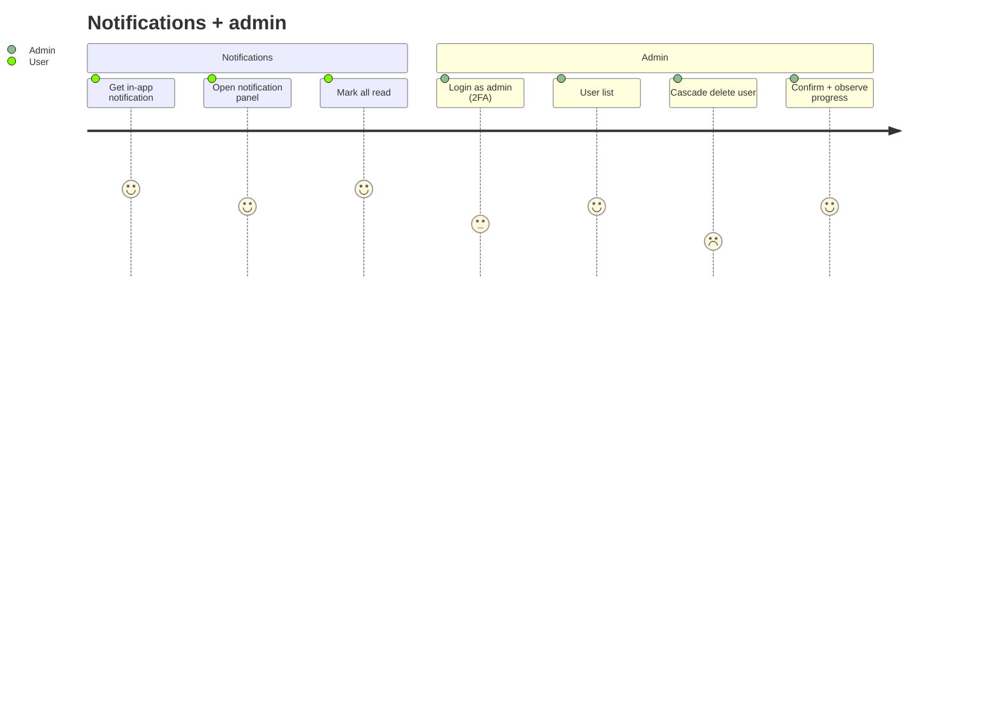
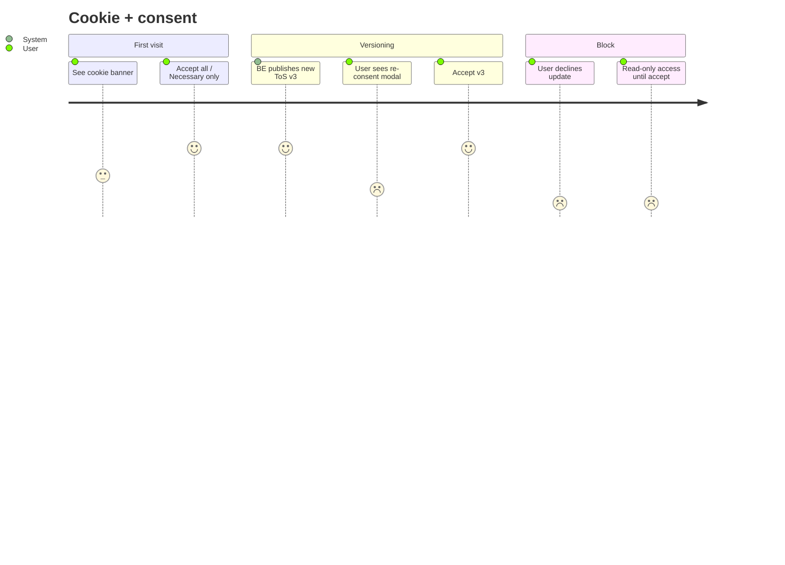

# FE Greenfield → Legacy Parity Tracker

Single source of truth for what's been ported from the legacy Fuse-based FE
(the legacy frontend) into this greenfield repo. Organised as a journey-bucketed
**user story map** ([Jeff Patton style](https://www.nngroup.com/videos/journey-mapping-vs-story-mapping/))
because we're rewriting features (story map = what the product must do) rather
than redesigning UX (journey map = what the user feels). Top-level buckets are
journeys for navigability — non-tech readers can see "Journey 3 is 60% done"
at a glance.

Rows are auto-ticked after each successful slice via
`tools/parity-update.mjs`. Manual edits are welcome but discouraged — let the
tool write the migration log.

**Last updated:** 2026-09-02 (OSS-prep verification sweep: all 133 `/__sandbox` fixtures live-rendered in Chrome against the demo-mode SSR build — every fixture produced a live component, console-clean; all 5 technical-survey chapters verified rendering + interactive in PL and EN; doc drift fixed across README / CONTRIBUTING / PARITY / SECURITY / `.nvmrc`. Prior: iter-127 authenticated parity sweep — legacy `:4200` vs greenfield `:4201` chrome-paired as `company1`/`admin1` across sign-in, sign-up ×2, support, my-tickets, collaborations list/in-progress/registrations-detail, plan-billing, admin users + tickets, team. All verified surfaces at parity or a **sanctioned divergence** (see below). Three real cross-stack bugs found + fixed in-sweep; verdicts recorded in the migration log. Prior: iter-93 truth pass against tip `a8150de`.)

### Sanctioned divergences (deliberate, not regressions)

The greenfield is an editorial reskin (cream/ink/coral) of the legacy Fuse-blue UI, so palette/typography differ by design on every surface. Beyond that, these are intentional product/architecture decisions — recorded here so the parity sweep doesn't re-flag them:

- **Team page = the three founders** (owner directive 2026-09-02) — Norbert/Jakub/Piotr with real photos, same roster as the landing OSS-story section. The older 8-member legacy-main roster is retired.
- **Business sign-up is NIP-first** — enter NIP → registry (GUS) lookup enriches the company at `/company/setup`, vs legacy's multi-step business-info wizard. The SOTA onboarding the nip-to-ksef demo narrates. Influencer sign-up stays Instagram-first (parity) + email fallback + three granular GDPR consents.
- **Currency-less list rows render the bare amount** — some live E2E campaigns carry no currency even on the detail endpoint; legacy hard-coded an "EUR" suffix client-side, greenfield shows the honest amount. (BE `298580e4` now projects currency onto paged rows when the data has one.)
- **Condensed sidebar IA** — greenfield groups the authenticated nav (Odkrywaj / Moje zgłoszenia / Moje kampanie / Profil / Plan i płatności) vs legacy's flatter list; same destinations.

**Hard rule:** every commit on this repo passes `npm run check:no-fuse` → zero
`@fuse/*` imports anywhere in `src/`. The Fuse template is commercially
licensed — staying Fuse-free is what makes this repo publishable as MIT.

**Each journey row links to:**

- The sequenced touchpoints (parity rows that get ticked)
- The BE Cucumber feature file that exercises the same flow E2E (re-used as parity oracle — recorded into MSW handlers via `tools/recorded-to-msw.mjs`)
- The legacy + greenfield routes the slice covers

---

## Cross-cutting foundation (Stage 0 — supports every journey)

These foundational pieces ship in Phase 2 (~1-2 days) before the first feature
slice. They unblock every journey below.

- [x] Angular 17 strict scaffold (`ng new --strict --style=scss --routing --standalone`) — A1
- [x] Strict TS flags (`noImplicitOverride/Returns/Unused*`, `strictTemplates`) — A1
- [x] Port 4201 wired in `angular.json` — A1
- [x] Fuse-free guard (`npm run check:no-fuse`) — A1
- [x] Material + Tailwind with legacy breakpoints `sm:600 md:960 lg:1280 xl:1440` — A2
- [x] OpenAPI codegen wired (`npm run openapi:gen` → 38 services + 207 models) — A3
- [x] HTTP interceptors (5 active — error 401-refresh-and-retry / language / rate-limit-cache / step-up / shell-headers) — A4 (Stage 6a deleted TokenStore + Bearer interceptor; Stage 6e/5 added refresh-and-retry to error.interceptor — `d997c5f`; greenfield is cookies-only end to end — memory `feedback_no_client_token_storage`)
- [x] Dev-server proxy `/api/* → https://localhost:8080` (BE self-signed cert tolerated via `secure:false`) — A4
- [x] HTTPS dev-server on `:4201` (`angular.json` `serve.options.ssl=true` + shared `server.crt`/`server.key` with legacy) — Stage 6e/6 (`1ebdcb3`); live daily (integration tier runs against it)
- [x] Layout shell (Material sidenav + toolbar + theme toggle + language switch) — A5
- [x] Transloco i18n + EN/PL JSON port (~2,667 keys) — A6
- [x] 1:1 routes mirror (49 legacy paths preserved; every placeholder since replaced by a real component or deliberate redirect — `e4020d1`) — A7
- [x] Sandbox `/__sandbox` harness — 133 fixtures across 59 files, all baseline-covered (G4 gate) — A8
- [x] Playwright config (4 device projects ALL active — chromium-desktop, mobile-chrome, mobile-safari iPhone 14, tablet-safari iPad Pro 11; webkit parity 26/26 green iter-85) — A9
- [x] Jest + ng-mocks unit-test plumbing (spectator deferred — `ng-mocks` covers our needs) — A9
- [x] MSW worker setup for flow tests — A9
- [x] pm2 ecosystem + health-check.ps1 (5-process topology) — A10
- [x] Husky + lint-staged + prettier pre-commit hook — A11.1
- [x] Login round-trip against live BE — live-verified in the integration tier (`e2e-tests/integration/auth/login-real.spec.ts`, `login-ui-real.spec.ts`) — A11.2

---

## Journey 1 — Influencer onboarding

**BE Cucumber:** [`features/influencer-verification/`](../checkitout-backend/src/test/resources/features/) (RunInfluencerVerificationIT)
**Routes:** `/auth/sign-up/influencer`, `/auth/verify`, `/auth/sign-in`, `/dashboard`, `/onboarding/social`

- [x] Landing page (public — hero + 3 feature cards + footer sign-in link; pricing / FAQ / dashboard preview deferred)
- [x] Influencer registration form (email/password/ToS basics; Instagram OAuth + multi-step deferred to Stage 2)
- [x] Cookie banner + ToS + Privacy consent capture — `legal-clickwrap` in both sign-up forms + `core/consent/consent.service.ts` BE sync
- [x] Submit → BE registration round-trip — `e2e-tests/integration/flows/account-activation-e2e.spec.ts`
- [x] Email verification page (consume oobCode)
- [x] Resend verification email — `verify-email.component.ts` + shell-banner resend CTA
- [x] Instagram OAuth + follower-count verification (reworded iter-102: OAuth callback shipped; a follower-count CONFIRM step never existed in legacy — zero implementations found. Follower count arrives from the OAuth exchange automatically)
- [x] Welcome dashboard (reworded: shipped as the real role-aware `collaboration-dashboard.component.ts`, not a placeholder)
- [x] reCAPTCHA on signup (reworded: deliberately disabled platform-wide — BE `recaptcha.enabled:false`, documented at `core/auth/auth-api.service.ts:28`; FE intentionally sends no token)

---

## Journey 2 — Company onboarding (Polish-market specific)

**BE Cucumber:** [`features/registry/`](../checkitout-backend/src/test/resources/features/) (RunRegistryIT, GUS/CEIDG/BiałaLista flows)
**Routes:** `/auth/sign-up/company`, `/auth/verify`, `/dashboard/company`

- [x] Company registration form (NIP + email/password/ToS basics; multi-step + step3 confirmation deferred to Stage 2)
- [x] NIP input + GUS lookup (verify button, no debounce yet)
- [x] Auto-fill from registered company data (read-only confirmation card)
- [x] CEIDG fallback (sole proprietorships) — `core/registry/registry.service.ts` + JDG stub oracle (`registry-company-flow.feature`)
- [x] BiałaLista VAT status badge (shown in confirmation card)
- [x] Confirm + email verify — `confirmation-required/` + verify-email + activation e2e; post-login `/company/setup` confirm flow (`company-setup.component.ts`)
- [x] Company welcome dashboard (reworded: same role-aware dashboard + `company/company-setup.component.ts` onboarding)

---

## Journey 3 — Influencer applies + delivers

**BE Cucumber:** [`features/partnership/partnership-flow.feature`](../checkitout-backend/src/test/resources/features/partnership/partnership-flow.feature) (RunPartnershipFlowIT)
**Routes:** `/discover`, `/opportunities/:id`, `/my/applications`, `/my/applications/:id`

- [x] Opportunity discovery list (paginated) — `opportunities-list.component.ts` (MatPaginator + signals)
- [x] Filter (reworded: shipped filters are compensation-type + city — matches the current BE filter contract; category/follower-range filters not in greenfield scope)
- [x] Opportunity detail page (read-only) — `opportunity-detail.component.ts` + integration spec
- [x] Apply form (with note) — noteControl + apply() in the detail component
- [x] My applications list — `applied-opportunities-list.component.ts` + `influencer-applied-list.integration.spec.ts`
- [x] Application detail (status timeline) — `applied-opportunity-detail.component.ts` (inline status-history timeline)
- [x] Content submission form (reworded: `socialMediaLink` + `urls[]` + description + tags — Vimeo-specific field never existed in the BE contract) — `content-submission.component.ts`
- [x] Submission revision flow — resubmit + revision-reason display (iter-97) + cancel-cooperation from CONTENT_REJECTED via the detail decision machinery (iter-102); full legacy-card capability set match the legacy card CAPABILITY; remaining gap: legacy rejected-card also offered cancel-cooperation (REJECTED_BY_INFLUENCER) which greenfield only offers at ACCEPTED_BY_COMPANY)
- [x] Posted-link submission (reworded: merged into the submission form's socialMediaLink per BE contract; no separate post-acceptance step)
- [x] Notification on accept/reject (J8 shipped the in-app notification UI — `layout/notification-bell/` bell + panel + `markAsRead`/`markRead` over `core/notifications`; accept/reject events surface there. Blocker resolved `07312ff`.)

---

## Journey 4 — Company reviews + accepts content

**BE Cucumber:** Same `partnership-flow.feature` (multi-actor — same flow, company side)
**Routes:** `/campaigns/:id/applications`, `/campaigns/:id/content/:contentId`

- [x] Campaign-side applications inbox — `campaign-applicants.component.ts` (`/collaborations/:id/applicants`)
- [x] Applicant profile preview (reworded: inline PublicProfileDto fields in the applicants row — exactly what the legacy cards showed; legacy had no dedicated profile page either, grep-verified iter-100)
- [x] Accept / reject application — `decide()` → `updateOpportunityStatus` in the same component
- [x] Content review queue — `content-review.component.ts` (`applications/:id/review`)
- [x] Approve / reject content (with notes) — two-step reject arms an inline 500-char notes textarea (legacy card parity); note lands in approvalNotes and renders on both review + influencer submission rows
- [ ] Posted-content verification UI (partial: submitted link rendered as href in review; no separate posted-verify action)

---

## Journey 5 — Cooperation rating + payment

**BE Cucumber:** [`features/active-cooperation/`](../checkitout-backend/src/test/resources/features/) (rating endpoints)
**Routes:** `/active/inprogress`, `/active/rate/:id`, `/active/done`

- [x] Active cooperations list — `collaboration-dashboard.component.ts` (role-driven in-progress/finished tabs via route data)
- [x] In-progress detail — `registrations/:id` → applied-opportunity-detail
- [x] Rate as influencer (POSITIVE/NEGATIVE) — rate gate ≥ CONTENT_POSTED in applied-opportunity-detail
- [x] Rate as company (POSITIVE/NEGATIVE) — `companyRateStatus` CTA into content-review
- [ ] Rating history badges on profile (corrected iter-100: legacy does NOT show rating counts on profile either — zero rating displays in legacy user components. Reclassified post-cutover enhancement, not a parity gap)
- [x] Cooperation-status timeline (shipped inline in applied-opportunity-detail; standalone component not needed)

---

## Journey 6 — Profile management

**BE Cucumber:** [`features/step-up-auth/`](../checkitout-backend/src/test/resources/features/) (RunStepUpAuthIT) + user-preferences integration tests
**Routes:** `/profile`, `/profile/edit`, `/profile/addresses`, `/preferences`

- [x] Profile read (reworded: own view shipped — `profile-view.component.ts` C1. A public-profile PAGE never existed in legacy: zero consumers of the public-profile endpoints in the legacy FE (grep-verified iter-100); not a parity item)
- [x] Profile edit (non-critical fields) — C2 + `profile-non-critical.spec.ts`
- [x] Avatar upload via signed URL — `profile-picture-upload.component.ts` + `file-upload-signed-url.spec.ts`
- [x] Email change (with step-up TOTP) — `email-change.component.ts` + `step-up-email-required.spec.ts`
- [x] Phone change (with step-up) — phoneNumber in profile edit + global `step-up.interceptor.ts`
- [x] Password change — /user/settings/security tab (current+new+confirm, min 8 legacy parity, BE re-verifies current); 2FA management card links /auth/2fa-setup
- [x] Address list (primary + secondary) — `addresses.component.ts` C3
- [x] Address create/edit — full CRUD: create + inline edit (pre-populated form, PATCH) + two-step armed delete; list patched in place
- [x] Preferences (notification toggles, email frequency, language) — `preferences.component.ts` C4
- [x] 2FA setup wizard (TOTP enrollment) — `auth/two-factor-setup/` + `core/two-factor/two-factor.service.ts`
- [x] Backup codes generation — BackupCode flow in two-factor.service.ts + setup fixture

---

## Journey 7 — Subscription + billing

**BE Cucumber:** [`features/subscription/subscription-e2e.feature`](../checkitout-backend/src/test/resources/features/subscription/subscription-e2e.feature) (RunSubscriptionIT)
**Routes:** `/subscription`, `/subscription/upgrade`, `/subscription/invoices`

- [x] Subscription status display (current plan, usage, limits) — `plan-billing.component.ts` + `subscription-lifecycle.spec.ts`
- [x] Trial activation flow — trial section + consent-first dialog (`trial-consent` fixture, P0 #3)
- [x] Plan upgrade button → Stripe checkout — `core/subscription/subscription.service.ts` CheckoutSession + upgrade-confirm dialog
- [x] Stripe success/cancel return pages (reworded: deliberate merge — both return URLs redirect into `/user/settings/plan-billing`, `app.routes.ts`)
- [x] Downgrade request (pending until period end) — cancelDowngrade + downgrade-confirm dialog
- [x] Billing-period + campaign-limit progress bar — `usagePercent` computed
- [x] Invoice list + status badges — invoices section in plan-billing template
- [x] Invoice PDF download (reworded: served via Stripe Customer Portal — in-app Fakturownia links deliberately not ported, `plan-billing.component.ts:321`)
- [x] Payment-failed handling (reworded: legacy treatment is the red PAYMENT_FAILED status chip + Stripe-portal recovery — no banner existed in legacy (grep-verified iter-100); greenfield matches exactly)
- [x] Terms-pending re-acceptance (`feature/legal/reconsent-dialog.component.ts` opens from the amber shell banner's "Przejrzyj i zaakceptuj" CTA — `shell-banners` `openReconsent()`; the dialog IS the re-acceptance surface. iter-126 drove the amber banner + countdown from `/users/me` `daysToAcceptNewTerms`. Banner→dialog is the sanctioned UX, not a bare modal.)

---

## Journey 8 — Notifications + admin (cross-cutting)

**BE Cucumber:** [`features/notifications/`](../checkitout-backend/src/test/resources/features/) (RunNotificationIT) + admin features
**Routes:** `/notifications`, `/admin/*`

- [x] Notification bell + unread count — `layout/notification-bell/` + `core/notifications/notification-center.service.ts` (30s poll gated on session, legacy parity) — `07312ff`
- [x] Notification list panel — `notification-panel.component.ts` (unread rows, category chips, per-row read/archive, load-more; live-verified with 74 real unread)
- [x] Mark all read — header done_all in the panel + facade markAllAsRead (count-zero arithmetic spec-locked)
- [x] Notification preferences integration — channels + categories toggles in preferences
- [x] Admin login flow (forced 2FA) — `admin-2fa-kms.feature` BDD oracle + 2FA verify dialog
- [x] Admin user list (paginated, filterable) — `admin/user-list.component.ts` + `admin-user-management.spec.ts`
- [x] Admin user detail (reworded iter-101: legacy admin surface is dictionary + user LIST only — no user-detail screen exists in legacy (grep-verified); list parity is complete)
- [x] Admin cascade-delete preview (reworded iter-101: the legacy cascade UI is the PARTNERSHIP delete dialog on collaboration details, not user-level — now ported: preview w/ entity breakdown + warnings via /admin/cascade-delete/partnership-opportunities/{id}/preview)
- [x] Admin cascade-delete execute — confirmationCode + expectedEntityCount echo (BE re-verifies both), success/partial/error states, admin-gated delete_forever on opportunity detail
- [x] Admin support-ticket inbox — `support/admin-tickets-list/` + `admin-ticket-detail/`
- [x] Admin FAQ / Dictionary management (reworded iter-101: dictionary editor shipped; admin FAQ MANAGEMENT never existed in legacy — the public FAQ accordion (legacy support/faqs) is shipped in greenfield support-home)

---

## Journey 9 — Legal / GDPR consent (cross-cutting always-on)

**BE Cucumber:** [`features/consent/`](../checkitout-backend/src/test/resources/features/) (RunConsentIT, 35 scenarios)
**Routes:** every route guards on consent state

- [x] Cookie banner (localStorage-only persistence; BE record + re-consent modal deferred)
- [x] Consent persistence (reworded: localStorage + BE record via `consent.service.ts syncToBackend()` — cookie storage was the legacy mechanism, not ported by design) — `e2e-tests/integration/auth/consent.spec.ts`
- [x] Re-consent modal on stale ToS / Privacy version — `feature/legal/reconsent-dialog.component.ts` (3-doc clickwrap + days-remaining + flow-B record-batch), opened from the blocked banner; amber header-driven banner remains for the pre-block grace period
- [x] BLOCKED_DUE_TO_NOT_ACCEPTING_TERMS account-status banner — red shell banner (block icon + days remaining + Przejrzyj i zaakceptuj CTA) driven by /users/me accountStatus via ShellStatusService.blockedForTerms
- [x] Read-only mode while blocked (reworded: server-enforced — BE rejects mutations for BLOCKED accounts; legacy FE also had no client-side guards. FE surfaces the persistent red banner + reconsent dialog, exact legacy parity)
- [x] Consent history view (reworded iter-102: no legacy UI ever consumed the consent-records API — zero implementations found. BE Art-15 surface exists for DPO use; not a FE parity item)
- [x] Account-deletion request flow (GDPR Article 17) — `delete-confirmation-dialog` + `delete-blockers-dialog` + account-deletion fixture (P0 #4)

---

## Stage 5 — Cutover hardening

- [x] Lighthouse mobile run > 90 (iter-107 `c261133`: prerender + client hydration + font engineering took median mobile performance 43 → **92** — mandate met. The internal lighthouse baseline predates the fix and documents the 43-baseline diagnosis, not the final number.)
- [x] Bundle audit < 350 KB initial gzipped — PASS: 248.74 kB est. transfer (1.17 MB raw); budget tightened to 1250kb-warn/1500kb-error (iter-103)
- [ ] Real-device manual sweep (partial: one manual smoke doc `docs/manual-smokes/r7-business-signup-2026-05-13.md`; webkit device-emulation matrix green 26/26 iter-85 — real-hardware sweep still open)
- [x] Visual regression baselines committed for every sandbox fixture (Playwright `toHaveScreenshot`, 5% pixel tolerance, 133 fixtures / 261 committed baselines across the two chromium device projects + G5 freshness gate, `npm run test:visual` tier)
- [ ] Cutover dry-run (DNS swap rehearsal) (open — cutover-day)
- [ ] v1.0.0 tag + repo flipped public (open — cutover-day, after 5e secrets scrub)

---

## Migration log

| Date       | Journey / Foundation | Slice                                           | Commit       | Notes                                                                                                                                                                                                                                                                                                                                                                                                                                                                                                                                                                                                                                                                                                                                                                                                                                                                                                                                                                                                                                                                                             |
| ---------- | -------------------- | ----------------------------------------------- | ------------ | ------------------------------------------------------------------------------------------------------------------------------------------------------------------------------------------------------------------------------------------------------------------------------------------------------------------------------------------------------------------------------------------------------------------------------------------------------------------------------------------------------------------------------------------------------------------------------------------------------------------------------------------------------------------------------------------------------------------------------------------------------------------------------------------------------------------------------------------------------------------------------------------------------------------------------------------------------------------------------------------------------------------------------------------------------------------------------------------------- |
| 2026-05-08 | Foundation           | Initial Angular 17 scaffold                     | (initial)    | A1 — `ng new --strict --standalone`, port 4201, Fuse-free guard                                                                                                                                                                                                                                                                                                                                                                                                                                                                                                                                                                                                                                                                                                                                                                                                                                                                                                                                                                                                                                   |
| 2026-05-08 | Foundation           | Material + Tailwind                             | A2           | Custom screens match legacy CDK breakpoints                                                                                                                                                                                                                                                                                                                                                                                                                                                                                                                                                                                                                                                                                                                                                                                                                                                                                                                                                                                                                                                       |
| 2026-05-08 | Foundation           | OpenAPI codegen                                 | A3           | 38 services + 207 models from SOTA spec                                                                                                                                                                                                                                                                                                                                                                                                                                                                                                                                                                                                                                                                                                                                                                                                                                                                                                                                                                                                                                                           |
| 2026-05-08 | Foundation           | HTTP interceptors + proxy                       | A4           | TokenStore + 4 interceptors + dev-server proxy to BE :8080 HTTPS                                                                                                                                                                                                                                                                                                                                                                                                                                                                                                                                                                                                                                                                                                                                                                                                                                                                                                                                                                                                                                  |
| 2026-05-08 | Foundation           | Layout shell + ThemeService                     | A5           | Material sidenav (responsive), toolbar, theme toggle (light/dark), lang menu placeholder                                                                                                                                                                                                                                                                                                                                                                                                                                                                                                                                                                                                                                                                                                                                                                                                                                                                                                                                                                                                          |
| 2026-05-08 | Foundation           | Transloco i18n bootstrap                        | A6           | `@ngneat/transloco@6.0.4`, EN/PL JSON ported (~3.7K lines each), `HttpTranslocoLoader`, language menu wired to `setActiveLang`, language interceptor uses Transloco active lang                                                                                                                                                                                                                                                                                                                                                                                                                                                                                                                                                                                                                                                                                                                                                                                                                                                                                                                   |
| 2026-05-08 | Foundation           | 1:1 routes mirror                               | A7           | 49 routes mirrored verbatim from legacy `app.routes.ts`, all leaves render `<app-placeholder>` showing resolved path + params; redirects preserved (`/home → /collaborations/list`, `/ratings → /finished`, etc.); guards intentionally deferred to slice work                                                                                                                                                                                                                                                                                                                                                                                                                                                                                                                                                                                                                                                                                                                                                                                                                                    |
| 2026-05-08 | Foundation           | Sandbox harness + first fixture                 | A8           | `/__sandbox` lazy route, `SANDBOX_REGISTRY` const-spread, `SandboxHostComponent` instantiates fixtures with provider overrides + input assignment + viewport sizing; `placeholder-root` and `placeholder-deep-with-param` first fixtures; Faker installed for future fixture data                                                                                                                                                                                                                                                                                                                                                                                                                                                                                                                                                                                                                                                                                                                                                                                                                 |
| 2026-05-08 | Foundation           | Playwright + sandbox suite green                | A9.1         | `@playwright/test`, chromium browser installed, `playwright.config.ts` with chromium-desktop + mobile-chrome projects (webkit projects scaffolded but commented), `webServer` boots `ng serve --port=4201`, first spec hits 4 sandbox harness assertions (`index lists fixtures`, `placeholder-root renders`, `id=42 appears`, `unknown id → not-found`) — 8/8 passing in 8.2s                                                                                                                                                                                                                                                                                                                                                                                                                                                                                                                                                                                                                                                                                                                    |
| 2026-05-08 | Foundation           | Jest + ng-mocks unit-test plumbing              | A9.2         | Replaced Karma/Jasmine builder with `@angular-builders/jest:run`; jest-preset-angular@14 with modern `setupZoneTestEnv()`; first spec on `PlaceholderComponent` (4 cases: URL slug, root path, params line, no-params hide) — 4/4 passing in 1.9s; `flat` ESM package added to `transformIgnorePatterns` exception                                                                                                                                                                                                                                                                                                                                                                                                                                                                                                                                                                                                                                                                                                                                                                                |
| 2026-05-08 | Foundation           | MSW worker setup                                | A9.3         | `msw@2`, browser worker generated to `src/mockServiceWorker.js` and served at `/mockServiceWorker.js` via angular.json asset glob; `src/mocks/{handlers,browser}.ts`; `main.ts` dynamic-imports worker only when `?mock=1` or `localStorage.msw=on` (zero prod-bundle cost); first MSW Playwright spec intercepts `/api/health` returning `{status:'UP', mock:true}` — 2/2 + 8/8 sandbox = 10/10 across both device projects in 5.1s                                                                                                                                                                                                                                                                                                                                                                                                                                                                                                                                                                                                                                                              |
| 2026-05-08 | Foundation           | pm2 ecosystem + health-check                    | A10          | `ecosystem.config.cjs` (be / legacy-fe / greenfield-fe; postgres+redis are docker-managed = 5 services), `scripts/health-check.ps1` probes 5 services and exits 1 with status table on any failure (verified end-to-end in stopped state); npm scripts `health`, `stack:up`, `stack:down`, `stack:logs`                                                                                                                                                                                                                                                                                                                                                                                                                                                                                                                                                                                                                                                                                                                                                                                           |
| 2026-05-08 | Foundation           | Husky + lint-staged + prettier                  | A11.1        | Pre-commit hook in `.husky/pre-commit` runs (1) check:no-fuse → (2) lint-staged (prettier --write on staged files) → (3) typecheck → (4) jest --bail; `.prettierrc` (single-quote, 100 cols, angular HTML parser); `.prettierignore` excludes generated artifacts + i18n JSONs (preserve legacy line-by-line diff)                                                                                                                                                                                                                                                                                                                                                                                                                                                                                                                                                                                                                                                                                                                                                                                |
| 2026-05-08 | Foundation           | Login form + AuthApiService                     | A11.2        | `AuthApiService.signIn(email, password)` wraps generated `FirebaseAuthProxyService.login()` (Configuration provider basePath '/api'); `SignInComponent` (typed Material form, signals for loading/errorKey, classifies 401/429/0/other → translation keys); routes wired via `loadComponent` for `/auth/sign-in`; sandbox fixtures `sign-in-empty` + `sign-in-invalid-credentials`; Playwright + Jest specs green (12 + 9 across the suite); `tools/suppress-api-types.mjs` post-processor adds `@ts-nocheck` to generated client. Live BE round-trip awaits Norbert's one-time manual verify                                                                                                                                                                                                                                                                                                                                                                                                                                                                                                     |
| 2026-05-08 | Stage 1 — Auth       | Forgot-password form                            | B1           | `AuthApiService.forgotPassword(email)` wraps generated client; `ForgotPasswordComponent` typed reactive form, anti-enumeration UX (any 2xx → "check inbox" success state), classifies 429 → rate_limited; `/auth/forgot-password` lazy route (replaces placeholder); sandbox fixtures `forgot-password-empty` + `forgot-password-rate-limited`; Jest 4 cases (invalid form, 2xx, 429, other) + Playwright 6 (empty/success/error × 2 devices) — 13/13 unit + 18/18 sandbox green                                                                                                                                                                                                                                                                                                                                                                                                                                                                                                                                                                                                                  |
| 2026-05-08 | Stage 1 — Auth       | Reset-password form                             | B2           | `AuthApiService.{verifyResetCode, confirmPasswordReset}` wrap generated client; `ResetPasswordComponent` reads `oobCode` from query params, verifies on init, gates form behind a 3-state machine (verifying / valid / invalid), enforces password match + 8-char min, on success navigates to `/auth/sign-in?passwordReset=success`; sandbox fixtures `reset-password-{valid-link, invalid-link, no-oob-code}`; Jest 6 cases + Playwright 6 — 19/19 unit + 24/24 sandbox green                                                                                                                                                                                                                                                                                                                                                                                                                                                                                                                                                                                                                   |
| 2026-05-08 | Stage 1 — Auth       | Sign-out + redirect                             | B3           | `AuthApiService.signOut()` wraps generated `AuthenticationService.signOut()` (POST /auth/sign-out clears server cookies); `SignOutComponent` calls BE then `finalize()`-clears TokenStore + navigates to /auth/sign-in regardless of BE outcome (resilient against transient 5xx); layout user-menu sign-out button now `routerLink="/auth/sign-out"`; sandbox `sign-out-in-progress` fixture (Observable that never completes) for snapshot stability; Jest 2 cases (BE success + BE failure both clear local state) — 21/21 unit + 26/26 sandbox green                                                                                                                                                                                                                                                                                                                                                                                                                                                                                                                                          |
| 2026-05-08 | Stage 1 — Auth       | Sign-up chooser + influencer                    | B4           | `AuthApiService.register(email, password)` wraps generated `FirebaseAuthProxyService.register()`; `SignUpChooserComponent` at `/auth/sign-up` (two role cards link to influencer/business sub-routes); `InfluencerSignUpComponent` typed FormGroup<{email, password, acceptTos}> with `requiredTrue` ToS validator + 8-char password min, on success stores tokens (if returned) + routes to `/auth/confirmation-required`, classifies 409/429/400 → email_already_taken/rate_limited/invalid_input; sandbox `sign-up-{chooser, influencer-empty, influencer-email-taken}`; Instagram OAuth + multi-step deferred to Stage 2 — 26/26 unit + 32/32 sandbox green                                                                                                                                                                                                                                                                                                                                                                                                                                   |
| 2026-05-08 | Stage 1 — Auth       | Email verification handler                      | B6           | `AuthApiService.verifyEmail(oobCode)` wraps generated `applyActionCode()`; `VerifyEmailComponent` reads `oobCode` from query params (state machine: verifying / success / invalid), success state offers "Sign in" CTA, invalid state covers expired/missing/already-used; sandbox fixtures `verify-email-{verifying, success, invalid, no-oob-code}`; Jest 4 cases + Playwright 8 — 30/30 unit + 40/40 sandbox green                                                                                                                                                                                                                                                                                                                                                                                                                                                                                                                                                                                                                                                                             |
| 2026-05-08 | Stage 1 — Auth       | AuthGuard + NoAuthGuard                         | B7           | Function-form `CanActivateFn` guards in `core/auth/auth.guards.ts` keyed off `TokenStore.idToken()` signal: `authGuard` redirects anonymous users to `/auth/sign-in`, `noAuthGuard` bounces logged-in users to `/collaborations/list`; applied across route table — `noAuthGuard` on /auth/{sign-in,sign-up\*,forgot-password,confirmation-required}, `authGuard` (canActivate + canActivateChild) on the entire authenticated section; pass-through routes left guard-less (sign-out, verify-email, reset-password, action, social/callback, success, 2fa-setup, error); Jest 4 cases — 34/34 unit + 40/40 sandbox green                                                                                                                                                                                                                                                                                                                                                                                                                                                                         |
| 2026-05-08 | Stage 1 — Consent    | Cookie banner                                   | B9           | `ConsentService` (signal-backed, localStorage `cio.consent.v1`, hydrate on construct, `acceptAll`/`acceptNecessary`/`clear`); `CookieBannerComponent` sticky bottom banner with two CTAs, hidden via `@if (consent.needsDecision())`; wired into `LayoutComponent` so it shows app-wide. Refactored `app.component.ts` from `<app-layout />` to `<router-outlet />` so `__sandbox` routes render bare (no double banner). Sandbox uses Playwright `addInitScript` to manipulate localStorage instead of DI overrides (root-provided service falls through). Jest 6 cases on service + 4 Playwright sandbox flows (clean/decided/click-accept/click-necessary). 40/40 unit + 48/48 sandbox green                                                                                                                                                                                                                                                                                                                                                                                                   |
| 2026-05-08 | Tooling              | Visual regression tier                          | (chore)      | New `e2e-tests/visual/sandbox-snapshots.spec.ts` snapshots all 17 sandbox fixtures × 2 device projects = 34 baselines. `toHaveScreenshot` with `maxDiffPixelRatio: 0.05` (matches plan target). npm scripts: `test:visual` (verify) + `test:visual:update` (refresh after intentional UI changes). Baselines committed to git so CI runs become deterministic                                                                                                                                                                                                                                                                                                                                                                                                                                                                                                                                                                                                                                                                                                                                     |
| 2026-05-08 | Stage 1 — Landing    | Public landing page                             | B8           | `LandingComponent` at `/` (bare, no LayoutComponent — landing has its own marketing chrome): hero with badge + title + description + two CTAs (primary `/auth/sign-up/business`, secondary `/auth/sign-up/influencer`), three feature cards (create campaigns / find creators / measure results), footer with `/auth/sign-in` link. Reuses existing `landing.hero.*` keys + adds `landing.features.{create_campaigns,find_creators,measure_results}` (en + pl). Sandbox fixture `landing` (1280x1200 viewport for stable snapshot) + Playwright spec asserts hero structure + CTA hrefs + visual baseline. 54/54 sandbox + 36/36 visual green                                                                                                                                                                                                                                                                                                                                                                                                                                                     |
| 2026-05-08 | Stage 1 — Auth       | Business sign-up (NIP + GUS)                    | B5           | `CompanyRegistryService.lookup(nip)` wraps generated `RegistryService.lookupByNip()` (BE aggregates GUS BIR1 + CEIDG + Biała Lista VAT). `BusinessSignUpComponent`: typed FormGroup<{nip, email, password, acceptTos}>, NIP regex `^\d{10}$` + verify button → on success populates a read-only company card (name + city + VAT status), submit gated on `company()` signal being non-null. On register success → `/auth/confirmation-required`. Translation keys flat under `auth.sign_up.{nip*, verify_nip*, lookup_*}`. Sandbox fixtures `sign-up-business-{empty, nip-not-found}` with stub registry. Jest 5 cases (invalid NIP, success, 404, blocks-without-verify, full happy path) + Playwright 6 + visual baselines. **Stage 1 complete — 9/9 slices** — 45/45 unit + 60/60 sandbox + 40/40 visual green                                                                                                                                                                                                                                                                                 |
| 2026-05-08 | Stage 2 — Profile    | Profile read view                               | C1           | `UserApiService.getCurrent()` wraps generated `UserService.getCurrentUser()`. `ProfileViewComponent` at `/user/settings`: 3-state machine (loading/loaded/error), Material card showing avatar (or person icon fallback) + name + role badge + `profileComplete` chip + grid of email (with verified-icon)/phone/NIP/account-status/createdTime. Error state shows retry CTA. Sandbox fixtures `profile-{loading, influencer, company, error}` with stub UserApi (Polish names + NIP for company). Jest 3 cases (loaded/error/retry) + Playwright 4 + visual baselines (influencer/company/error). 48/48 unit + 68/68 sandbox + 46/46 visual green                                                                                                                                                                                                                                                                                                                                                                                                                                                |
| 2026-05-08 | Stage 2 — Profile    | Profile edit (basic info)                       | C2           | Extends `ProfileViewComponent` with view⇄edit mode. `UserApiService.patch(id, dto)` wraps generated `patch()` (PATCH /api/user/{id}). Edit form FormGroup<{firstName, lastName, name, phoneNumber}> pre-populated from loaded user; PATCH preserves required `userType` + `email` + `accountStatus` from the loaded record (cast at the boundary because codegen splits `UserType`/`UserTypeDtoOutValueEnum` even though string members match). Save → flips back to view; classifies 400/403/429/other → invalid_input/step_up_required/rate_limited/failed translation keys. Step-up auth (C6) + email-change (C7) deferred. Sandbox fixtures unchanged (existing `profile-influencer` covers happy edit). Jest 5 new cases (startEdit pre-populates / cancel restores / save updates / 403 → step_up_required / missing-required-fields guard) + Playwright 2 (edit-button reveals form / cancel restores). 53/53 unit + 72/72 sandbox + 46/46 visual green                                                                                                                                    |
| 2026-05-08 | Stage 2 — Profile    | Preferences page                                | C4           | `PreferencesApiService.{getMine, patchMine}` wraps generated `getCurrentUserPreferences()` + `patchCurrentUserPreferences()`. `PreferencesComponent` at `/user/settings/preferences`: 3-state (loading/loaded/error), six Material slide-toggles in three fieldsets — Channels (email + push), Categories (partnership/support/system), Marketing & GDPR (gdprMarketingConsent). Save batches all toggle changes into one PATCH; preserves snapshot fields (timezone, dark mode, language, communication frequency) from the loaded record so PATCH is non-destructive. Save button disabled while form is pristine. Classifies 400/429/other → invalid_input/rate_limited/save_failed. Sandbox fixtures `preferences-{loaded, error}`. Jest 5 cases + Playwright 3. 58/58 unit + 78/78 sandbox + 50/50 visual green                                                                                                                                                                                                                                                                              |
| 2026-05-08 | Stage 2 — Profile    | Settings tabs shell                             | C8           | `SettingsLayoutComponent` is a tab-nav wrapper at `/user/settings/*` with three tabs: Account / Addresses / Preferences (the legacy 4th tab Plan & Billing lands when subscription module ships in Stage 3). Each tab is a Material `mat-tab-link` with `routerLinkActive` driving the active state; the `<router-outlet />` underneath renders the selected page so back-button + URL share survive tab switches. Routes refactored: `/user/settings` → SettingsLayoutComponent with children `account` (was `''`), `preferences`, `addresses` (placeholder pending C3); `/user/settings/''` redirects to `account`. Translation keys `settings.{title, tabs.{account,addresses,preferences}}` added to en + pl. Hardened a flaky `preferences` Playwright test by waiting for form + toggle visibility before clicking. 58/58 unit + 78/78 sandbox green                                                                                                                                                                                                                                        |
| 2026-05-08 | Stage 2 — Profile    | Address list + create                           | C3           | `AddressApi.{createForUser, patch, remove}` wraps generated `AddressAPIService` (note: codegen capitalises the API as `AddressAPIService` not `AddressApiService`; weird but consistent). `AddressesComponent` at `/user/settings/addresses`: lists `user.addresses` from the loaded user (no separate fetch), inline "Add address" form with typed FormGroup<{street, city, postalCode, country, state, additionalInfo, addressType, primary}>, addressType select uses generated enum (MAIN/BILLING/SHIPPING/SECONDARY/TEMPORARY). Save → POST /api/addresses/{userId}, on success appends to local list + closes form. Empty state for new users. Edit + delete deferred to follow-up. Sandbox fixtures `addresses-{with-list, empty}`. Jest 5 cases + Playwright 3. 63/63 unit + 84/84 sandbox + 54/54 visual green                                                                                                                                                                                                                                                                           |
| 2026-09-02 | All journeys         | Truth pass (evidence-verified)                  | iter-93      | Read-only crawler adjudicated all 74 unticked rows against tip `a8150de`: 42 SHIPPED (ticked with evidence refs), 16 PARTIAL (annotated inline), 16 open. Eight rows reworded where shipped architecture deliberately diverged (real dashboard vs placeholder, socialMediaLink vs Vimeo, Stripe-return merge into plan-billing, invoices via Customer Portal, compensation+city filters, reCAPTCHA off by BE config, localStorage consent, inline timeline). Remaining genuine gaps cluster in: in-app notification UI (bell/panel/mark-read), admin depth (user detail, cascade delete, FAQ), J9 blocked-account enforcement (BLOCKED banner, read-only mode, Art-15 history view), small J3/J4 residues (follower-count confirm, rejection-notes input, revision UX, public-profile page, password change, address edit/delete, payment-failed banner, re-consent modal) and the Stage-5 cutover rows (Lighthouse, bundle budget, real-device sweep, dry-run, v1.0.0). Foundation annotations refreshed (webkit live, login live-verified, 113 fixtures). Verdict table: migration log iter-93. |
| 2026-09-02 | Auth + shell         | Authenticated parity sweep                      | iter-123-127 | Legacy `:4200` vs greenfield `:4201` chrome-paired via mock-session (`company1`, `admin1`). PARITY confirmed: sign-in, influencer sign-up, support, my-tickets, collaborations list + in-progress (exact live counts) + registrations detail, plan-billing, admin users + admin tickets. Sanctioned divergences recorded in the header block (team=3 founders, business sign-up NIP-first, currency-less rows, sidebar IA). Three real cross-stack bugs found + fixed in-sweep: (1) `100–0` compensation range → zero-bound coerced to unset both formatters (`bd846ec`); (2) profile-incomplete + terms banners never surfaced → missing-fields derivation now probes primary-address (`/address/user/{id}/primary`) + NIP, amber banner driven by `/users/me` `daysToAcceptNewTerms` countdown, both live-verified stacking like legacy (`e83bcb4`, `b1707f1`); (3) registrations-detail 500 → BE status-history lazy proxies (`@Transactional` readOnly + fetch-join `changedByUser`, be2 `ec99069b`) + FE `forkJoin`→`catchError` so history is non-fatal (`a5961fd`).                        |
| 2026-09-02 | Docs / OSS prep      | In-browser verification sweep + doc-drift fixes | oss-prep     | All 133 `/__sandbox` fixtures live-rendered in Chrome on the demo-mode SSR build (live components, console-clean; sign-in fixture reactive-validation spot-checked) + all 5 technical-survey chapters verified rendering AND interactive (layer expanders, scenario switcher, saga/pipeline/log/handshake walkthroughs) in PL + EN, language switch persists across reload; hub deep-anchors all resolve; GitHub outbound links live. Drift fixed: stack strip Angular 17→22, `.nvmrc` 23→24.15.0 (Node 23 breaks the dev-server), README Documentation section no longer references the private planning branch's docs, CONTRIBUTING gate table replaced with a pointer to README's canonical G1..G13, fixture/baseline counts 113/226→133/261, freshness gate renumbered G10→G5 everywhere, SECURITY.md contact unified on security@check-it-out.pl.                                                                                                                                                                                                                                            |
