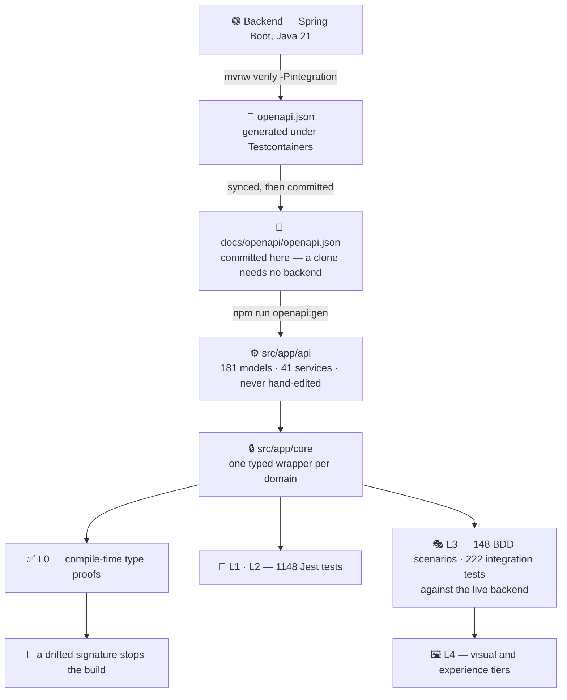

<div align="center">

# checkItOut — Frontend

**A production Angular rewrite where the test strategy is the architecture.**

Types are generated from the backend's OpenAPI spec, so a contract change is a compile error before
it is ever a bug. Every tier above that re-proves the same truth at a higher level of integration.

[](LICENSE)
[](https://angular.dev)
[](https://www.typescriptlang.org/)
[](#-the-test-pyramid)
[](#coverage-size-and-vitals)
[](https://github.com/Check-It-Out-Dev/checkitout-frontend/actions/workflows/ci-tests.yml)

<sub>The two count badges are static, measured 2026-09-07, and reproduced by
<code>npm test&nbsp;--&nbsp;--coverage</code>. The CI badge is the workflow's own and is live.</sub>

### ▶ [**checkitout.app**](https://checkitout.app) — the live demo

_Frontend only. Every `/api` call answered in the browser. No account, no backend, no payment._

**[Backend](https://github.com/Check-It-Out-Dev/checkitout-backend)** ·
**[Graph-theory method](https://github.com/Check-It-Out-Dev/graph-theory-system-modeling)** ·
**[Technical survey](https://checkitout.app/technical-survey)**

</div>

---

## The sixty-second version

checkItOut is an influencer-marketing platform: companies publish campaigns, creators apply,
money moves through Stripe, invoices go out through Fakturownia and on to the Polish national
e-invoicing system. It runs in production. This repository is the **greenfield rewrite of its
frontend** — from a template-heavy Angular 17 app to Angular 22 standalone + Material, rebuilt
route by route without a feature freeze on the product.

Three claims, and the rest of this page is where you check them:

| Claim                                                                                                                                                                                                                              | Where to check it                            |
| :--------------------------------------------------------------------------------------------------------------------------------------------------------------------------------------------------------------------------------- | :------------------------------------------- |
| **The backend contract cannot silently drift.** 181 model types and 41 API services are generated from the backend's spec; three separate mechanisms refuse to let hand-written code diverge from them.                            | [Contract pipeline](#-the-contract-pipeline) |
| **1,837 tests across nine tiers, and each proves something the others structurally cannot.** 1148 Jest · 148 BDD scenarios · 222 live-backend integration · 138 visual · 79 experience · counted by the runners, skipped included. | [Test pyramid](#-the-test-pyramid)           |
| **Fifteen gates run before any commit lands, and each was born from a specific defect that got through.**                                                                                                                          | [Quality gates](#-quality-gates)             |

> [!NOTE]
> Every number on this page was measured on **2026-09-07** with a command you can run yourself, and
> `npm run check:published-numbers` fails the build if any of them drifts from the code.
> Where something is designed but not yet running, it is marked ⬜ and appears in the
> [roadmap](#-shipped--in-progress--planned). Nothing here is aspirational unless it says so.

---

## 🚀 Getting it running

Three levels, and only the third one costs you anything.

### 1 · Look at it — 0 minutes, 0 setup

**[checkitout.app](https://checkitout.app)** — the whole product, guided tours and all. Every `/api`
call is answered inside the browser. No account, no backend, no payment path.

### 2 · Run the frontend yourself — 2 minutes, no credentials

The demo build serves every `/api` response from in-memory fixtures — the _same typed builders the
test tiers use_, so what you click is what the tests assert against. It hosts as plain static files:

```bash
npm ci
npm run build:demo
npx http-server dist/check-it-out-fe-greenfield/browser
```

That is also enough to run **1,420 of the 1,837 tests**: every Jest test, the fifteen-gate wall, and
the sandbox, visual and experience tiers.

### 3 · Run the whole platform — a weekend, and some of it costs money

From the [backend repo](https://github.com/Check-It-Out-Dev/checkitout-backend),
`node tools/dev-lite.mjs` brings up PostgreSQL, Redis, the backend on a credential-less profile and
this frontend, with a seeded world and accounts to sign in as. That gets you a working platform for
browsing and for most of the BDD corpus.

Getting the _whole_ thing — payments, invoicing, social connections, geolocation, the Polish
registries — means bringing your own accounts. See the note below for exactly which.

**Development mode.** Node `^22.22.3 || ^24.15.0` (Angular 22's dev server calls
`tls.getCACertificates`, which Node 23 does not have), npm 10+, backend on `https://localhost:8080`.

```bash
npm ci
npx playwright install chromium webkit   # one-time, ~300 MB, for the e2e tiers
npm run start                            # https://localhost:4201
```

The dev server's certificate is generated per clone rather than committed — a private key in a
public repository looks like a leak whether or not it is one.

<details>
<summary><b>Every test command</b></summary>

```bash
npm test                  # 1148 Jest unit + component tests          ~20 s
npm test -- --coverage    # …with coverage, gated by a threshold
npm run check:full        # the entire 14-gate wall, exactly as CI runs it
npm run test:bdd          # 148 Cucumber scenarios       (needs the stack)
npm run test:integration  # 222 live-backend cases       (needs the stack)
npm run test:sandbox      # 41 component-sandbox tests
npm run test:visual       # 138 byte-stable snapshots over 140 fixtures
npm run test:parity       # legacy-vs-greenfield pixel diff, 4 device projects
npm run test:perf         # 78 experience measurements   (serves a real build)
npm run openapi:cycle     # regenerate the client from the backend spec
```

</details>

> [!IMPORTANT]
> **This is a commercial product, so you cannot clone it and run everything — and that is worth
> saying plainly rather than hiding behind a green suite.**
>
> The backend is real and public: [checkitout-backend](https://github.com/Check-It-Out-Dev/checkitout-backend),
> Spring Boot 3.4.5 on Java 21. The frontend really does run against it, and the live-backend tiers
> really do exercise it. But standing that stack up is not `docker compose up`. It needs, at minimum,
> your own **Google Cloud Storage** bucket and service account, a **VPS** to put it on, **Grafana +
> Loki** for the logs the tests read, and working credentials for **Meta/Instagram**, **MaxMind**
> GeoIP, **Fakturownia** invoicing, **Stripe**, and the **Polish public registries** (GUS, VAT
> status, KSeF e-invoicing). Several of those are paid, and two require a registered business to
> obtain at all.
>
> Not one secret is committed here, which is the correct decision and also the reason a clone cannot
> reach those services. So the live-backend tiers guard themselves — 180 inline
> `test.skip(condition, reason)` calls check for a backend, for credentials, for an endpoint that
> exists at this backend tip — and on a machine that cannot run them they skip, by name, with the
> reason printed. That is deliberate: a suite that fails on a machine that was never going to run it
> teaches people to ignore red.
>
> **What runs with no setup at all:** the demo build (every `/api` answered in the browser), all
> 1148 Jest tests, the fifteen-gate wall, and the sandbox and visual tiers. That is 1,420 of
> the 1,837 tests, on a clean clone, with no account and no key.

---

## 🔺 The test pyramid

**1,837 tests.** Five layers in the pyramid, four tiers beside it. The point is not the count — it
is that the layers are **connected**: each is built from the artifacts of the one below, so a
regression cannot pass a lower layer and hide in a higher one. The tiers beside the pyramid are
there because they answer questions the chain structurally cannot.

```text
                        ┌──────────────────────────────────────┐
                        │  L4 · VISUAL                         │  138 tests · 140 fixtures
                        │  what a person actually sees         │  + 41 parity × 4 devices
                    ┌───┴──────────────────────────────────────┴───┐
                    │  L3 · BDD ORACLE — the live backend          │  148 tests
                    │  the business rules, re-proven through the   │  27 feature files
                    │  screens a real user touches                 │  needs the full stack
                ┌───┴──────────────────────────────────────────────┴───┐
                │  L2 · COMPONENT                                      │
                │  UI logic against service interfaces, never HTTP     │  1148 tests
            ┌───┴──────────────────────────────────────────────────────┴───┐
            │  L1 · SERVICE                                                │  131 suites
            │  every wrapper's URL, verb, body and return type             │  ~20 s
        ┌───┴──────────────────────────────────────────────────────────────┴───┐
        │  L0 · CONTRACT — compile time, zero runtime cost                     │  18 assertions
        │  the wrapper's signature IS the generated model                      │  41 services · 181 models
        └──────────────────────────────────────────────────────────────────────┘

   beside the pyramid, because they answer questions it cannot:

   ▸ INTEGRATION · trace-equivalence   222 tests · 40 files · each cites its backend feature
   ▸ SANDBOX     · component states     41 tests · 13 files · every fixture, mocked
   ▸ SCENARIOS   · multi-actor flows     6 tests ·  3 files · two people, one campaign
   ▸ EXPERIENCE  · perf                 78 tests · 15 files · smooth, readable, honest in motion

   1148 Jest + 689 Playwright = 1,837 tests. Counted by the runners themselves,
   skipped and fixme included — `npx playwright test <dir> --list` says so.
```

### What each tier proves — and what it cannot see

| Tier              | Proves                                                                                                                                                                        | Cost                     | Blind to                                               |
| :---------------- | :---------------------------------------------------------------------------------------------------------------------------------------------------------------------------- | :----------------------- | :----------------------------------------------------- |
| **L0 Contract**   | A wrapper's signature is _exactly_ the generated model. Drift is a `tsc` error.                                                                                               | 0 runtime                | Anything at runtime. It is a type proof, nothing more. |
| **L1 Service**    | Each wrapper serialises the right URL, verb and body, and types the response. Services read as executable API documentation.                                                  | ms                       | Whether the real backend agrees.                       |
| **L2 Component**  | UI logic against service _interfaces_, with builder-shaped data.                                                                                                              | ms                       | Wiring, routing, and anything the DOM does.            |
| **L3 BDD oracle** | 148 scenarios of business rules — ported from the backend's own Cucumber corpus — re-proven through the frontend, against a live backend, with real auth and multiple actors. | minutes, needs the stack | Pixels, timing, motion.                                |
| **L4 Visual**     | Byte-stable snapshots of 140 component fixtures, plus legacy-vs-greenfield pixel diff across four device projects.                                                            | minutes                  | Behaviour. A beautiful broken button passes.           |
| **Integration**   | The API call _trace_ the app actually emits: header semantics, retry behaviour, cookie domains, ordering. Every spec cites the backend Cucumber feature it ports.             | minutes, needs the stack | Rendering.                                             |
| **Experience**    | Long animation frames, layout stability, main-thread answerability, how long evidence stays readable on screen.                                                               | 24 min                   | Correctness.                                           |

> [!IMPORTANT]
> **The API tier is not Pact, and calling it that would be wrong.** Pact is _consumer-driven contract
> testing_: the consumer records expectations, the provider verifies them in isolation, neither ever
> talks to the other. What happens here is the inverse and is worth naming precisely — **spec-first
> integration testing**. The provider publishes an OpenAPI document, the consumer _generates_ its
> types from it, a compile-time layer proves the hand-written code still matches, and then the same
> typed services are exercised against a **live** backend with real authentication and multi-actor
> flows. Static conformance where a compiler can prove it; real integration where it cannot.
>
> The honest gap: nothing here checks that the **running server** matches its own published spec —
> only that the client and the spec agree. [Schemathesis](https://schemathesis.io/) is what would
> close it, and it is not installed. ⬜

### Coverage, size and vitals

Measured 2026-09-07. Coverage excludes `src/app/api/**` — 271 generated files nobody edits, and
counting them would move the number without moving the truth.

|                          |                                                                                                Measured | Gate                            |
| :----------------------- | ------------------------------------------------------------------------------------------------------: | :------------------------------ |
| **Lines**                |                                                                               **77.84 %** (5407 / 6946) | fails under 75                  |
| **Statements**           |                                                                               **76.48 %** (6029 / 7883) | fails under 74                  |
| **Branches**             |                                                                               **68.43 %** (2049 / 2994) | fails under 66                  |
| **Functions**            |                                                                               **64.94 %** (1282 / 1974) | fails under 62                  |
| **Files in scope**       | **242** — every hand-written file under `src/app`; **80 of them have no test at all** and count as zero | —                               |
| **Test code : app code** |                                              **0.75 : 1** — 50,639 lines of tests against 67,409 of app | —                               |
| **Initial bundle**       |                                                                **1.09 MB** raw · **250 kB** transferred | 1250 kB warning / 1500 kB error |

> [!WARNING]
> **Function coverage at 64.7 % is the weak number here and it is not good enough.** It is published
> because a threshold you cannot see is not a threshold. Every figure above is now a floor set two
> points below what was measured, so the number can only be raised, never quietly allowed to slide.
> Raising branch and function coverage is [on the roadmap](#-shipped--in-progress--planned).

**Web Vitals** — a _lab_ measurement of the _demo_ build on the live host, desktop, **unthrottled**.
There is no field data: the domain has no CrUX entry, and a number from one machine is not a claim
about real users.

| Metric                                |         Value |                                                                              |
| :------------------------------------ | ------------: | :--------------------------------------------------------------------------- |
| **LCP**                               |    **185 ms** | TTFB 43 ms + render delay 143 ms                                             |
| **CLS**                               |      **0.00** | independently confirmed by the experience tier on the animated landing story |
| **Lighthouse — accessibility**        |        **97** | 59 audits pass, 1 fails: colour contrast on small coral text                 |
| **Lighthouse — best practices / SEO** | **100 / 100** |                                                                              |

📄 The full reasoning behind the layering: **[docs/testing/LAYERED-TEST-ARCHITECTURE.md](docs/testing/LAYERED-TEST-ARCHITECTURE.md)**

---

## 🏗 Architecture

Feature-first, standalone, signal-driven. No shared "core module", no barrel-file spaghetti: a
feature owns its routes, its components and its state, and reaches the outside world through one
door.

```
src/app/
├── api/          271 generated files — 181 models, 41 services.  NEVER hand-edited.
├── core/         the only code allowed to import from api/. One wrapper per domain.
├── feature/      routed features. Standalone components, signals, mostly OnPush.
├── layout/       shells and chrome.
├── shared/       genuinely shared UI. Small on purpose.
└── testing/      9 builders + 18 compile-time contract assertions. Ships with the tests.
```

| Decision                                                 | Why                                                                                                                                                                                                                                                                    |
| :------------------------------------------------------- | :--------------------------------------------------------------------------------------------------------------------------------------------------------------------------------------------------------------------------------------------------------------------- |
| **Angular 22 standalone + signals**                      | The rewrite started on 17 and migrated in place; no NgModules were ever written. `OnPush` on 82 of 123 components; 36 are deliberately `Eager` (the editorial survey pages, where content is static and the ceremony buys nothing). Zone-based, not zoneless.          |
| **Tailwind with preflight OFF**, beside Angular Material | Preflight and Material's own resets fight each other. The resets we actually need — `box-sizing`, button and border defaults — live explicitly in `styles.scss @layer base`. A missing rule there looks like a whole-app styling bug, which is why it is written down. |
| **Transloco** for i18n, `pl` + `en`                      | Key sets are gated to be identical, so a missed translation is a failed commit rather than a raw key in production.                                                                                                                                                    |
| **SSR built, prerender used**                            | `ng build` emits browser + server bundles and prerenders `/`. Only `browser/` is deployed; nginx serves it with an index fallback.                                                                                                                                     |
| **A demo build with a mocked interceptor**               | Same code, same components, every `/api` answered in-browser. It is what [checkitout.app](https://checkitout.app) serves, and it is how the whole product is demonstrable without an account.                                                                          |

### The rewrite methodology

Rewriting a live product is harder than greenfield: every strange branch in the old code encodes a
customer bug fix, a regulation, or a UX lesson someone learned the hard way. Five rules kept that
knowledge from being thrown away with the template:

1. **Never feature-freeze the product.** The old frontend kept shipping throughout.
2. **Freeze the URL surface on day one.** Placeholder routes 1:1 with the legacy app, then filled
   in. Cutover preserves bookmarks, deep links and shared URLs.
3. **The OpenAPI spec is the contract; the client is generated, never hand-written.** Backend
   breakage surfaces at compile time, not in production.
4. **Visual baselines are committed artifacts.** A pull request reviews the _image_ change, not only
   the code change — and a gate refuses baselines older than the components they claim to show.
5. **One cutover unit per route.** A route is either legacy or new. Nothing half-migrated.

---

## 🔗 The contract pipeline

This is the spine of the whole project. The backend owns the truth; the frontend never restates it.



Five steps, one command — `npm run openapi:cycle` ([tools/openapi-cycle.mjs](tools/openapi-cycle.mjs)):

1. **Backend regenerates the spec** — `mvnw verify -Pintegration OpenApiSpecGeneratorTest`, under
   Testcontainers, so the document describes a server that actually booted.
2. **The spec is committed here.** A public clone with no sibling backend checkout still
   regenerates, still typechecks, still builds — and it is the _identical file_, not a copy that
   drifted. The generator test on the backend sorts the JSON keys before writing precisely so that
   two repositories can hold it byte for byte, which makes the claim one command:

   ```bash
   sha256sum docs/openapi/openapi.json
   # 96ceb20f44831ba48ac6a01349e953c0131260ff8db84b447d704893b01e7cbb
   # run it in either repository — same file
   ```

3. **Codegen** — `openapi-generator-cli generate -g typescript-angular`, output wiped and rewritten,
   then a post-processor pass.
4. **`npm run typecheck`** — every contract break in the entire application surfaces here.
5. **`npx bddgen`** — the Cucumber steps recompile against the new models, so the behavioural
   corpus cannot describe a request shape that no longer exists.

### Three mechanisms stop the contract from drifting

Codegen alone is not enough — generated types are worthless the moment hand-written code casts
around them.

**1. Feature code may not touch the generated client.**
[`tools/check-api-wrappers.mjs`](tools/check-api-wrappers.mjs) refuses any import of
`src/app/api/api/*` from outside `src/app/core/**`. The reason is specific: the generator's
implementation overload returns `Observable<any>`, and one `any` at a call site quietly turns every
downstream type into a lie.

**2. Each wrapper's signature is proven identical to the generated model — by the compiler.**

```ts
// src/testing/contract/address.contract.ts — zero runtime cost, pure type-level proof
type _createForUser = Expect<
  Equal<
    AddressApi['createForUser'],
    (userId: number, dto: AddressDtoIn) => Observable<AddressDtoOut>
  >
>;
```

Widen a parameter, drop a field, return the wrong shape — `tsc` fails. No test runs, nothing is
executed, and the drift is caught in seconds.

**3. The proofs themselves are coverage-gated.**
[`tools/check-contract-coverage.mjs`](tools/check-contract-coverage.mjs) tracks which wrappers carry
a contract file and fails on any that is neither proven nor explicitly waived. It currently reports
**19 of 31 wrappers under an L0 contract, 12 waived** — 9 that never cross the wire (client-side
only) and 3 whose boundary transforms the payload, so a type-identity assertion would be false.
Nothing is silently missing; the backlog is empty.

---

## 🛡 Quality gates

Fifteen gates, run by `npm run check:full` and by CI on every pull request. The pre-commit hook
runs G1–G10, G12–G15 by name; G11 alone rides in `check:static`, which the hook does not call and
CI does — a gap worth knowing about rather than papering over. Twelve are custom scripts written
for this repository, and each one exists because something specific got through:

| #   | Gate                                  | Refuses                                                                                                                                      | Born from                                                                                                                                                                       |
| :-- | :------------------------------------ | :------------------------------------------------------------------------------------------------------------------------------------------- | :------------------------------------------------------------------------------------------------------------------------------------------------------------------------------ |
| G1  | `check:no-legacy-ui`                  | Any import from the old template library                                                                                                     | The rewrite's whole point                                                                                                                                                       |
| G2  | `check:api-wrappers`                  | Feature code importing the generated client directly                                                                                         | `Observable<any>` leaking through casts                                                                                                                                         |
| G3  | `check:i18n-parity`                   | `en.json` and `pl.json` having different key sets — 4499 keys and 52 templates, checked pairwise                                             | A typo'd key shipping as raw text                                                                                                                                               |
| G4  | `check:visual-fixture-coverage`       | A sandbox fixture with no visual baseline — 140/140 registered and captured                                                                  | Silent coverage loss when new fixtures land                                                                                                                                     |
| G5  | `check:visual-baseline-freshness`     | Baselines older than the components they claim to show                                                                                       | An editorial sweep touched 27 templates without regenerating baselines                                                                                                          |
| G6  | `check:integration-cucumber-citation` | An integration spec that does not cite the backend feature it ports — 67/67 cite theirs                                                      | The tier is a _port_ of the backend corpus, not a parallel one                                                                                                                  |
| G7  | `check:bdd-corpus`                    | A backend Cucumber feature that is neither ported nor explicitly waived — 34 accounted for, 26 ported, 8 waived                              | Completeness you can measure beats completeness you assume                                                                                                                      |
| G8  | `check:component-pair-sync`           | A component pair pointing at a fixture that no longer exists                                                                                 | Dangling parity pairs passing vacuously                                                                                                                                         |
| G9  | `check:contract-coverage`             | A core wrapper that is neither under an L0 type proof nor explicitly waived — 19/31 proven, 12 waived with reasons                           | See above                                                                                                                                                                       |
| G10 | `check:icon-subset`                   | An icon used in code but missing from the shipped font subset                                                                                | A missing glyph is invisible in review and obvious in production                                                                                                                |
| G11 | `check:i18n-cache-buster`             | A stale translation-bundle hash                                                                                                              | Users served yesterday's copy                                                                                                                                                   |
| G12 | `typecheck` + `typecheck:e2e`         | Any type error, app or test                                                                                                                  | Strict everywhere, tests included                                                                                                                                               |
| G13 | `build:check`                         | Template type errors — `strictTemplates` only fires in `ng build`                                                                            | `tsc --noEmit` does **not** check templates; this is the gate people skip and then wonder why their edits "aren't reaching the browser"                                         |
| G14 | `jest --bail` + coverage threshold    | A failing test, or coverage sliding below the floor                                                                                          | —                                                                                                                                                                               |
| G15 | `check:published-numbers`             | Any number this repo publishes about itself disagreeing with the measured one — 55 figures across the README, both locales and one component | The site said 216 generated models against a directory holding 181, and 949 Jest tests against 1,141. `check:i18n-parity` cannot see it: both are valid strings in both locales |

Run the whole wall yourself: `npm run check:full`.

---

## ⚙️ CI/CD

### ✅ On every pull request — today

[`.github/workflows/ci-tests.yml`](.github/workflows/ci-tests.yml) runs the **same fifteen gates**
the pre-commit hook runs, on a GitHub-hosted runner. It is deliberately **hermetic** — no backend,
no browsers, no Docker — so it behaves identically on a fork's pull request as on the mainline, and
fork code never touches self-hosted infrastructure.

Two tiers are deliberately _not_ in it, and the workflow says so in its own header rather than
leaving you to notice:

- **Visual tiers** — baselines are byte-stable per platform, and a Linux runner rasterises different
  pixels than the machine that captured them. Running them there would produce noise, not signal.
- **BDD, integration and scenario tiers** — they need a live backend, PostgreSQL, Redis and a mail
  server. They belong in a full-stack workflow, not in the fast wall that guards a pull request.

### ⬜ Nightly, full-stack, sharded — [written](.github/workflows/nightly-full-stack.yml), not yet scheduled

The pull-request run optimises for _latency_; the nightly run optimises for _coverage_. It is a
separate workflow, not a longer version of the same one:

```
   ┌─ shard 1/4 ─┐  backend + Postgres + Redis + mail, own ports   ─ blob report ─┐
   ├─ shard 2/4 ─┤  a preset queue of suites per shard, not a       ─ blob report ─┤
   ├─ shard 3/4 ─┤  dynamic balancer: predictable and debuggable    ─ blob report ─┼─▶ merge-reports
   └─ shard 4/4 ─┘  is worth more than optimal at this size         ─ blob report ─┘        │
                                                                                            ▼
                                                    one HTML report · downloadable artifact ·
                                                    pass rate + duration written to the run summary
```

Each shard gets its own backend, Postgres, Redis and mail server on its own ports — four shards
fighting over one database produce flake that belongs to the infrastructure, not to the product. The
split is a **preset queue per shard**, not a dynamic balancer: at this size a scheduler is one more
thing that can be wrong at 3 a.m., and a shard whose contents never change is a shard whose failure
you can reproduce locally with one command. Playwright's blob reporter emits a fragment per shard
and a final job merges them with `merge-reports` into one HTML report — downloadable, with the
outcome counts written into the run summary so the result is legible without downloading anything.
Flaky is counted apart from passed, because a test that only passed on a retry did not pass.

The workflow is committed and runnable by hand. It is **not on a schedule**, and the reason is in
its own header: the backend image is not yet published for CI, so the boot step exits neutral and
each shard reports skipped rather than a false green. A red cron nobody has seen green is worse than
no cron.

### Deployment — plain, and deliberately so

Two self-hosted-runner workflows, test and production, ported from the legacy pipeline. `ng build`
emits browser and server bundles; only `browser/` is deployed; nginx serves it with an index
fallback. No Kubernetes, no service mesh, no reason for either. The demo at
[checkitout.app](https://checkitout.app) deploys the same way — build, ship, atomic directory swap,
purge the CDN, verify the served bundle hash past the cache.

---

## 🕸 Modelling the system as a graph

The application is also maintained as a **knowledge graph** in Neo4j, so that both a person and an
agent can navigate it without reading everything.

- **A three-level topology** — one navigation root → entity navigators → concrete implementations.
  You can ask the graph a question instead of grepping for a convention you hope was followed.
- **A six-entity behavioural lens** — every subsystem is read as Controller, Configuration,
  Security, Implementation, Diagnostics, Lifecycle. It is a reading methodology, not a node type:
  it forces the question "where is the _lifecycle_ of this feature?" to have an answer.
- **State machines as first-class data** — the subscription lifecycle is 10 states and 56
  transitions with its business rules and resolved corner cases stored as nodes and edges, not as
  prose someone has to keep in their head. The guided demo has three more.
- **The complexity argument** — k-hop graph retrieval is O(k) and vector search O(log n), while
  packing a codebase into a prompt is O(n) attention with documented degradation in the middle.
  A maintained graph is a categorically cheaper memory than a bigger context window.

🔍 Live, with real figures: **[checkitout.app/technical-survey/engineering#graph-topology](https://checkitout.app/technical-survey/engineering#graph-topology)** ·
the published method: **[graph-theory-system-modeling](https://github.com/Check-It-Out-Dev/graph-theory-system-modeling)**

---

## 🤖 AI in the loop — the method, not the marketing

An AI agent did a lot of work in this repository. That is only interesting if the _method_ is
interesting, so here is the method.

**The human is the architect.** What to test, at which layer, with which technology, and which
business paths mattered enough to port — those were decisions, and they were mine. For the
greenfield rewrite I built a parity map of the business paths first, so that "are we done?" had an
answer that was not a feeling.

**The agent's leverage came from being given eyes.** An agent that can only read source code is
guessing. The same agent with the backend's logs open while it drives an API test, with the test
runner's output, with a per-frame recording of the running application, is doing something closer to
debugging. Most of the engineering here went into building those instruments — a per-frame DOM
sampler, a screencast pipeline, an error-class register where a defect found once becomes a sweep
across all seven user journeys — rather than into prompting.

**One example each way.** The instruments found eighteen real defects the assertion suites could not
see, including a beat of the guided tour that showed its own proof for 91 milliseconds. And they
were wrong too: a reviewer measured the guide's arrow and reported it pointing the wrong way, I
acted on it, and a second reviewer looking at a different recording showed the first was mistaken —
the arrow is the product's own call-to-action glyph, used thirty times elsewhere. It was reverted.
A finding is evidence, not a verdict, and the thing that caught it was a second reader who had never
seen the first.

**The graph is what makes a large system navigable — for both of us.** The application is modelled
in Neo4j on the method published in
[graph-theory-system-modeling](https://github.com/Check-It-Out-Dev/graph-theory-system-modeling): a
three-level topology, the six-entity behavioural lens, and the state machines as data. Asking a graph
"what does this subsystem's lifecycle look like?" costs one query. Answering it by putting a codebase
into a prompt costs O(n) attention with documented degradation in the middle. That difference is why
the graph exists, and it is the same reason a human reviewer benefits from it.

**Why this loop is fast, in numbers that are not about the agent.** The speed comes from the contract,
not from the typing. Static types are measured at catching on the order of **15 %** of shipped public
bugs (Gao, Bird, Barr — ICSE '17, and the authors call that conservative), and Airbnb's postmortem
analysis put **38 %** of their production bugs as preventable by TypeScript used _strictly_. Strictly
is the operative word, and it is the setting this repository runs under: `strict` plus Angular's
`strictTemplates`, across application and test code alike.

On top of that, generated types turn an entire class of integration bug into a compile error. When
the backend changes a field, nothing here goes looking for it at runtime — `npm run typecheck`
reports every call site in seconds, before a test runs, before a browser opens. The three feedback
loops, in order of latency: `tsc` in seconds, the fifteen-gate wall in minutes, and the live-backend
tiers when the stack is up. An agent is only useful inside a loop that short, and only because
something other than the agent decides whether its output survives.

📈 The longer version, with the numbers: **[checkitout.app/technical-survey/engineering#velocity](https://checkitout.app/technical-survey/engineering#velocity)**
and **[#graph-dev](https://checkitout.app/technical-survey/engineering#graph-dev)**

---

## 📋 Shipped · In progress · Planned

|     | What                                                     | Detail                                                                                                                                          |
| :-- | :------------------------------------------------------- | :---------------------------------------------------------------------------------------------------------------------------------------------- |
| ✅  | Contract pipeline, end to end                            | Spec → codegen → wrappers → compile-time proofs → every tier                                                                                    |
| ✅  | 14-gate wall, local and in CI                            | Identical locally and on pull requests                                                                                                          |
| ✅  | 1148 Jest unit + component tests                         | Coverage measured and now gated                                                                                                                 |
| ✅  | 148 BDD scenarios from the backend corpus                | 27 feature files; 26 of 34 backend features ported, 8 waived, gated by G7                                                                       |
| ✅  | 222 live-backend integration tests                       | Each citing the feature it ports                                                                                                                |
| ✅  | 138 visual snapshots over 140 fixtures + 41 parity diffs | Coverage gated by G4, freshness by G5                                                                                                           |
| ✅  | Experience tier — 78 measurements                        | Nine error classes closed, each swept across all seven journeys                                                                                 |
| ✅  | Live demo, fully mocked                                  | [checkitout.app](https://checkitout.app)                                                                                                        |
| 🟡  | Branch and function coverage                             | 68.2 % and 64.7 %. The floors stop a slide; they do not fix the gap.                                                                            |
| ⬜  | Nightly full-stack sharded run                           | [Written](.github/workflows/nightly-full-stack.yml) and runnable by hand; needs the backend image published for CI before it goes on a schedule |
| ⬜  | Published test-result history                            | Pass rate, duration and flake trend over time, not just the last run                                                                            |
| ⬜  | Flaky-test detection                                     | Re-run analysis plus statistical detection over that history                                                                                    |
| ⬜  | Lighthouse CI with assertions                            | The vitals here are a single manual lab run; a budget in CI is the real version                                                                 |
| ⬜  | Web Vitals from real users                               | No field data exists — the demo has no meaningful traffic                                                                                       |
| ⬜  | Colour contrast on small coral text                      | The one failing accessibility audit                                                                                                             |
| ⬜  | Visual tiers in CI                                       | Needs a runner whose rasterisation matches the captured baselines                                                                               |

---

## 🧭 The rest of the estate

Three repositories and a running site, and each answers the question the previous one raises.

| If you are wondering                                            | Go here                                                                                                                                                                                                                                                                                              |
| :-------------------------------------------------------------- | :--------------------------------------------------------------------------------------------------------------------------------------------------------------------------------------------------------------------------------------------------------------------------------------------------- |
| "Is any of this actually running?"                              | **[checkitout.app](https://checkitout.app)** — the product, and a five-chapter technical survey of how it is built                                                                                                                                                                                   |
| "Is the backend real, or is this a frontend talking to a mock?" | **[checkitout-backend](https://github.com/Check-It-Out-Dev/checkitout-backend)** — where the business rules live, and where the contract above is generated from a server that actually booted. It owns the Cucumber corpus this repository's BDD tier ports.                                        |
| "How did one person build and navigate a system this size?"     | **[graph-theory-system-modeling](https://github.com/Check-It-Out-Dev/graph-theory-system-modeling)** — the method: the system modelled as a knowledge graph, plus the retrieval, prompt-evaluation and agentic tooling built on it. This is the tooling that made the loop described above workable. |

## 📚 Documentation

Start at **[docs/README.md](docs/README.md)** — it splits the reading by what you are here
for: evaluating the engineering, or taking a piece of it and using it.

| Document                                                                  | What it is                                                                                                    |
| :------------------------------------------------------------------------ | :------------------------------------------------------------------------------------------------------------ |
| [LAYERED-TEST-ARCHITECTURE.md](docs/testing/LAYERED-TEST-ARCHITECTURE.md) | Why the tiers are connected rather than parallel                                                              |
| [BROWSER-QA-METHODOLOGY.md](docs/testing/BROWSER-QA-METHODOLOGY.md)       | The error-class register, the instrument laws, and the run log                                                |
| [SANDBOX-TODO.md](docs/testing/SANDBOX-TODO.md)                           | Nine error classes, their instruments, and what is open by decision                                           |
| [docs/openapi/openapi.json](docs/openapi/openapi.json)                    | The committed contract                                                                                        |
| [docs/testing/measured-counts.json](docs/testing/measured-counts.json)    | Every number on this page, as the runners reported it. G15 fails the build if the page and this file disagree |

## 🔐 Security

No credentials in the repository. The development certificate is generated per clone. The demo build
contains no backend, no accounts and no payment path. An external penetration test was carried out
against the platform; the findings that apply to the frontend were fixed here, two were accepted as
design decisions and two were deferred with a written reason. The full response — every finding,
its status and the rationale — is documented in the backend repository.

## 📄 License

MIT — see [LICENSE](LICENSE).
