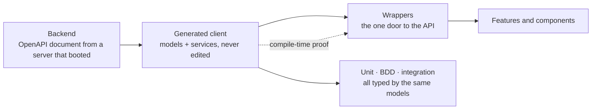

# CheckItOut — Frontend

Angular frontend for the CheckItOut marketplace — the platform that connects companies with
influencers, and that ran in production. This repository is that frontend, rewritten route by route.
Angular 22 · TypeScript · Angular Material · Tailwind · Transloco.

[**🔗 Live demo — no account needed**](https://checkitout.app) ·
[**🧪 Live sandbox — this frontend on the real backend**](https://checkitout.app/sandbox/) ·
[**📋 Technical survey**](https://checkitout.app/technical-survey/engineering) ·
[**📊 Quality dashboard**](https://check-it-out-dev.github.io/checkitout-frontend/)

[](docs/ENGINEERING.md#testing)
[](https://check-it-out-dev.github.io/checkitout-frontend/)
[](https://check-it-out-dev.github.io/checkitout-frontend/lighthouse/latest.json)
[](https://check-it-out-dev.github.io/checkitout-frontend/#quality)
[](https://github.com/Check-It-Out-Dev/checkitout-frontend/actions/workflows/pr.yml)
[](https://github.com/Check-It-Out-Dev/checkitout-frontend/actions/workflows/nightly.yml)
[](LICENSE)

<sub>Only the test count is static — 2018 across every tier, measured 2026-09-14 and held to the
code by a gate. Coverage, Lighthouse and the mutation score are read live from the quality dashboard,
which every run on <code>main</code> republishes.</sub>

---

## Highlights

- **A typed API client generated from the backend's OpenAPI document** — models and services are
  generated, never hand-written, so a change in the backend's contract is a compile error here
  before it is ever a bug.
- **Generated code is checked, not trusted** — feature code may not import the generated client
  directly, each hand-written wrapper is proven identical to the generated signature by the
  compiler, and a nightly job compares a live backend's document with the committed copy.
- **End-to-end tests on the same contract** — the backend's Cucumber scenarios are ported and
  re-proven through the real screens against a live backend, with real sign-in and several actors.
- **2,018 tests across nine tiers**, each with a stated job and a stated blind spot — unit,
  component, BDD, live-backend integration, visual, experience. The runners do the counting
  (`npm run measure:counts`, `npx playwright test --list`), and a gate fails the build when a
  published number drifts from the code.
- **Fifteen gates before a commit lands** — the [gate table](docs/ENGINEERING.md#quality-gates)
  names, row by row, the defect each one was written after.
- **A demo that needs nothing** — one build flag answers every `/api` call in the browser from the
  same typed fixtures the tests use. It is what [checkitout.app](https://checkitout.app) serves.

## How the contract holds


```mermaid
flowchart LR
    BE["Backend<br/>OpenAPI document from a server that booted"] --> GEN["Generated client<br/>models + services, never edited"]
    GEN --> WRAP["Wrappers<br/>the one door to the API"]
    WRAP --> APP["Features and components"]
    GEN -. "compile-time proof" .-> WRAP
    GEN --> TESTS["Unit · BDD · integration<br/>all typed by the same models"]
```

The backend owns the truth and the frontend never restates it. How each step is enforced:
[the contract pipeline](docs/ENGINEERING.md#the-contract-pipeline).

## Quick start

Node 24.15.0 (see `.nvmrc`) and npm 10+.

```bash
npm ci
npm start              # https://localhost:4201 — expects the backend on https://localhost:8080
```

The first start generates a self-signed development certificate; nothing is committed. The backend
is expected on HTTPS: its one-command wizard starts it that way, and a backend started by hand on
plain HTTP needs `BE_PROXY_TARGET=http://localhost:8080`.

| You want                                             | Run                                                                                                                                                               |
| :--------------------------------------------------- | :---------------------------------------------------------------------------------------------------------------------------------------------------------------- |
| The frontend alone, no backend                       | `npm run start:demo` — every `/api` call is answered in the browser                                                                                               |
| The demo as static files                             | `npm run build:demo && npm run serve:demo` → `http://localhost:4300`                                                                                              |
| The whole platform, no credentials                   | `node tools/dev-lite.mjs` in the [backend repository](https://github.com/Check-It-Out-Dev/checkitout-backend) — database, backend, this frontend, seeded accounts |
| A backend on another address                         | set `BE_PROXY_TARGET` (for example `https://localhost:8443`) before `npm start`                                                                                   |
| The client regenerated from the committed spec       | `npm run openapi:gen` (needs Java)                                                                                                                                |
| The spec refreshed from the backend, then the client | `npm run openapi:cycle` (needs the backend checked out next door, and Docker)                                                                                     |

## Testing

```bash
npm test               # unit and component tests, about 20 seconds
npm run check:full     # the whole gate wall, exactly as CI runs it
npm run test:sandbox   # component states in a real browser, no backend
```

The tiers that need a running backend, what each tier proves, the coverage table and the two CI
pipelines are in **[docs/ENGINEERING.md](docs/ENGINEERING.md)**. Results are public: the
[quality dashboard](https://check-it-out-dev.github.io/checkitout-frontend/) and an
[Allure report](https://check-it-out-dev.github.io/checkitout-frontend/allure/latest/) with history.

## Documentation

|                                                                                        |                                                                                         |
| :------------------------------------------------------------------------------------- | :-------------------------------------------------------------------------------------- |
| [docs/ENGINEERING.md](docs/ENGINEERING.md)                                             | Tiers, the contract pipeline, the gates, CI/CD, what is still under way                 |
| [docs/README.md](docs/README.md)                                                       | The index: what to read if you are evaluating, what to take if you want to reuse a part |
| [docs/testing/LAYERED-TEST-ARCHITECTURE.md](docs/testing/LAYERED-TEST-ARCHITECTURE.md) | Why the tiers are connected rather than parallel                                        |
| [docs/testing/ai-in-the-loop.md](docs/testing/ai-in-the-loop.md)                       | Agents propose, invariants dispose, a person merges — in plain words                    |
| [CONTRIBUTING.md](CONTRIBUTING.md)                                                     | Setup, the pre-commit gates, conventions                                                |

## The rest of the estate

- **[checkitout-backend](https://github.com/Check-It-Out-Dev/checkitout-backend)** — Spring Boot;
  where the business rules live and where the contract above is generated.
- **[graph-theory-system-modeling](https://github.com/Check-It-Out-Dev/graph-theory-system-modeling)** —
  how a system this size stays navigable: the code base modelled as a graph that coding agents query.
- **[checkitout.app/technical-survey](https://checkitout.app/technical-survey/engineering)** — the
  estate in one screen.

## License

MIT — see [LICENSE](LICENSE).
