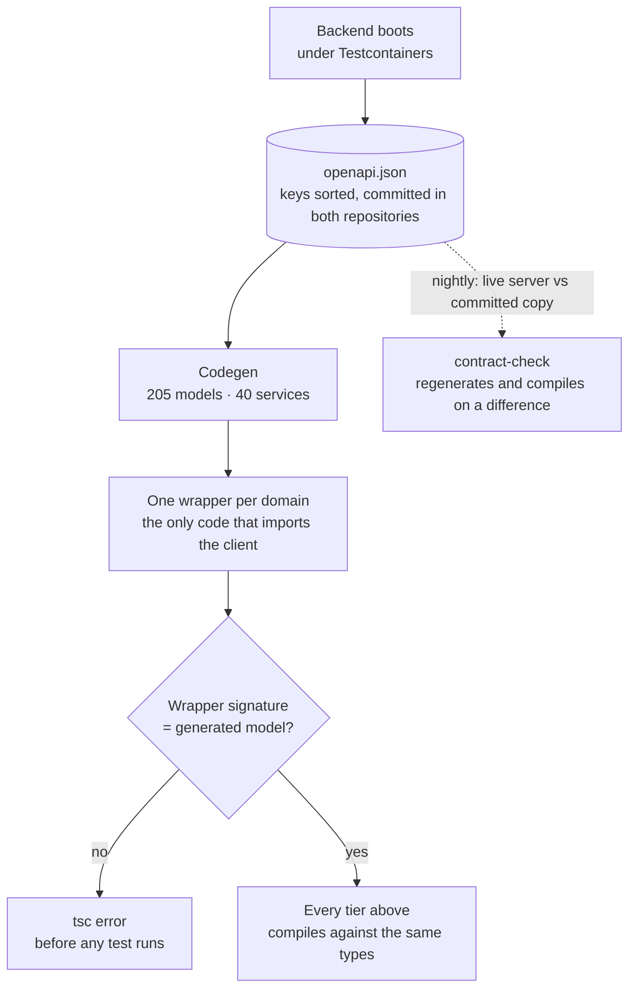
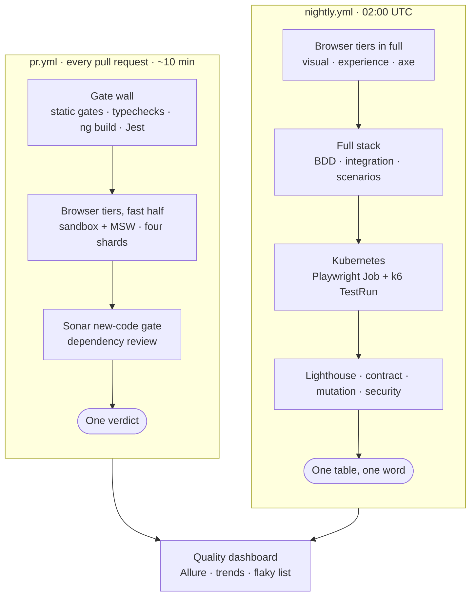
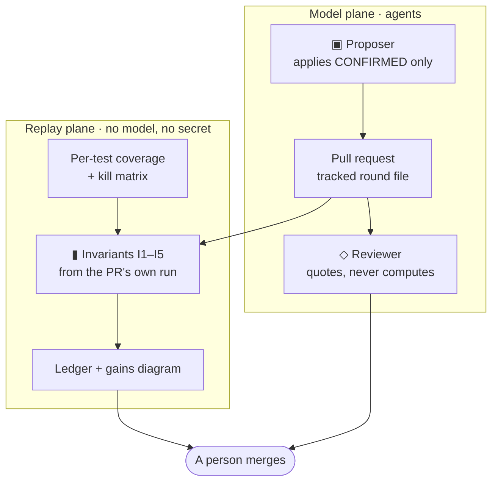

# Engineering: how this frontend is tested, gated and shipped

The [README](../README.md) says what this repository is and how to run it. This page is the depth
behind it: the test tiers and what each one proves, the contract pipeline, the gates, the pipelines,
and what is still under way.

**Contents** — [Three claims](#three-claims) · [Run it](#run-it) · [Testing](#testing) ·
[Architecture](#architecture) · [The contract pipeline](#the-contract-pipeline) ·
[Quality gates](#quality-gates) · [CI/CD](#cicd) · [Test governance](#test-governance) ·
[In progress](#in-progress) · [Seven days of machine-written change](#seven-days-of-machine-written-change) ·
[AI in the loop](#ai-in-the-loop-invariants-in-charge) · [Security](#security)

---

## Three claims

checkItOut is an influencer-marketing platform: companies publish campaigns, creators apply, billing
is built on Stripe and invoices on Fakturownia. The platform ran in production with real users;
today it is an open demo. This repository is the **rewrite of its frontend** — from a template-heavy
Angular 17 app to Angular 22 standalone + Material, rebuilt route by route without a feature freeze
on the product.

Three claims, and the rest of this page is where you check them:

| Claim                                                                                                                                                                                                           | Where to check it                               |
| :-------------------------------------------------------------------------------------------------------------------------------------------------------------------------------------------------------------- | :---------------------------------------------- |
| **The backend contract cannot silently drift.** 205 model types and 40 API services are generated from the backend's spec; three separate mechanisms refuse to let hand-written code diverge from them.         | [The contract pipeline](#the-contract-pipeline) |
| **Nine tiers, and each proves something the others structurally cannot.** 1306 Jest · 148 BDD scenarios · 222 live-backend integration · 142 visual · 82 experience · counted by the runners, skipped included. | [Testing](#testing)                             |
| **Fifteen gates run before any commit lands, and each was born from a specific defect that got through.**                                                                                                       | [Quality gates](#quality-gates)                 |

> [!NOTE]
> Every test, coverage and gate number on this page was measured on **2026-09-14** with a command you
> can run yourself, and `npm run check:published-numbers` fails the build if any of them drifts from
> the code. Where something is designed but not yet running, it is marked ⬜ and appears under
> [in progress](#in-progress). Nothing here is aspirational unless it says so.

---

## Run it

Three levels, and only the third one costs you anything.

**1 · Look at it — 0 minutes.** [checkitout.app](https://checkitout.app): the whole product, guided
tours and all. Every `/api` call is answered inside the browser. No account, no backend, no payment.

**2 · Run the frontend yourself — 2 minutes, no credentials.** The demo build serves every `/api`
response from in-memory fixtures — the _same typed builders the test tiers use_ — and hosts as
plain static files:

```bash
npm ci
npm run build:demo
npm run serve:demo        # http://localhost:4300
```

That is also enough to run **1,595 of the 2,018 tests**: every Jest test, the gate wall, and the
sandbox, visual and experience tiers.

**3 · Run the whole platform — one command, from the backend.** In the
[backend repository](https://github.com/Check-It-Out-Dev/checkitout-backend), `node tools/dev-lite.mjs`
brings up PostgreSQL, Redis, the backend on a credential-less profile and this frontend, with a seeded
world and accounts to sign in as. Real payments, invoicing, social connections and geolocation need
your own accounts (Google Cloud Storage, Stripe, Fakturownia, Meta, MaxMind); not one secret is
committed here, so on a machine without them the live-backend tiers skip by name, with the reason
printed — about two hundred inline `test.skip(condition, reason)` calls, on purpose. A suite that
fails on a machine that was never going to run it teaches people to ignore red.

**Development mode.** Node 24.15.0 (`.nvmrc`; 22.22.3+ also works), npm 10+, backend on
`https://localhost:8080` — set `BE_PROXY_TARGET` to point somewhere else. The dev certificate is
generated per clone rather than committed.

```bash
npm ci
npx playwright install chromium webkit   # one-time, ~300 MB, for the e2e tiers
npm start                                # https://localhost:4201
```

**Every test command:**

```bash
npm test                  # 1306 Jest unit + component tests          ~20 s
npm test -- --coverage    # …with coverage, gated by a threshold
npm run check:full        # the entire gate wall, exactly as CI runs it
npm run test:bdd          # 148 Cucumber scenarios       (needs the stack)
npm run test:integration  # 222 live-backend cases       (needs the stack)
npm run test:sandbox      # 64 component-sandbox tests
npm run test:visual       # 142 byte-stable snapshots over 146 fixtures
npm run test:parity       # legacy-vs-greenfield pixel diff, 4 device projects
npm run test:perf         # 82 experience measurements   (serves a real build)
npm run perf:k6           # k6 thresholds on the demo's public routes
npm run openapi:cycle     # regenerate the client from the backend spec
npm run measure:counts    # re-ask the runners; writes docs/testing/measured-counts.json
```

---

## Testing

> **The results, live** — [quality dashboard](https://check-it-out-dev.github.io/checkitout-frontend/) · [Allure with history](https://check-it-out-dev.github.io/checkitout-frontend/allure/latest/) ·
> [Lighthouse](https://check-it-out-dev.github.io/checkitout-frontend/lighthouse/latest.json) · [k6 in Grafana](https://checkitoutapp.grafana.net/public-dashboards/bc4987ccdb234296a33afd3a794f1f4e)
>
> The dashboard is what this section describes, after it has run: pass rate and its trend, mutation
> score, security findings, every test that failed or flaked in the last ten runs, per-tier
> durations, and links to the reports themselves. The numbers below are the design; the dashboard is
> the measurement.

**2,018 tests.** Five layers in the pyramid, four tiers beside it. The point is not the count — it
is that the layers are **connected**: each is built from the artifacts of the one below, so a
regression cannot pass a lower layer and hide in a higher one. The tiers beside the pyramid are
there because they answer questions the chain structurally cannot.

```text
                        ┌──────────────────────────────────────┐
                        │  L4 · VISUAL                         │  142 tests · 146 fixtures
                        │  what a person actually sees         │  + 41 parity × 4 devices
                    ┌───┴──────────────────────────────────────┴───┐
                    │  L3 · BDD ORACLE — the live backend          │  148 tests
                    │  the business rules, re-proven through the   │  27 feature files
                    │  screens a real user touches                 │  needs the full stack
                ┌───┴──────────────────────────────────────────────┴───┐
                │  L2 · COMPONENT                                      │
                │  UI logic against service interfaces, never HTTP     │  1306 tests
            ┌───┴──────────────────────────────────────────────────────┴───┐
            │  L1 · SERVICE                                                │  152 suites
            │  every wrapper's URL, verb, body and return type             │  ~20 s
        ┌───┴──────────────────────────────────────────────────────────────┴───┐
        │  L0 · CONTRACT — compile time, zero runtime cost                     │  18 contract files
        │  the wrapper's signature IS the generated model                      │  40 services · 205 models
        └──────────────────────────────────────────────────────────────────────┘

   beside the pyramid, because they answer questions it cannot:

   ▸ INTEGRATION · trace-equivalence   222 tests · 40 files · each cites its backend feature
   ▸ SANDBOX     · component states     61 tests · every fixture, mocked
   ▸ SCENARIOS   · multi-actor flows     6 tests ·  3 files · two people, one campaign
   ▸ EXPERIENCE  · perf                 82 tests · 15 files · smooth, readable, honest in motion

   1306 Jest + 712 Playwright = 2,018 tests. Counted by the runners themselves,
   skipped and fixme included — `npx playwright test <dir> --list` says so.
```

| Tier              | Proves                                                                                                                                                                        | Cost                     | Blind to                                               |
| :---------------- | :---------------------------------------------------------------------------------------------------------------------------------------------------------------------------- | :----------------------- | :----------------------------------------------------- |
| **L0 Contract**   | A wrapper's signature is _exactly_ the generated model. Drift is a `tsc` error.                                                                                               | 0 runtime                | Anything at runtime. It is a type proof, nothing more. |
| **L1 Service**    | Each wrapper serialises the right URL, verb and body, and types the response. Services read as executable API documentation.                                                  | ms                       | Whether the real backend agrees.                       |
| **L2 Component**  | UI logic against service _interfaces_, with builder-shaped data.                                                                                                              | ms                       | Wiring, routing, and anything the DOM does.            |
| **L3 BDD oracle** | 148 scenarios of business rules — ported from the backend's own Cucumber corpus — re-proven through the frontend, against a live backend, with real auth and multiple actors. | minutes, needs the stack | Pixels, timing, motion.                                |
| **L4 Visual**     | Byte-stable snapshots of 146 component fixtures, plus legacy-vs-greenfield pixel diff across four device projects.                                                            | minutes                  | Behaviour. A beautiful broken button passes.           |
| **Integration**   | The API call _trace_ the app actually emits: header semantics, retry behaviour, cookie domains, ordering. Every spec cites the backend Cucumber feature it ports.             | minutes, needs the stack | Rendering.                                             |
| **Experience**    | Long animation frames, layout stability, main-thread answerability, how long evidence stays readable on screen.                                                               | 24 min                   | Correctness.                                           |
| **Performance**   | k6 against the public routes: p95 per route under a budget, error rate under 1 %, the SSR shell present — a threshold, not a lab number.                                      | 30 s – 75 s              | Everything but latency and availability.               |

**Not Pact, and worth naming precisely.** Pact is consumer-driven contract testing: the consumer
records expectations, the provider verifies them in isolation. What happens here is the inverse —
**spec-first integration testing**: the provider publishes an OpenAPI document, the consumer
_generates_ its types from it, a compile-time layer proves the hand-written code still matches, and
the same typed services are then exercised against a **live** backend with real authentication and
multi-actor flows. The remaining question — does the _running server_ match its own published
spec? — is answered in the backend repository, where [Schemathesis](https://schemathesis.io/) fuzzes
a live server against the document every night
([how](https://github.com/Check-It-Out-Dev/checkitout-backend/blob/main/docs/guide/openapi-contract.md)).

### Coverage

Measured 2026-09-14. Coverage excludes `src/app/api/**` — the generated client nobody edits;
counting it would move the number without moving the truth.

|                          |                                                                                                Measured | Gate                            |
| :----------------------- | ------------------------------------------------------------------------------------------------------: | :------------------------------ |
| **Lines**                |                                                                               **78.72 %** (5993 / 7613) | fails under 75                  |
| **Statements**           |                                                                               **77.26 %** (6682 / 8648) | fails under 74                  |
| **Branches**             |                                                                               **69.52 %** (2325 / 3344) | fails under 66                  |
| **Functions**            |                                                                               **66.79 %** (1410 / 2111) | fails under 62                  |
| **Files in scope**       | **242** — every hand-written file under `src/app`; **80 of them have no test at all** and count as zero | —                               |
| **Test code : app code** |                                              **0.75 : 1** — 50,639 lines of tests against 67,409 of app | —                               |
| **Initial bundle**       |                                                                **1.09 MB** raw · **250 kB** transferred | 1250 kB warning / 1500 kB error |

Function coverage is the weak number and it is published because a threshold you cannot see is not
a threshold. Every floor sits below what was measured, so the number can only be raised. Web Vitals
are lab runs of the demo build, asserted in CI by Lighthouse (the badge on the README is the latest
run); there is no field data.

The reasoning behind the layering: **[testing/LAYERED-TEST-ARCHITECTURE.md](testing/LAYERED-TEST-ARCHITECTURE.md)** ·
the error-class register and the instrument laws: **[testing/BROWSER-QA-METHODOLOGY.md](testing/BROWSER-QA-METHODOLOGY.md)**

---

## Architecture

Feature-first, standalone, signal-driven. A feature owns its routes, its components and its state,
and reaches the outside world through one door.

```text
src/app/
├── api/          the generated client — 205 models, 40 services.  NEVER hand-edited.
├── core/         the only code allowed to import from api/. One wrapper per domain.
├── feature/      routed features. Standalone components, signals, mostly OnPush.
├── layout/       shells and chrome.
├── shared/       genuinely shared UI. Small on purpose.
└── testing/      9 builders + 18 compile-time contract files. Ships with the tests.
```

| Decision                                                 | Why                                                                                                                                                                                                                                                                    |
| :------------------------------------------------------- | :--------------------------------------------------------------------------------------------------------------------------------------------------------------------------------------------------------------------------------------------------------------------- |
| **Angular 22 standalone + signals**                      | The rewrite started on 17 and migrated in place; no NgModules were ever written. Most components are `OnPush`; the editorial survey pages are deliberately `Eager`, because their content is static and the ceremony buys nothing. Zone-based, not zoneless.           |
| **Tailwind with preflight OFF**, beside Angular Material | Preflight and Material's own resets fight each other. The resets we actually need — `box-sizing`, button and border defaults — live explicitly in `styles.scss @layer base`. A missing rule there looks like a whole-app styling bug, which is why it is written down. |
| **Transloco** for i18n, `pl` + `en`                      | Key sets are gated to be identical, so a missed translation is a failed commit rather than a raw key in production.                                                                                                                                                    |
| **SSR built, prerender used**                            | `ng build` emits browser + server bundles and prerenders `/` and the technical survey. Only `browser/` is deployed; nginx serves it with an index fallback.                                                                                                            |
| **A demo build with a mocked interceptor**               | Same code, same components, every `/api` answered in-browser. It is what [checkitout.app](https://checkitout.app) serves, and it is how the whole product is demonstrable without an account.                                                                          |

**Rewriting a live product** is harder than greenfield: every strange branch in the old code encodes
a customer bug fix, a regulation, or a UX lesson. Five rules kept that knowledge: never feature-freeze
the product; freeze the URL surface on day one; the OpenAPI spec is the contract and the client is
generated, never hand-written; visual baselines are committed artifacts reviewed as images; one
cutover unit per route.

### The contract pipeline

The backend owns the truth; the frontend never restates it.



Five steps, one command — `npm run openapi:cycle` ([tools/openapi-cycle.mjs](../tools/openapi-cycle.mjs)):

1. **Backend regenerates the spec** — `mvnw verify -Pintegration OpenApiSpecGeneratorTest`, under
   Testcontainers, so the document describes a server that actually booted.
2. **The spec is committed here** — [openapi/openapi.json](openapi/openapi.json). The generator sorts
   the JSON keys so that two repositories hold the _identical file_:
   `git show HEAD:docs/openapi/openapi.json | sha256sum` →
   `376699dae1d86d29083ec0fa773420185c8ca5e5f0c0bf8ae3e7ab86cad1ba41`, in either repository.
   (Hash the committed blob, not the working file: a Windows checkout may rewrite line endings.)
3. **Codegen** — `openapi-generator-cli generate -g typescript-angular`, output wiped and rewritten,
   then a post-processor pass.
4. **`npm run typecheck`** — every contract break in the entire application surfaces here.
5. **`npx bddgen`** — the Cucumber steps recompile against the new models.

Three mechanisms keep hand-written code from drifting around the generated types: feature code may
not import the generated client ([`check-api-wrappers`](../tools/check-api-wrappers.mjs) — one
`Observable<any>` at a call site turns every downstream type into a lie); each wrapper's signature is
proven identical to the generated model by the compiler:

```ts
// src/testing/contract/address.contract.ts — zero runtime cost, pure type-level proof
type _createForUser = Expect<
  Equal<
    AddressApi['createForUser'],
    (userId: number, dto: AddressDtoIn) => Observable<AddressDtoOut>
  >
>;
```

and the proofs are coverage-gated ([`check-contract-coverage`](../tools/check-contract-coverage.mjs)):
every core wrapper is either under an L0 contract or waived with a written reason — the counts are
row G9 of the [gate table](#quality-gates).

The committed copy did drift once: on 2026-09-12 it was seven contract commits behind the backend's,
because the sync ran only when a person ran it. It caught up on 2026-09-24, and
[`contract-check.yml`](../.github/workflows/contract-check.yml) now compares a live backend's
document with the committed copy every night. The story is the worked example in
[ci/GOVERNING-MACHINE-WRITTEN-CHANGE.md](ci/GOVERNING-MACHINE-WRITTEN-CHANGE.md) §10.

**Modelled as a graph.** The application is also maintained as a knowledge graph in Neo4j — a
three-level topology, a six-entity behavioural lens, state machines as data — so that a person and
an agent can navigate it without reading everything. The method and the tooling are published in
[graph-theory-system-modeling](https://github.com/Check-It-Out-Dev/graph-theory-system-modeling);
the graph, drawn from the real data with the cost of an answer measured against grep-and-read, is on
[checkitout.app/technical-survey/engineering#graph-topology](https://checkitout.app/technical-survey/engineering#graph-topology).

**How it was built.** An AI agent did much of the typing in this repository, inside a loop where
something other than the agent decides whether its output survives: `tsc` under `strict` and
`strictTemplates` in seconds, the gate wall in minutes, the live-backend tiers when the stack is up.
The human owned what to test, at which layer, and which business paths mattered enough to port; most
of the engineering went into instruments — a per-frame DOM sampler, a screencast pipeline, an
error-class register — rather than into prompting. The numbers behind "why this loop is fast" are
on [#velocity](https://checkitout.app/technical-survey/engineering#velocity).

---

## Quality gates

Fifteen gates, run by `npm run check:full`, by the pre-commit hook and by CI on every pull request.
Twelve are custom scripts written for this repository, and each exists because something specific
got through:

| #   | Gate                                  | Refuses                                                                                                                                                                 | Born from                                                                                      |
| :-- | :------------------------------------ | :---------------------------------------------------------------------------------------------------------------------------------------------------------------------- | :--------------------------------------------------------------------------------------------- |
| G1  | `check:no-legacy-ui`                  | Any import from the old template library                                                                                                                                | The rewrite's whole point                                                                      |
| G2  | `check:api-wrappers`                  | Feature code importing the generated client directly                                                                                                                    | `Observable<any>` leaking through casts                                                        |
| G3  | `check:i18n-parity`                   | `en.json` and `pl.json` having different key sets — 4687 keys and 53 templates, checked pairwise                                                                        | A typo'd key shipping as raw text                                                              |
| G4  | `check:visual-fixture-coverage`       | A sandbox fixture with no visual baseline — 146/146 registered and captured                                                                                             | Silent coverage loss when new fixtures land                                                    |
| G5  | `check:visual-baseline-freshness`     | Baselines older than the components they claim to show                                                                                                                  | An editorial sweep touched 27 templates without regenerating baselines                         |
| G6  | `check:integration-cucumber-citation` | An integration spec that does not cite the backend feature it ports — 67/67 cite theirs                                                                                 | The tier is a _port_ of the backend corpus, not a parallel one                                 |
| G7  | `check:bdd-corpus`                    | A backend Cucumber feature that is neither ported nor explicitly waived — 34 accounted for, 26 ported, 8 waived                                                         | Completeness you can measure beats completeness you assume                                     |
| G8  | `check:component-pair-sync`           | A component pair pointing at a fixture that no longer exists                                                                                                            | Dangling parity pairs passing vacuously                                                        |
| G9  | `check:contract-coverage`             | A core wrapper that is neither under an L0 type proof nor explicitly waived — 19/32 proven, 13 waived with reasons                                                      | A new wrapper shipping with no proof and nothing failing                                       |
| G10 | `check:icon-subset`                   | An icon used in code but missing from the shipped font subset                                                                                                           | A missing glyph is invisible in review and obvious in production                               |
| G11 | `check:i18n-cache-buster`             | A stale translation-bundle hash                                                                                                                                         | Users served yesterday's copy                                                                  |
| G12 | `typecheck` + `typecheck:e2e`         | Any type error, app or test                                                                                                                                             | Strict everywhere, tests included                                                              |
| G13 | `build:check`                         | Template type errors — `strictTemplates` only fires in `ng build`                                                                                                       | `tsc --noEmit` does **not** check templates                                                    |
| G14 | `jest --bail` + coverage threshold    | A failing test, or coverage sliding below the floor                                                                                                                     | —                                                                                              |
| G15 | `check:published-numbers`             | Any number this repo publishes about itself disagreeing with the measured one — 76 figures across the README, this page, the docs index, both locales and one component | The site said 216 generated models against a directory holding 181, and 949 Jest against 1,141 |

Four checks joined the wall after the table was numbered. `check:input-labels`: every form control
has an accessible name, by the rule the code actually follows (Material associates a `mat-label` at
runtime, which a static checker cannot see). `check:workflow-env`: workflow defects that a YAML
parser and `bash -n` both wave through — a duplicate key, a single-quoted `'${VAR}'` — one of which
took a release chain down for six hours without a line of log. `check:playwright-image-pin`: the
container that rasterises the visual baselines and the installed `@playwright/test` are one pin
written twice. `check:gate-parity`: the hook and `check:static` must run the same list — on
2026-09-10 they disagreed by exactly one entry, G11, and a stale translation hash got through.

---

## CI/CD

Everything runs on GitHub-hosted runners on the free tier. Speed comes from sharding across several
of them, never from a bigger one — and no workflow on this public repository runs on self-hosted
infrastructure, so a fork's pull request can never reach the box.

**Two pipelines, two verdicts.** There used to be nine workflows firing on every push, which is the
same thing as none: nine status checks with nine outcomes make "is this safe to merge" a paragraph
you assemble by hand. Every tier below is now a reusable workflow with no trigger of its own — still
dispatchable on its own while you work on it, never firing by itself — and each pipeline ends in one
line that says whether the answer is yes.



| Pipeline                                          | Trigger                      | What it calls                                                                                                              | Budget              |
| :------------------------------------------------ | :--------------------------- | :------------------------------------------------------------------------------------------------------------------------- | :------------------ |
| [`pr.yml`](../.github/workflows/pr.yml)           | pull request, push to `main` | gate wall · browser tiers (sandbox + MSW, four shards) · Sonar's new-code gate · dependency review                         | ~10 min             |
| [`nightly.yml`](../.github/workflows/nightly.yml) | 02:00 UTC, on demand         | browser tiers in full · full stack · Kubernetes · Lighthouse · contract · mutation · security, then one table and one word | as long as it takes |

| Tier                                                                    | What runs                                                                                                                                                                                                                                                                                                                                                                                                                               | Time          |
| :---------------------------------------------------------------------- | :-------------------------------------------------------------------------------------------------------------------------------------------------------------------------------------------------------------------------------------------------------------------------------------------------------------------------------------------------------------------------------------------------------------------------------------- | :------------ |
| [`ci-tests.yml`](../.github/workflows/ci-tests.yml)                     | The same gates as the pre-commit hook: the static gates, two typechecks, `ng build` with strictTemplates, the Jest suite with coverage. **Hermetic** — no backend, no browsers, no Docker.                                                                                                                                                                                                                                              | ~350 s        |
| [`browser-tiers.yml`](../.github/workflows/browser-tiers.yml)           | Up to ten runners: sandbox and MSW over four shards, the smoothness tier over three (one worker each, because two workers on one machine drop frames in each other's measurements), the visual tier inside the pinned Playwright image, the quality dashboard under axe-core, and the job that merges them. Blob reports become one HTML report, one Allure report and one verdict. The pull-request pipeline takes only the fast half. | 6–20 min      |
| [`nightly-full-stack.yml`](../.github/workflows/nightly-full-stack.yml) | Four shards — BDD, integration ×2, scenarios and sandbox — each with its own PostgreSQL 16, Redis 7 and GreenMail, against the published backend image.                                                                                                                                                                                                                                                                                 | 75 min budget |
| [`k8s-test-execution.yml`](../.github/workflows/k8s-test-execution.yml) | A kind cluster on the runner: PostgreSQL, Redis, the backend image on `dev-lite`, the frontend behind nginx. Playwright runs as an **Indexed Job** of four pods, k6-operator as a `TestRun` of two, generating load against the in-cluster services. Metrics remote-written to Grafana Cloud.                                                                                                                                           | ~11 min       |
| [`lighthouse.yml`](../.github/workflows/lighthouse.yml)                 | Lighthouse CI against the demo build served in the job, asserted against `lighthouserc.json`. `color-contrast` and the accessibility category are **errors**, not warnings.                                                                                                                                                                                                                                                             | ~4 min        |
| [`contract-check.yml`](../.github/workflows/contract-check.yml)         | Boots the backend on the runner, takes the OpenAPI document from it, and compares it with the copy committed here. On a difference it regenerates the TypeScript client and compiles against it, so drift is a build error rather than a runtime surprise.                                                                                                                                                                              | ~6 min        |
| [`mutation.yml`](../.github/workflows/mutation.yml)                     | Stryker over the five core areas that have specs. Coverage says a line ran; this says whether anything checked the result. Publishes the score for the dashboard to trend.                                                                                                                                                                                                                                                              | ~10 min       |
| [`security.yml`](../.github/workflows/security.yml)                     | Semgrep, Checkov, Trivy and an SBOM, plus a ZAP baseline against the live sandbox. Every scanner writes SARIF into code scanning, and one job counts what they all found so the number can be trended. CodeQL is deliberately absent: the organisation runs it through **default setup**, and the two cannot coexist — GitHub refuses SARIF from a workflow while default setup is enabled.                                             | ~6 min        |
| [`sonar.yml`](../.github/workflows/sonar.yml)                           | SonarQube Cloud, fed the same lcov coverage the gate wall measures.                                                                                                                                                                                                                                                                                                                                                                     | ~4 min        |

Outside the two pipelines, because deployment is not a test:

|                                                                 | Trigger                          | What runs                                                                                                                                                                       | Time   |
| :-------------------------------------------------------------- | :------------------------------- | :------------------------------------------------------------------------------------------------------------------------------------------------------------------------------ | :----- |
| [`deploy-sandbox.yml`](../.github/workflows/deploy-sandbox.yml) | push to `main`                   | Builds the image, then waits for a human in the `sandbox` environment. Rollout keeps the previous tags, gates on health, and rolls back by itself when the gate does not clear. | ~4 min |
| Demo — [`tools/deploy-demo.mjs`](../tools/deploy-demo.mjs)      | `npm run deploy:demo -- --build` | Demo build, tar over SSH, atomic directory swap with three rollback copies, CDN purge, the served bundle hash verified on both domains past the cache.                          | ~3 min |

Every run publishes to the [quality dashboard](https://check-it-out-dev.github.io/checkitout-frontend/): pass rate and its trend, **mutation score**,
**security findings**, the flaky list over the last ten runs, per-tier durations, and the reports
themselves — [Allure](https://check-it-out-dev.github.io/checkitout-frontend/allure/latest/) with history, the merged Playwright report, k6 summaries
and Lighthouse. Two public Grafana dashboards carry the k6
[API journeys](https://checkitoutapp.grafana.net/public-dashboards/bc4987ccdb234296a33afd3a794f1f4e)
and the [sandbox](https://checkitoutapp.grafana.net/public-dashboards/f48c40b8b3244bdfa019117fa9fdcbbe).

That dashboard is held to the same standard as the pages the product serves: axe-core over it at
WCAG 2.2 AA in both themes at two widths, plus keyboard reachability and a visible focus ring. A
report nobody can read is not a report, and the tier found a real contrast failure the first time it
ran — the skipped column in the tier table, at 3.2:1.

The visual tier is rasterised in one place, by design: baselines are captured and compared inside the
same pinned `mcr.microsoft.com/playwright` image, on the dev box and on the runner alike, because a
Linux runner draws text differently from a Windows one and two sets of baselines drift apart
([ADR](ci/ADR-visual-baselines.md)). Hosting stays Docker Compose and systemd on one VPS,
right-sized for this product; Kubernetes appears here only as the substrate for running tests.

### Test governance

Two things, named as two, because they run at different times and answer different questions.

**On every pull request: the invariants.** The Jest tier in `ci-tests.yml` runs armed — a hook
records which statements, functions and branches every test moved — and the `invariants` job judges
the change on that run's own probes against the base artefacts the last governance run published,
in one line: coverage never lower on any file, class or method the change did not touch (I1); no
mutant killed on base left unkilled by the tests still in the tier (I2); the suite green (I3); the
published numbers consistent (I4). It proposes nothing, calls no model, holds no secret. A missing
artefact is INCOMPLETE, never PASS.

**As a process of its own: the governance round.** A proposal run computes, from per-test coverage and
the whole-estate kill matrix ([`stryker.estate.conf.json`](../stryker.estate.conf.json): every
production file under `src/app` except components, modules and routes, every killing test per
mutant), which tests are carried by others: a test may leave the pull-request tier only if every
probe it covers and every mutant it kills is also covered and killed by tests that stay, and the
matrix actually ran it against a mutant. An exact minimum-cost cover picks the set; a round policy
takes the surest evidence tier first — an exact duplicate in the same spec before a test with two
carriers before one with one — under a budget, never more than half of any spec in one round.
`apply.mjs` rewrites each one `it(` → `subsumed(it)(` — a global from `setup-jest.ts` that is the
real `it` under `SUITE=nightly` and `it.skip` otherwise; never a deletion — and opens a branch
`test-governance/round-N-<runId>` whose tracked `docs/testing/governance/round.json` is the link to
the proposal run. On that branch, under the label `test-governance`,
[`test-governance-pr.yml`](../.github/workflows/test-governance-pr.yml) trusts nothing the proposal
said and re-measures on the reduced tier: the tier armed, then the invariants from that run; the
tier again in random order (`jest --randomize`), so a kept test that only passed because a demoted
one ran before it shows itself; Stryker again over the estate, so the mutation score is measured,
not projected; then a ledger with one rule — tests or seconds lower, **and** none of coverage on
unchanged code, kills on unchanged code or mutation score lower, both runs green, the published
numbers consistent — drawn as a gains diagram beside the subsumption diagram. A person merges.

Three voices appear on such a pull request, each with a fixed first line, so a reader knows who is
speaking before reading a number: `▣ Proposer` (the tool on the box, applies CONFIRMED only, never
merges), `▮ Invariants` (the replay plane, no model), `◇ Reviewer` (Claude Code on a pull request,
quotes the gate's numbers only, never approves). Every figure on the page comes from a report the
run produced; the count of demoted tests is a key in `measured-counts.json`, gated like the rest.
The method — identities, artefact shapes, the solver, the metrics, the round policy — is
[`tools/subsume/README.md`](../tools/subsume/README.md); the decision is the
[ADR](ci/ADR-test-subsumption.md). The first round already found something the matrices cannot
see: two specs that passed only in the order they were written, caught by the random-order run on
the base tier and fixed before any test was demoted.

---

## In progress

Work under way, dated 2026-09, so that nothing on this page reads as finished-and-abandoned. ✅
shipped · 🟡 under way · ⬜ designed, not started.

|     | What                                                     | Detail                                                                                                                                                                                                                                                                                                                                                                                                                                                                                                                             |
| :-- | :------------------------------------------------------- | :--------------------------------------------------------------------------------------------------------------------------------------------------------------------------------------------------------------------------------------------------------------------------------------------------------------------------------------------------------------------------------------------------------------------------------------------------------------------------------------------------------------------------------- |
| ✅  | Contract pipeline, end to end                            | Spec → codegen → wrappers → compile-time proofs → every tier                                                                                                                                                                                                                                                                                                                                                                                                                                                                       |
| ✅  | Gate wall, local and in CI                               | Identical locally and on pull requests                                                                                                                                                                                                                                                                                                                                                                                                                                                                                             |
| ✅  | 1306 Jest unit + component tests                         | Coverage measured and gated                                                                                                                                                                                                                                                                                                                                                                                                                                                                                                        |
| ✅  | 148 BDD scenarios from the backend corpus                | 27 feature files; 26 of 34 backend features ported, 8 waived, gated by G7                                                                                                                                                                                                                                                                                                                                                                                                                                                          |
| ✅  | 222 live-backend integration tests                       | Each citing the feature it ports                                                                                                                                                                                                                                                                                                                                                                                                                                                                                                   |
| ✅  | 142 visual snapshots over 146 fixtures + 41 parity diffs | Coverage gated by G4, freshness by G5                                                                                                                                                                                                                                                                                                                                                                                                                                                                                              |
| ✅  | Experience tier — 82 measurements                        | Nine error classes closed, each swept across all seven journeys                                                                                                                                                                                                                                                                                                                                                                                                                                                                    |
| ✅  | k6 performance gate                                      | Thresholds on the public routes, local and on demand in CI                                                                                                                                                                                                                                                                                                                                                                                                                                                                         |
| ✅  | Live demo, fully mocked                                  | [checkitout.app](https://checkitout.app), with the technical survey prerendered and described for link previews                                                                                                                                                                                                                                                                                                                                                                                                                    |
| ✅  | Test execution on Kubernetes                             | kind on the runner: Playwright as a four-pod Indexed Job, reports collected off a hostPath and merged                                                                                                                                                                                                                                                                                                                                                                                                                              |
| ✅  | k6 on Kubernetes                                         | k6-operator `TestRun`, two runners against the in-cluster services, thresholds as the pass condition, metrics remote-written to Grafana Cloud                                                                                                                                                                                                                                                                                                                                                                                      |
| 🟡  | Branch and function coverage                             | The two weak rows of the [coverage table](#coverage). The floors stop a slide; they do not fix the gap.                                                                                                                                                                                                                                                                                                                                                                                                                            |
| 🟡  | Nightly full-stack run on a schedule                     | Runs at 02:00 UTC against the published backend image; the first scheduled run passed all four shards and went red on 16 Firebase-dependent scenarios, because the nightly's backend service has no emulator beside it the way the backend's own tier does                                                                                                                                                                                                                                                                         |
| ✅  | Report aggregation and a flaky list                      | Allure 3 with history on Pages, plus a dashboard listing every test that failed or flaked in the last ten runs. Quarantine remains a policy question, not a tooling one.                                                                                                                                                                                                                                                                                                                                                           |
| ✅  | Two pipelines instead of nine workflows                  | `pr.yml` answers "safe to merge" in about ten minutes; `nightly.yml` answers "is the system healthy" and takes as long as it takes. Every tier is a reusable workflow with no trigger of its own, so nothing fires by itself and each pipeline ends in one line.                                                                                                                                                                                                                                                                   |
| ✅  | Mutation testing in both repositories                    | Stryker over the five frontend core areas that have specs; PIT over the backend's security, rate-limit and auth services. Both floors are ratchets, both reports list survivors by file rather than only a score, and the current scores are on each repository's quality dashboard.                                                                                                                                                                                                                                               |
| ✅  | Quality and security metrics over time                   | The dashboard trends mutation score and the security finding count run by run, beside pass rate, coverage, k6 and Lighthouse. Counted from the scanners' own SARIF, so a tool that runs and finds nothing reads as zero rather than as absence.                                                                                                                                                                                                                                                                                    |
| ✅  | Lighthouse CI and web-vitals budgets                     | `lighthouserc.json` on every push; the scores are the badge on the README                                                                                                                                                                                                                                                                                                                                                                                                                                                          |
| ✅  | Secret scanning, push protection, CodeQL                 | Enabled 2026-09-09 after a credential was found in the backend's test corpus; dependency review fails a pull request that adds a high-severity advisory                                                                                                                                                                                                                                                                                                                                                                            |
| ✅  | Schemathesis against the running backend                 | Property-based fuzzing of the running provider, in the backend repository where it lives. It found the gap on its first run: every secured operation answered 401 while the document declared none — a contract defect, since this repository's client is generated from that document                                                                                                                                                                                                                                             |
| ✅  | Visual tiers in CI                                       | One rasteriser: the pinned Playwright image, on the dev box and the runner alike                                                                                                                                                                                                                                                                                                                                                                                                                                                   |
| ✅  | OWASP Top 10 in the pipeline                             | `security.yml`: Semgrep over the OWASP/secrets/TypeScript rule sets, Checkov on the manifests and workflows, Trivy for CVEs and an SBOM, and a ZAP baseline against the live sandbox — the dynamic half, which nothing covered before. All SARIF into code scanning                                                                                                                                                                                                                                                                |
| ✅  | SonarQube Cloud quality gate                             | Free for public repositories. Answers what CodeQL does not: whether new code is worse than the code already there, and — the reason it matters here — a coverage _trend_ rather than only a floor                                                                                                                                                                                                                                                                                                                                  |
| 🟡  | The test population under invariants                     | Per-test coverage probes for every Jest test and every JUnit test; whole-estate kill matrices in both repositories; the subsumption core with an exact cover; the invariants job on every pull request; the governance round with its re-measuring job — see [Test governance](#test-governance). Round 1 is merged here (74 Jest tests left the pull-request tier, nothing lost). Next: the scheduled governance run that replaces the developer box — [ADR](ci/ADR-test-subsumption.md), [contracts](../tools/subsume/README.md) |
| ✅  | Colour contrast on small coral text                      | Fixed at the token rather than at 128 call sites: coral-600 exists to be read (103 text usages against 6 backgrounds) and was 3.85:1 on cream, below AA. It is 4.60:1 now on the lightest ground it sits on, 700 is 7.01:1, hue and saturation unchanged. Lighthouse asserts `color-contrast` and the accessibility category as **errors**, so it cannot come back                                                                                                                                                                 |

---

## Seven days of machine-written change

I ran coding agents in a loop for about seven days across this repository and the backend, and
switched the security scanners on while they worked. What came back was not a quality collapse — it
was three scanners meeting a codebase for the first time, at a volume no one reads line by line.

Counted through the GitHub API on 2026-09-12. Unlike every other figure on this page, these are a
dated observation of a service rather than a fact about this tree, so no gate can re-derive them —
which is why the query that reproduces each one is printed underneath.

|                                                                              | Code scanning | Fixed | Dismissed | Open | Dependabot      |
| :--------------------------------------------------------------------------- | :------------ | :---- | :-------- | :--- | :-------------- |
| [checkitout-backend](https://github.com/Check-It-Out-Dev/checkitout-backend) | 1151          | 582   | 550       | 19   | 138 (137 fixed) |
| this repository                                                              | 335           | 265   | 63        | 7    | 82 (all fixed)  |

> [!NOTE]
> Reproduce any row:
> `gh api "repos/Check-It-Out-Dev/checkitout-frontend/code-scanning/alerts?per_page=100" --paginate -q '.[].state' | sort | uniq -c`
> — 509 of the backend's dismissals are a single rule, closed by one control at the sink with a
> [written disposition](https://github.com/Check-It-Out-Dev/checkitout-backend/blob/main/docs/security/log-injection-disposition.md)
> and a test that fails if the control is ever reverted.

The loop that got this repository built assumed something that stopped being true during those seven
days: that whoever wrote the passing test did not also write the bug. It also turned up a drift
nobody had noticed — this repository's committed copy of the contract was, that week, seven contract
commits behind the backend's, so the typed client every tier compiled against proved conformance to
yesterday's document. The number that was gated against a generated file stayed correct; three
numbers that were published by hand did not.

**So: after seven days of machine-written change, does the system still do the same thing for the
user?** Answering that mechanically — invariants extracted from the code, enforced on the diff,
rendered as diagrams a person can review, with a human ratifying every loosening — is work in
progress, and the method, its precedents and its honest status are in
**[ci/GOVERNING-MACHINE-WRITTEN-CHANGE.md](ci/GOVERNING-MACHINE-WRITTEN-CHANGE.md)**.

---

## AI in the loop, invariants in charge

Agents write and remove code here now. What keeps the system intact is not the agent's judgement but
five **invariants** — things that must stay true after every change, checked by a machine from the
change's own measurements before a person looks:

1. Coverage never drops for any file, class or method the change did not touch.
2. No deliberate defect the suite caught yesterday survives today.
3. The suite is green — in the order it was written and in a random one.
4. Every number this repository publishes moved in the same commit as the code.
5. Every number the reviewing agent writes appears in a report the machine produced.

An agent may propose anything; the invariants dispose; a person merges. Two planes, meeting at that
person:



**The first thing governed this way is the suite itself: a redundant-test killer that may not lose
anything.** Coverage says a test walked past a line; mutation testing says whether it would notice
the line being wrong — Stryker makes one deliberate change at a time (a _mutant_: `<` becomes `<=`,
a condition is negated), runs the tests that reach it, and records every test that fails (_kills_ it).
A test may leave the pull-request tier only when the tests that stay cover every statement and branch
it covers **and** kill every mutant it kills; it is rewritten `subsumed(it)(`, never deleted, and the
nightly still runs it. One pair from the first round, in `demo-fixtures.spec.ts`: _serves the persona
for /users/me, role-aware via localStorage_ reaches nothing that _signs the persona in on
/auth/firebase/login_ and one account test do not, and kills nothing they do not, so it leaves with a
marker naming both — and if anyone later weakens either, invariant 2 on their pull request says so.
Before the door closes, the round's own job re-measures everything on its own machine: the full
tier, the reduced tier, the reduced tier in random order, Stryker again over the estate — and a
ledger with one rule, tests or seconds lower and nothing the invariants guard lower. The first
random-order run found two specs that passed only in the order they were written, before a single
test was demoted. The plain-words guide, with the loop drawn and a round explained step by step, is
[testing/ai-in-the-loop.md](testing/ai-in-the-loop.md); the mechanics are under
[Test governance](#test-governance) above; the decision is
[ci/ADR-test-subsumption.md](ci/ADR-test-subsumption.md). If mutants, kills and set cover
are new words, [testing/mutation-primer.md](testing/mutation-primer.md) starts from a house
and its guards and ends at our metrics.

---

## Security

No credentials in the repository. The development certificate is generated per clone. The demo build
contains no backend, no accounts and no payment path. An external penetration test was carried out
against the platform; the findings that apply to the frontend were fixed here, and the full response,
finding by finding, is
[documented in the backend repository](https://github.com/Check-It-Out-Dev/checkitout-backend/blob/main/docs/security/pentest-remediation.md).

The supply chain is pinned rather than trusted. Every action in every workflow names a commit SHA,
not a tag, because a tag is a pointer its owner can move — and the workflow gate refuses an unpinned
one, so the next person cannot reintroduce it by copying an example from the internet. Called
workflows are handed the secrets they declare and nothing else; `secrets: inherit` would give a tier
that needs none every secret this repository and its environments hold.

Back to the [README](../README.md) · the documentation index is [docs/README.md](README.md).
