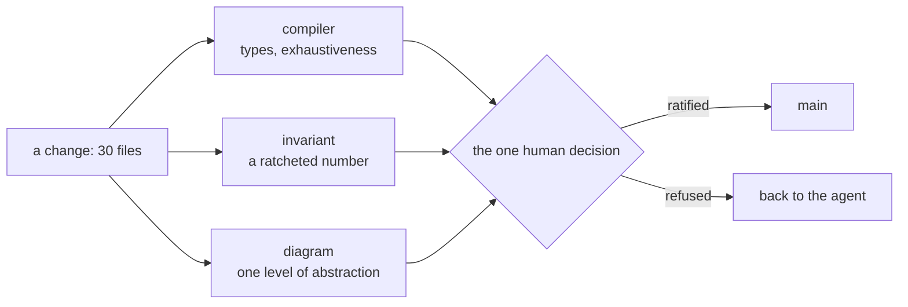
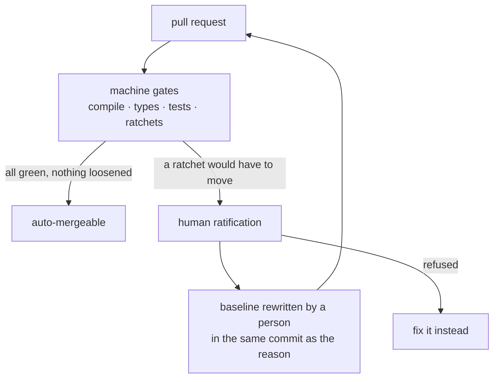
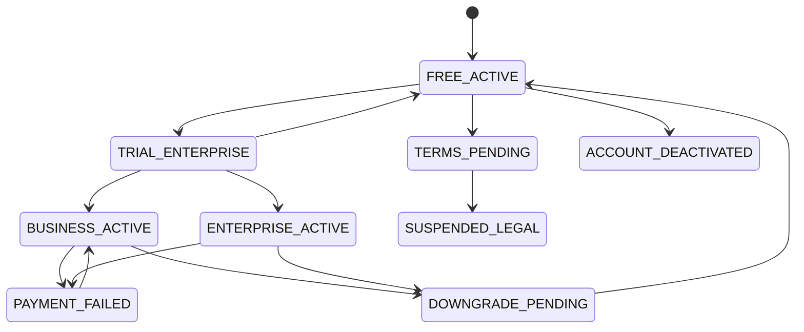

# Governing machine-written change — methods, their precedents, and what each one costs

_Design of record, 2026-09-12. §§1-3 and 10-12 are measured on this estate; the §5 catalogue carries
a status per row; §13 is an open problem with no answer yet. Every figure below is reproducible from
the command or query printed beside it._

The guarantee you actually rely on when you merge is not "the tests pass". It is that whoever wrote
the passing test did not also write the bug. Two people, two mental models, one of them wrong: that
is the whole mechanism, and it has held since the first regression suite.

It stops holding when the same agent writes the code and the test in one pass, from one reading of
the requirement. If the reading was wrong, both halves are wrong and agree with each other. Nothing
is red. The suite still passes, faster than before, and it now certifies a misunderstanding.

This page is what I did about that on a live product, after running coding agents in a loop for
about seven days. It is not a manifesto and it does not propose a methodology to adopt. It is a
catalogue of specific mechanisms, each with an industrial precedent, a machine check, an honest
status, and the failure it was bought to prevent. Several of them are running here; several are not
yet built and say so.

---

## 1 · The loop that worked

_Shipped and still running; this section is history, not design._

The loop this repository was built with, before the seven days:

1. Design the architecture, and model it as a graph so it stays navigable.
2. Groom the work into slices small enough to hold in one head.
3. **Design the tests first** — the BDD corpus and the integration tiers, from the requirement.
4. Model the change with AI: interfaces, edge cases, the shape of the data.
5. Let the agent write the implementation.
6. Click through the result, then let the pre-existing suite say whether anything else moved.

Step 6 is the load-bearing one. The tests were written before the implementation and from a separate
reading of the requirement, so when one went red the triage question was sharp: _is this red expected
from the change I just made, or is it a change that should not have happened?_ That question has an
answer only because the oracle was independent of the thing it judges.

Two conditions break it, and by 2026-09-11 both held here:

| Condition                                     | What it does to step 6                                                                                                                                          |
| --------------------------------------------- | --------------------------------------------------------------------------------------------------------------------------------------------------------------- |
| The same agent authors the code and the tests | The oracle stops being independent. A shared misunderstanding produces a green suite.                                                                           |
| A single change lands across 30 files         | The human review that backstopped the suite stops being possible at the diff level. Nobody reads 30 files at the necessary depth, under a deadline, repeatedly. |

Everything below follows from those two lines.

---

## 2 · Seven days, measured

_Measured 2026-09-12 through the GitHub API; every row reproducible with the query beneath the table._

Scanners were switched on during the loop, so these counts measure the volume of change and the
scanner surface at once, not a security posture before and after.

| Repository                                                                     | Code scanning | Fixed | Dismissed | Open | Dependabot      |
| ------------------------------------------------------------------------------ | ------------- | ----- | --------- | ---- | --------------- |
| [checkitout-backend](https://github.com/Check-It-Out-Dev/checkitout-backend)   | 1151          | 582   | 550       | 19   | 138 (137 fixed) |
| [checkitout-frontend](https://github.com/Check-It-Out-Dev/checkitout-frontend) | 335           | 265   | 63        | 7    | 82 (all fixed)  |

```bash
gh api "repos/Check-It-Out-Dev/checkitout-backend/code-scanning/alerts?per_page=100" --paginate \
  -q '.[].state' | sort | uniq -c
```

Alerts were created 2026-09-09 to 09-11 and closed 09-10 to 09-11. 1486 findings across two
repositories in three days is not a quality collapse — it is three scanners meeting a codebase for
the first time. The number that matters is what happened to them, which is §11.

> [!NOTE]
> Every one of the 613 dismissals was made by one account and carries a written comment. That is not
> a boast; it is the property the check in §5 exists to keep true when it is no longer one person.

---

## 3 · What the seven days taught

_The narrative spine. Everything after this is what follows from these five lines._

1. **The oracle problem arrives before the volume problem.** Losing test independence is silent;
   losing review capacity is at least visible as a backlog.
2. **A number a machine re-derives stays true; a number a human typed goes stale and nobody notices.**
   Proven three times over on this repository's own README — §10.
3. **Manual discipline does not fail gradually, it fails in bursts.** The contract sync here worked
   at every one of its five exercises, then lost to seven commits in one evening — §10.
4. **Where a finding goes matters more than whether it was found.** Meta measured a batch-mode fix
   rate near zero against over 70% for the same findings surfaced on the diff. Everything expensive
   in this estate currently runs at night — §5, row 3.
5. **A dismissal is a debt, not a decision.** 509 of ours are right, and are right only because a
   document and a test say why — §11.

---

## 4 · Bandwidth is the problem diagrams solve

_Design; the diagram-as-invariant mechanism is not built yet — see §5, last row._

A reviewer reads about one screen at a time and holds roughly four things in working memory at once.
A 30-file diff is not a bigger version of a readable diff; it is a different category of object, in
the way a spreadsheet is not a longer sentence.

So a diagram here is not documentation. It is a lossy compression chosen so that the part that
survives is the part a human has to decide about. That framing has a consequence people skip: the
compression must be **generated from the thing it describes**, or it compresses a wish.



Each of the three boxes throws away almost everything. That is their function. The design question
is only ever _what survives_, and the answer differs per level — which is why one diagram holds one
level of abstraction and no more.

---

## 5 · The method catalogue

_Status per row. ✅ running here · 🟡 partly · ⬜ designed, not built._

| Method                                 | What it governs                                           | Industrial precedent                                                                                                                                                                                                             | The machine check                                                                                                    | Status                                                           |
| -------------------------------------- | --------------------------------------------------------- | -------------------------------------------------------------------------------------------------------------------------------------------------------------------------------------------------------------------------------- | -------------------------------------------------------------------------------------------------------------------- | ---------------------------------------------------------------- |
| Byte-identical generated artefact      | The API contract                                          | Nearest analogue: AWS Cedar's daily differential testing of the Rust engine against its Lean model                                                                                                                               | Regenerate, then diff. Any difference is a contract change by definition                                             | 🟡 artefact committed both sides; no gate compares them — §10    |
| Ratchet with human ratification        | Any metric an agent could optimise against                | Google runs mutation testing against the diff and surfaces it in review (Petrović & Ivanković, ICSE SEIP 2018)                                                                                                                   | A committed baseline; lowering is free, raising requires a person running `--write-baseline`, never CI               | ✅ `tools/ci/fuzz-baseline.json`, mutation floors both repos     |
| Report on the diff, not at night       | Whether a finding is ever acted on                        | Meta's Infer: batch fix rate ≈0%, at diff time >70% (Distefano et al., CACM 2019)                                                                                                                                                | Which tier a check sits in: `pr.yml` versus `nightly.yml`                                                            | 🟡 the expensive tiers are nightly here                          |
| Tests generated from a declared domain | The gap between the declared input space and the real one | MongoDB abandoned trace-checking after 10 weeks, then generated 4,913 tests from the same spec and reached 100% branch coverage in about two                                                                                     | Schemathesis generating requests from the OpenAPI document against a running server                                  | ✅ `api-fuzz.yml`; it found an undocumented 401 on its first run |
| Model as an oracle, not as a proof     | Business logic                                            | AWS Cedar: the Lean proofs found 4 bugs, differential testing against the same model found 21                                                                                                                                    | Random command sequences run against a reference model and the implementation, compared                              | ⬜ designed — §12                                                |
| Model checking a protocol design       | Concurrency, retries, idempotency                         | AWS on S3, DynamoDB and EBS: engineers productive in 2-3 weeks; one DynamoDB defect needed a 35-step counterexample (Newcombe et al., 2015)                                                                                      | TLC or Quint over a small model, in CI                                                                               | ⬜ designed                                                      |
| Learning the model from behaviour      | Drift between intent and what runs                        | Protocol state fuzzing learned automata from TLS implementations and found real flaws by diffing them against the specification (de Ruiter & Poll, USENIX Security 2015); AWS PObserve checks production logs against the P spec | Conformance check of an event log against the model                                                                  | ⬜ designed                                                      |
| Dismissal register                     | Human judgement under deadline pressure                   | — (own)                                                                                                                                                                                                                          | Every dismissal has a comment, a disposition document that exists, a test holding its control, and a per-rule budget | 🟡 all true by hand today, nothing enforces it                   |
| Attestations and seeded canaries       | Whether the reviewer read the diff                        | TSA projects synthetic threat images into X-ray screening to measure attention rather than trust it                                                                                                                              | Detection rate per reviewer; attestation fields tied to diff content                                                 | ⬜ designed — §9                                                 |

Three of these are running, two partly, four not at all. The catalogue is deliberately wider than
the implementation, because the sequencing decision — which of them to buy next — is the actual
engineering, and it depends on which failure you have evidence of. Ours is in §10.

---

## 6 · Writing code a formal description can be generated from

_Design. The subscription domain does not satisfy this today — §12._

Whether a model can be extracted from code deterministically is not a tooling question. It is a
question about where the model was put:

| Where the model lives                                        | Extraction                                                                      | Example here                                                             |
| ------------------------------------------------------------ | ------------------------------------------------------------------------------- | ------------------------------------------------------------------------ |
| **Declarative** — types, annotations, configuration, a table | Exact, decidable, no inference                                                  | `@PreAuthorize` to a role × endpoint matrix; springdoc to `openapi.json` |
| **Imperative** — branches spread across a service            | Approximate at best: static analysis over-approximates, tests under-approximate | 16 `setStatus` calls in one 948-line service                             |
| **Intent** — why the rule exists                             | Not extractable at all. It was never in the code                                | Why a downgrade is refused during a trial                                |

Rice's theorem is about semantic properties, and it is why the middle row can never be finished.
Syntactic properties are decidable, which is the whole trick: **move what matters into the first
row**, and extraction stops being research. A transition table is data; a `switch` over statuses
scattered across sixteen methods is not.

---

## 7 · Enforcing it with the compiler

_Partly shipped: the contract half is; the state-machine half is §12's work._

The cheapest formal method is the one already in the build. Exhaustiveness over a sealed type is a
totality proof, checked on every compile, at no cost:

- A `switch` with no `default` over an enum fails to compile when a constant is added. That turns
  "we updated every branch" from a review promise into a compiler error.
- A byte-identical generated artefact turns contract drift into a diff rather than a discussion.
  `OpenApiSpecGeneratorTest` boots the application, fetches `/api/v3/api-docs`, canonicalises the
  JSON with sorted keys and writes it, so the same code always produces the same bytes.
- Compile-time contract assertions (`Expect<Equal<A, B>>`, fourteen lines in
  `src/testing/type-assert.ts`) make a shape mismatch a red build rather than a runtime surprise.

The rule set worth adding here, measured against this codebase rather than recommended in general,
is in the implementation plan: `-Xlint:all` behind a ratchet before `-Werror`;
`noUncheckedIndexedAccess` (193 errors today) behind a ratchet; `isolatedDeclarations` rejected at
677 errors, almost all inside a generated client that already carries `@ts-nocheck`.

---

## 8 · Wiring it into CI/CD with a human in the loop

_Shipped for the fuzz and mutation tiers; the contract gate is the next slice._



Three rules make this work, and all three are about who may move a threshold:

1. **A machine may lower a budget; only a person may raise one.** `--write-baseline` does not run in
   CI. The number and the reason land in one commit, which makes the loosening reviewable as a diff.
2. **An unclassified finding gates by default.** A check that meets something it has no rule for
   must fail, not pass. Otherwise every new category is silently exempt.
3. **A rule that matches nothing reports zero problems.** Every gate needs a domain assertion — "at
   least N controllers exist" — or it will pass forever after a rename. This is the failure mode
   people never test for, and §14 is how we test for it.

---

## 9 · The human-review question

_Design, and one rejection. Nothing here is built._

The honest framing first: this is not about people being careless. It is about what a deadline does
to attention, and about the fact that reviewing machine-written code is measurably _more_ effort
than reviewing a colleague's, not less.

**Biometrics at merge: investigated, rejected.** A fingerprint or a hardware key proves that a
specific human was present and consented. It proves nothing about whether they read the diff.
Presence is necessary and nowhere near sufficient, and buying an expensive control that measures the
wrong variable is worse than buying none, because it produces a record that looks like assurance.

**"Was this review written by AI?": the wrong question.** Text classifiers for machine-generated
prose are unreliable at the individual level and are documented to misfire on non-native English
writers — using one would punish the wrong people for the wrong reason. It is also the wrong target:
an AI-assisted review by someone who read the diff is fine, and a hand-typed "LGTM" from someone who
did not is not.

**What replaces it: controls that are cheap if you read the diff and expensive if you did not.**

| Control                                                                  | Cost to a reviewer who read it      | Cost to a rubber stamp                              |
| ------------------------------------------------------------------------ | ----------------------------------- | --------------------------------------------------- |
| Specific attestation ("I checked that endpoint X still requires role Y") | Seconds — they already know         | They have to go and find out                        |
| Seeded canary defect, disclosed as policy, never merged                  | Zero                                | Detection rate is measured, per reviewer, over time |
| A size cap on critical paths                                             | Zero — the change was already small | Forces the 30-file change into reviewable pieces    |

> [!NOTE]
> Until 2026-09-12 neither repository had branch protection, a ruleset, or CODEOWNERS: nothing
> mechanically required a review at all, and this page was written from inside that position. It
> ships with the configuration that ends it — a ruleset on `main` in both repositories requiring a
> pull request and a green `Merge verdict`, with **no bypass for anyone, admins included**, and a
> CODEOWNERS file naming the invariant surfaces.
>
> What the ruleset deliberately does **not** require is an approval. GitHub does not let an author
> approve their own pull request, so on a repository with one maintainer a required approval makes
> every pull request permanently unmergeable — the control would have to be bypassed on its first
> use, which is worse than not having it. So the gate buys two real things, a rendered diff and CI
> that cannot be skipped, and does not pretend to buy a second reader. Raising the count to 1 the
> day someone else has write access is a one-line change, and CODEOWNERS is already written for it.
>
> This is the honest shape of the problem for a solo maintainer: every mechanism in §5 can be
> built alone, and the one in this section cannot.

---

## 10 · Worked example — three published claims, checked

_Measured 2026-09-12. This is the evidence for §3's lines 2 and 3._

This repository publishes its numbers, and gates some of them: `tools/check-published-numbers.mjs`
fails the build when a README figure disagrees with `docs/testing/measured-counts.json`. So there is
a natural experiment running here between gated and ungated claims.

| Claim, as published                                                                     | Where                                                               | Reality on 2026-09-12                                                                                                                                                                                      |
| --------------------------------------------------------------------------------------- | ------------------------------------------------------------------- | ---------------------------------------------------------------------------------------------------------------------------------------------------------------------------------------------------------- |
| `96ceb20f4483…`, "byte for byte the same file in both repositories"                     | backend `README.md:162-166`                                         | The backend file hashes `2b413dda…` (680,620 bytes), the frontend's copy `73b99335…` (665,242 bytes). The published hash matches **neither** — and matches none of the 15 committed revisions of that file |
| "234 paths · 279 operations · 182 schemas"                                              | backend `README.md:149-150`, an ASCII block no gate reads           | 233 paths, 272 operations, **205** schemas                                                                                                                                                                 |
| "Byte-identical to the copy in the backend repository — `sha256sum` it in both and see" | frontend `docs/README.md:14`                                        | Invites the reader to run the command that disproves it                                                                                                                                                    |
| "205 schemas"                                                                           | backend `README.md:116`, **gated** by `check-published-numbers.mjs` | Correct                                                                                                                                                                                                    |

The gated number survived seven days of machine-written change. The three ungated ones did not, and
one of them is an instruction to the reader to verify it.

**What actually diverged, and why it is not a filing error.** The two committed specs agree on 233
paths and 272 operations and disagree on 22 schemas:

- 24 schemas exist only in the backend, and **all 24 are reachable from paths** — so this is not a
  generator pruning unused definitions.
- 2 exist only in the frontend: `FilterProvider` and `MappingJacksonValue`, Jackson internals that
  the backend's 2026-09-11 typing work removed. That dates the frontend's copy.
- Of the 11 schemas present in both but different, **10 differ materially** — `InfluencerPublicProfileDto`
  gained 11 properties, `CompanyPublicProfileDto` a newly required `profileType`, `UserDtoOut` and
  `NipLookupResponse` changed property types. Only `OpportunityStatus` differs by description alone.
- `tools/openapi-cycle.mjs:107` is a plain `copyFileSync`, so none of this is a transform artefact.

**The cause is the interesting part.** The two copies were byte-identical at every one of their five
sync points, most recently `758d3188…` on 2026-09-11. Then the backend committed the contract
**seven more times that evening** — typing previously untyped responses — and the sync, which runs
only when a person types `npm run openapi:cycle`, did not.

The discipline never failed while it was exercised. It lost to a burst. And the frontend's typed
client — the compile-time contract check this estate's whole test strategy rests on — is generated
from the stale copy, so it currently proves conformance to yesterday's contract.

That is the argument for §5's first row in one paragraph: an artefact that two repositories must
hold identically needs a machine comparing them, because the failure mode is not carelessness, it is
throughput.

---

## 11 · Worked example — 509 alerts, one control

_Measured; the disposition and its test are both in the backend repository._

Of the backend's 550 dismissals, 509 are a single rule: `java/log-injection`. Dismissing 509
findings is either the most honest or the most suspicious act in this whole estate, so here is the
reasoning, which lives at
[`docs/security/log-injection-disposition.md`](https://github.com/Check-It-Out-Dev/checkitout-backend/blob/main/docs/security/log-injection-disposition.md)
and is what each dismissal comment points at.

The query is right: user-controlled values reach loggers in 509 places. The risk is not code
execution, it is **forgery** — a newline ends a record early and the attacker writes a second,
invented one into the audit trail. The control is at the sink: every deployed profile writes
structured JSON, where an encoder escapes newlines, so one record stays one record whatever the
message contains. Sanitising 509 call sites would have been weaker in every dimension that matters:
one missed site is the whole hole, and every log statement written afterwards is a new chance to
miss one. `LogForgeryUnitTest` holds the control in place — if anyone restores the pattern encoder,
it fails before the alerts would reopen.

**A dismissal is a debt, not a decision.** What makes these 509 defensible is not that a person
judged them; it is that the judgement is re-derivable by someone else, later, without asking that
person. Four properties, each of which a machine can check, and none of which is enforced yet:

| Property                                                                          | State on 2026-09-12                          |
| --------------------------------------------------------------------------------- | -------------------------------------------- |
| Every dismissal carries a comment                                                 | ✅ all 613 across both repositories          |
| The comment points at a disposition document that exists                          | 🟡 true for the 509; unverified for the rest |
| The disposition names the test holding its control, and that test is not disabled | 🟡 true for this one                         |
| Per-rule dismissal counts stay inside a committed budget                          | ⬜ not built                                 |

The same discipline already appears in a second place, written by hand before any tool asked for it:
`sonar-project.properties` in this repository carries seven rule exclusions, each scoped to one rule
and one path, each with its reasoning in the file, one pointing at
[`ADR-input-labels.md`](ADR-input-labels.md), and several recording that the real finding was fixed
first and only a residual case is excluded. The register's job is to turn that convention into
something that fails a build when it lapses.

**Open alerts need the mirror-image treatment.** 19 and 7 remain open, and some of them are the
consequence of fixing something else — reliability work opens new findings. So the metric is
per-rule age and trend, never a single total, because a total hides exactly that effect.

---

## 12 · Worked example — a state machine that exists in three places

_The divergence is measured; the target state is designed and not built._

| Where                                                                           | What it says                                                                         |
| ------------------------------------------------------------------------------- | ------------------------------------------------------------------------------------ |
| `docs/StripeGateway/REQUIREMENTS.md` §11 and the Neo4j `subscription` namespace | 10 states, 56 transitions                                                            |
| `SubscriptionStatus.java`                                                       | 9 constants, no transition table. The documented `ACCOUNT_CREATED` does not exist    |
| `SubscriptionService.java`                                                      | 16 `setStatus` writes across 16 methods of 948 lines, guarded by ad-hoc `if`/`throw` |

Nobody wrote three models on purpose. One was designed, one was implemented, one accreted — and
nothing compares them, so the disagreement is invisible until someone reads all three.

There is a second cost, and it is the one that decided the priority. PIT deliberately excludes this
domain: its tests are Testcontainers integration tests, so mutants would report `NO_COVERAGE` and
say nothing. The highest-stakes logic in the product is the one place mutation testing cannot reach,
_because_ the logic is entangled with the database.

The target state, bottom-up:



_The nine constants that exist in code today, drawn from the enum rather than from the requirement.
Once the transition table exists this diagram is generated from it and gated by `git diff
--exit-code`, so the picture cannot drift from the code without failing a build._

1. **The alphabet.** `canTransitionTo`, `getPossibleTransitions`, `isTerminal` on the enum, in the
   shape this codebase already uses at `OpportunityStatus.java:195` — a `default`-less exhaustive
   switch, so a tenth constant is a compile error rather than a missed branch.
2. **The transition core.** A `SubscriptionTransition(from, event, to)` record and a pure table.
   No Spring, no database, no containers — therefore unit-testable, mutable by PIT, and checkable by
   random command sequences against a reference model.
3. **Composition.** All 16 writes become one `applyTransition`, with an ArchUnit rule forbidding
   `setStatus` anywhere else. The diagram and the README's counts are then generated from the table.

The invariant has a hole exactly here, which is why it is the worked example: both subscription
controllers are `@Hidden`, so this surface is absent from the contract, and the frontend hand-froze
`SubscriptionStatus` into `src/app/core/api-frozen/hidden-models.ts`. The contract chain does not
currently cover the domain that needs it most.

---

## 13 · How we will know it worked

_Design. The seeded-violation drill is the first thing built, because every other number depends on it._

**Defects per thousand lines is the wrong instrument now.** It assumes the denominator is expensive.
When a machine writes the lines, density can improve while absolute defects rise — the figure
flatters exactly the situation it should warn about. Per-change and per-escape metrics replace it.

| Family  | Metric                                                                                                                                                         | Why this one                                                                                                  |
| ------- | -------------------------------------------------------------------------------------------------------------------------------------------------------------- | ------------------------------------------------------------------------------------------------------------- |
| Leading | **Seeded-violation detection rate**: break an invariant deliberately, record which gate caught it and at which stage                                           | The invariant analogue of a mutation score, and the only defence against a rule that silently matches nothing |
| Leading | **Escape stage**: for each defect, the earliest gate that could have caught it — compiler, unit, mutation, contract, integration, browser, nightly, production | Success is the distribution moving left over months, not a single number improving                            |
| Leading | **Ratchet integrity**: baseline raises versus lowers, each with the commit that justified it                                                                   | A raise is a governance event. Counting them is how you notice the ratchet becoming decorative                |
| Leading | **Dismissal debt**: dismissals lacking a disposition or a test, and their age                                                                                  | §11                                                                                                           |
| Human   | Canary detection rate; share of pull requests merged unreviewed; diff size on critical paths                                                                   | Measures attention instead of trusting it                                                                     |
| Lagging | DORA change-failure rate and time to restore; revert rate; **incidents per change, never per line**                                                            | The only outcomes that matter, and the ones AI-heavy delivery is measured to degrade                          |

**Quality, on the changed code.** Gate what is expensive to game and observe the rest, and measure it
on the diff rather than the repository, because a delta on a diff is attributable:

| Dimension                                           | Gate or observe           | Instrument here                                                                                                                                                        |
| --------------------------------------------------- | ------------------------- | ---------------------------------------------------------------------------------------------------------------------------------------------------------------------- |
| Do the tests check anything                         | Gate, ratcheted           | Stryker 72.84% (83.29% on covered code, 486 mutants); PIT 43.35% (69.22% on reached code). Both nightly and deliberately narrow today; the work is scoping to the diff |
| Duplication, cognitive complexity, new findings     | Gate                      | SonarQube Cloud on new code                                                                                                                                            |
| Refactoring share — moved lines against added lines | Observe                   | The decay to watch: GitClear's 2026 corpus measured duplicated blocks up 81% and refactored code down from 21% to 3.8% under AI-heavy authorship                       |
| Model-code agreement                                | Gate where a check exists | The invariants above                                                                                                                                                   |

**And the honest limit.** One product, one developer, no control group. No statistical claim about
defect reduction is available here, and manufacturing one would be precisely the kind of number this
page argues against. The defensible claim is a capability claim: _these classes of change can no
longer reach `main` without a human decision, and here is the seeded violation proving the gate
fires._ That is the form AWS uses for TLA+ — not "bugs fell by N%", but "this defect required a
35-step counterexample and testing would not have found it".

---

## 14 · Open problem — the test population

_Stated, not answered. The method is being developed; this section will be replaced when it is._

Governing the code leaves the suite ungoverned, and the suite is now also machine-written. Three
questions I do not yet have a principled answer to:

1. **How many tests are the right number?** Test count is a vanity metric, and an agent will happily
   add a thousand assertions that restate the implementation.
2. **Which tests may be deleted?** The measurable that looks most promising: a test whose removal
   changes no mutation outcome kills nothing its neighbours do not already kill. That is a deletion
   criterion with an instrument behind it rather than a taste argument.
3. **How do you rewrite a test so it stops depending on the code it judges?** The independence lost
   in §1 has to be rebuilt structurally — the oracle derived from the specification, not from the
   implementation, and the agent that writes it denied sight of the implementation.

The instruments needed already run here: mutation score per test, and coverage differential between
tiers (a branch reached only by unit tests and never by a black-box tier is either dead or outside
the contract). What is missing is the method, not the data.

---

## 15 · Status ledger

_The whole page in one table. ⬜ means designed and not built; nothing here is aspirational prose._

| #   | Mechanism                                           | Status | The machine check today                                                                                                            |
| --- | --------------------------------------------------- | ------ | ---------------------------------------------------------------------------------------------------------------------------------- |
| 5   | Ratchets with human-only loosening                  | ✅     | `fuzz-verdict.mjs --write-baseline`, refuses to run in CI                                                                          |
| 5   | Tests generated from the declared domain            | ✅     | `api-fuzz.yml` (Schemathesis)                                                                                                      |
| 5   | Mutation tiers with floors                          | ✅     | `mutation.yml` both repositories, floors 70 and 40                                                                                 |
| 5   | Published numbers gated against a generated file    | ✅     | `check-published-numbers.mjs` (G15)                                                                                                |
| 7   | Byte-identical contract artefact                    | 🟡     | Generated deterministically; **nothing compares the two repositories** — §10                                                       |
| 5   | Checks on the diff rather than at night             | 🟡     | The expensive tiers are nightly                                                                                                    |
| 11  | Dismissal register                                  | 🟡     | Convention holds by hand; no check                                                                                                 |
| 12  | Subscription transition table and generated diagram | ⬜     | none yet                                                                                                                           |
| 12  | Reference-model differential testing                | ⬜     | none yet                                                                                                                           |
| 5   | Model checking the webhook races                    | ⬜     | none yet                                                                                                                           |
| 9   | Attestations and seeded canaries                    | ⬜     | none yet                                                                                                                           |
| 9   | Branch protection, rulesets, CODEOWNERS             | 🟡     | Ruleset on `main`, both repositories: pull request required, `Merge verdict` required, no bypass. Zero approvals required — see §9 |
| 13  | Seeded-violation detection rate                     | ⬜     | none yet                                                                                                                           |
| 13  | Test-population method                              | ⬜     | open problem — §13                                                                                                                 |

---

## Sources

The precedents cited above, in order of appearance:

- Distefano, Fähndrich, Logozzo, O'Hearn, _Scaling static analyses at Facebook_, CACM 2019 — the
  batch versus diff-time fix rates.
- Petrović & Ivanković, _State of Mutation Testing at Google_, ICSE SEIP 2018 — mutation testing
  surfaced on the diff in review.
- Newcombe, Rath, Zhang, Munteanu, Brooker, Deardeuff, _How Amazon Web Services Uses Formal Methods_,
  CACM 2015 — TLA+ on S3, DynamoDB and EBS; 2-3 weeks to productivity; the 35-step counterexample.
- Disselkoen et al., _How we built Cedar: a verification-guided approach_, FSE 2024 — 4 bugs from
  proofs, 21 from differential testing against the model.
- _Conformance checking at MongoDB_, MongoDB engineering blog — trace-checking abandoned at 10 weeks;
  4,913 generated tests to 100% branch coverage in about two.
- de Ruiter & Poll, _Protocol state fuzzing of TLS implementations_, USENIX Security 2015 — learned
  automata diffed against the specification.
- AWS P language case studies and PObserve — production logs checked against the specification.
- GitClear, _AI code quality and maintainability_, 2026 — duplication and refactoring-share trends.
- DORA, _State of AI-assisted software development_, 2025 — throughput up, stability down.
