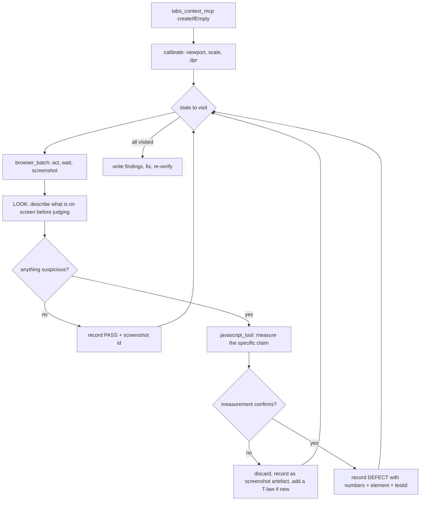

# Browser QA methodology — watching the demo with our own eyes (2026-09)

One sentence: **the automated tiers prove the demo does not stutter and does not
break; they cannot tell us it looks right — so this document defines how an
agent drives the sandbox in a real Chrome window, state by state, and turns
"that looks off" into evidence or discards it.**

Everything below is written to be executed by an agent (Claude), not by a
person. It is a living document: every run appends to §11, and any rule that
turns out to be wrong is rewritten in place rather than worked around.

---

## 1. Why this exists

| We already have                       | It proves                                                  | It cannot see                                                       |
| ------------------------------------- | ---------------------------------------------------------- | ------------------------------------------------------------------- |
| `npm run test:perf` (19 tests)        | no long frames, no dead ends, budgets held, keyboard works | whether the thing is _legible_, _aligned_, _pretty_, or _confusing_ |
| `npm run test:visual` (275 baselines) | pixels of isolated sandbox fixtures did not change         | anything about the assembled, live, mid-tour page                   |
| jest (1078)                           | logic                                                      | —                                                                   |

A baseline only says "the same as last time". If the tour looked wrong the day
the baseline was taken, it still looks wrong and every run is green. The gap is
_first sight_: no one has watched all 24 steps and asked "is this good?".

## 2. The two servers, and which to reach for

|          | `claude-in-chrome` (extension)                                                                                                                                             | `chrome-devtools-mcp` (CDP)                                                                                                                                                  |
| -------- | -------------------------------------------------------------------------------------------------------------------------------------------------------------------------- | ---------------------------------------------------------------------------------------------------------------------------------------------------------------------------- |
| Runs in  | the owner's real Chrome, real profile, real extensions                                                                                                                     | its own Chrome instance                                                                                                                                                      |
| Best for | **seeing** — screenshots of the real thing, hover states, the actual rendering the owner gets                                                                              | **measuring** — traces, insights, emulation, CPU/network throttling, deterministic geometry                                                                                  |
| Gives    | `computer` (screenshot/zoom/click/hover/scroll/key), `read_page` (a11y tree), `find`, `javascript_tool`, `read_console_messages`, `read_network_requests`, `browser_batch` | `take_snapshot` (uid model), `take_screenshot`, `performance_start_trace` + `performance_analyze_insight`, `emulate` (viewport/CPU/network/colour scheme), `evaluate_script` |
| Weakness | no CPU throttling, no trace, coordinates are not CSS pixels, stateful `zoom`                                                                                               | not the owner's browser; a clean profile hides profile-specific problems                                                                                                     |

**Rule: sight from the extension, numbers from CDP, and never trust one where
the other is authoritative.** A screenshot suggests; the DOM decides.

## 3. Calibration — measured first-hand, 2026-09-06

These were established by experiment in this repo's live demo, not read
anywhere. Re-run §3.1 at the start of every session; the numbers change with
the window.

### 3.1 The calibration probe (always first)

```
tabs_context_mcp {createIfEmpty:true}          → tabId
browser_batch [
  navigate {tabId, url},
  computer {action:"wait", duration:3},
  javascript_tool {text:"JSON.stringify({inner:[innerWidth,innerHeight],dpr:devicePixelRatio})"},
  computer {action:"screenshot"}
]
```

Record `scale = screenshotWidth / innerWidth`. Measured: viewport **1920×911**,
screenshot **1568×744**, `scale = 0.8167`, `dpr = 1`.

### 3.2 Tool laws (each one cost a failed call to learn)

| #   | Law                                                                                                                                                                                                                                                                               | Evidence                                                                                                         |
| --- | --------------------------------------------------------------------------------------------------------------------------------------------------------------------------------------------------------------------------------------------------------------------------------- | ---------------------------------------------------------------------------------------------------------------- |
| T1  | **Screenshot pixels are not CSS pixels.** Convert with `scale` before comparing to anything `getBoundingClientRect()` said.                                                                                                                                                       | 1568 px image of a 1920 px viewport                                                                              |
| T2  | **`resize_window` may report success and change nothing.** Always confirm with `innerWidth`, never assume the viewport.                                                                                                                                                           | asked 1440×900, got "Successfully resized", `innerWidth` stayed 1920                                             |
| T3  | **`zoom` is stateful and sticks.** After a zoom, _every_ later capture — including plain `screenshot` — is cropped to that region, and further zooms are interpreted inside it.                                                                                                   | after one zoom, `screenshot` returned 367×233 and zoom refused regions "exceeding viewport boundaries (367x233)" |
| T4  | **Recovery from a stuck frame: open a new tab.** `resize_window` does not clear it; navigation does not clear it.                                                                                                                                                                 | new tab returned full 1568×744 again                                                                             |
| T5  | **A tab created while a stale group id is held is "not in the same group".** Re-run `tabs_context_mcp` after any tab lifecycle change.                                                                                                                                            | `navigate` failed with "Tab … is not in the same group"                                                          |
| T6  | **The extension disconnects mid-batch.** Transient; retry the same batch once before concluding anything.                                                                                                                                                                         | "Chrome extension disconnected mid-operation" between two items                                                  |
| T7  | **`Page.captureScreenshot` can time out (30 s).** Wait 3 s and retry rather than treating the page as frozen.                                                                                                                                                                     | timed out immediately after a window resize                                                                      |
| T8  | **A downscaled JPEG fakes text clipping.** Uppercase, letter-spaced text at 0.82× reads as cut off when it is not. Confirm with `scrollWidth > clientWidth`.                                                                                                                      | panel hint looked clipped; `scrollWidth === clientWidth === 320`                                                 |
| T9  | **Extension and browser chrome appear in screenshots.** Before reporting any pixel, prove it belongs to us: `document.elementFromPoint(x,y).closest('app-root')`.                                                                                                                 | a circular widget at the right edge was the extension's own indicator, `inApp: false`                            |
| T11 | **Snapshot to navigate, screenshot to judge.** The accessibility snapshot is cheaper and more reliable for finding and acting on elements; the screenshot exists because _seeing_ is the point of this exercise. Do not use a screenshot to locate something a snapshot can name. | chrome-devtools-mcp guidance                                                                                     |
| T12 | **uids go stale.** Take a snapshot, act on uids from _that_ snapshot or from the action's own response, and only re-snapshot when the state actually changed. Re-snapshotting on every step is what makes uids stale.                                                             | chrome-devtools-mcp guidance                                                                                     |
| T10 | **Batch aggressively, but only what you can predict.** `browser_batch` stops at the first error and coordinates inside a batch refer to the screenshot taken _before_ the call — so never batch a click whose coordinates come from a screenshot in the same batch.               | tool contract                                                                                                    |

| T13 | **A disconnect does not mean the actions did not happen.** The extension can report "not connected" after already executing part of a batch. Re-read state before retrying, or you will act twice. | after a disconnect the page had already navigated to the target route |
| T14 | **Prefer `find` → `ref` over coordinates for clicking.** A ref resolves at click time; coordinates go stale the moment the page shifts, and it shifts more than you expect. | a click at the pill's measured centre missed because the page had moved 15 px in the 3 s since the screenshot; the same click by `ref` worked |
| T15 | **A backgrounded tab cannot be observed.** Reading the background tab through the extension makes it visible again, so "what does the page do while hidden" is not a question this instrument can answer. Ask it in the Playwright tier instead. | `javascript_exec` on the background tab returned `document.hidden: false` while another tab held focus |
| T16 | **`emulate` is the second server's reason to exist.** claude-in-chrome cannot change the viewport (T2) and has no media emulation at all; chrome-devtools-mcp's `emulate` does viewport, CPU, network and colour scheme — but not `prefers-reduced-motion`, which only the Playwright tier can force. | the 390×844 sweep and the mid-step 390→1100 resize both ran on chrome-devtools-mcp after `resize_window` refused |
| T17 | **An init script runs before `documentElement` exists.** A `MutationObserver` pointed at `document.documentElement` from an init script throws, and if the throw is swallowed the DOM half of a timeline silently never records. Observe `document`. | the first checkout timeline came back with navigation marks and not one DOM mark |
| T18 | **Instrument a transient element from the mutation records, not the live DOM.** An element that appears and disappears inside one batch is already gone when the callback queries for it. | the checkout dialog lives 101 ms and was invisible to a live-DOM scan |
| T19 | **`textContent` is the untransformed source.** A badge uppercased by CSS reads lowercase there, so a case-sensitive match against it silently never fires — and an instrument that never fires reports the absence of what it was looking for. | a recap detector matching `/GOTOWE/` against `textContent` `"Gotowe"` reported 16.7 s of dead air that did not exist |
| T20 | **Collapsing sampled frames needs an explicit key.** Spreading the sample into the comparison drags in the interval's own duration field, so no two frames ever compare equal and every frame becomes its own state. | 934 frames collapsed to 934 states until the key was written out by hand |
| T21 | **Hiding a control to fake "it is missing" also hides the affordance you were about to press.** Taking the ring's target away makes the ring give up and the panel take over, so the press lands on nothing and the run measures that pressing nothing does nothing. | five of seven tours reported "held, but said nothing about why" — the press had never happened |
| T22 | **A renamed `data-testid` still matches a prefix selector, and a container's id does not gate a recipe aimed at its children.** To simulate "the action did not happen", suppress the _effect_ — swallow the clicks — not the element. | `company-campaign` finds its applicant by `[data-testid^="applicant-accept-"]` and sailed through a `--gone` suffix |
| T23 | **Never guess how long an operation takes — poll for the outcome.** A fixed wait asserts in the middle of the thing it is measuring and reads "still working" as a verdict. Every action whose element never appears costs the runner its full four-second lookup, so a three-click recipe with a swallowed first click needs ten seconds before its `done` wait even begins. | three separate false failures today at 3 s, 7.5 s and 2.6 s — each of them the clock, not the app |
| T24 | **A product that deliberately moves ahead of itself will read as the defect you are hunting.** Sample until the state settles, not on the first change. The checkout persisted its next step _before_ running its recipe, so "did this step advance without its action?" answered yes on every run — correctly, and about the wrong thing. | the phantom sweep failed `nip-to-ksef` twice after the bug was fixed, both times on the pre-advance |
| T25 | **A cross-document ledger must append, not overwrite.** A recorder that writes its whole in-memory buffer to `sessionStorage` loses everything measured before a reload, the moment the new document records its first entry — and a reload is usually the interesting part. Flush and clear; never write the buffer wholesale. | caught by reading `demo-flash.spec.ts` before running it; it would have silently dropped the checkout, the beat it was built for |
| T26 | **An automated walk is infinitely fast, so anything waiting for a person looks like a flash.** Record who ended a transient: if the walker pressed something between its appearing and its going away, it was answered, not taken away. | three of the flash sweep's first four findings were dialogs patiently waiting for a press that came 400 ms later |
| T27 | **Wait for the next beat's screen, not for its step number.** The index is persisted the moment a tour advances; the route it names arrives later. Pressing on the index change lands on nothing, and the sweep reports the tour as stuck. Wait for a pressable way forward and for the ring to hold still. | five of seven tours read as broken in two independently written sweeps on the same afternoon, for this alone |
| T28 | **Only the top layer is being read.** Text behind an open dialog is dimmed by a backdrop and is explicitly not what the visitor is looking at; a geometry sweep that walks the whole document reports the pill covering headings two layers down. | `admin-ops` step 2 "the pill covers Wymagania by 132x6 px" — a campaign-detail label behind the cascade dialog |
| T29 | **An automated walk is too fast to film.** Driven at machine speed the whole 2FA tour finishes in 1.3 s — three presses, each the instant the pill appears. True, and a useless film: every "must stay readable" requirement then fails on the robot's impatience rather than on anything the application did. The film walk reads each beat before acting. | 18.8 s of footage instead of 2.3 s, and a readability sweep that measures the product |
| T30 | **A contact sheet cannot carry a legibility question.** A vision model sees in 28 px patches, so tiling a 1440 px frame puts small copy below the resolution it perceives at — and asked to read it anyway, a model guesses rather than declines. Sheets localise; a 2× crop, cut at coordinates the DOM recorded, is for reading. | the arithmetic, and a reviewer that magnified the full frames itself rather than accept the crop it was given |
| T31 | **Never ask a model for a number that was measured.** It receives no image metadata, so a millisecond read off a picture is invented. It names a frame; the manifest converts. Same for distances, contrast and counts above five. | documented vision limits, and the whole division of labour this tier rests on |
| T32 | **A budget nobody measures must not report as passing.** `readableMs` decided which phases got a crop and timed nothing, while the prompt told the reviewer the machine was timing it. Fixing that revealed the sampler was not watching the elements either, so the new measurement reported zero problems across fourteen films — a clean bill of health from measuring nothing. | an agent read the prompt, checked the source, and filed it as friction |
| T33 | **An instrument that encodes a rule must change with the rule.** Two budgets said "the ring is six pixels outside its control"; the day the ring learned to stop at the edge of a scrolling card, both called that an error — one of 48 px. The contract moved and its witnesses did not. The tier is not run by the pre-commit gate, so three commits landed between the change and the discovery. | the ring's clip: 3 failures, 0 of them the app doing anything a visitor would mind |
| T34 | **A convenience that skips a check is a check that is off.** `npm run test:perf` verified the demo build was newer than `src/` only in the branch that starts its own server, so a server left running from earlier work silently disabled it. Two fixes were written, measured against the bundle from before them, and read as not working. | an hour lost, twice |
| T35 | **New evidence makes new false findings possible; hand it over with its limits.** Giving the reviewers the recorded boxes answered two "a picture cannot settle this" reports at once — and a box at 0,0 is an element measured before it was placed, invisible while it waited. Without that sentence the next reviewer reports a pill at the corner of the screen that nobody ever saw. | checked against the frame before writing the sentence |
| T36 | **A run that substitutes a different route must say so.** Half the corpus claims to be the by-hand walk, which is where the worst defects have hidden all week — and for one tour every beat of it fell through to the guide's pill, producing a film frame for frame identical to the guided one under the other label. Nothing in the artifact said so; a reviewer had to read the trace. | support-ticket-hand, and then admin-2fa's two code beats |
| T37 | **The one frame that matters most is the one a sampling rule is most likely to drop.** A 40 ms minimum gap between captured frames is right for a stream and wrong for its last event: a tour's final transition repaints once, milliseconds after the previous frame, so the throttle discarded exactly the frame carrying the payoff — and a still screen produced nothing to replace it. Three reviewers reported a missing ending on three tours before anyone looked at the throttle. | two wrong diagnoses first — the page going still, and failing acknowledgements — both ruled out by probe |
| T38 | **A budget that fails a third of the time is a reading of the machine.** The worst-frame figure is 222–267 ms idle and 338 ms inside the tier's own twenty-minute run; it was asserted at 250, re-anchored at 320, and failed at both. Report it and assert on the figures that hold across runs. An ignored budget guards nothing. | 102 of its 104 ms is forced style and layout in the ring's own loop, and neither caching the clip search nor removing the opacity read moved it |
| T39 | **A sweep that accepts "somewhere while the beat was live" is asking a weaker question than the one it was written for.** The continuity check let a carrier beat name its subject either on the screen it settled into or on the screen its action produced. The ticket list prints every reference, so the beat that opens the wrong ticket passed on the list it was launched from — with the original defect deliberately re-planted underneath it. Say which screen carries the claim, and the same plant fails. | the plant: `read-response` pointed back at seeded ticket 9001, green before, red after |
| T40 | **The answer to a rule that lives in four places is one copy, not vigilance.** "Where the ring is drawn" existed in the component, in `walk.ts` twice and in the phantom sweep's own probe. It moved twice in a day; each time a copy was left behind, and each time the instrument reported the app as broken — 48 px of drift on a correct ring, a sweep that silently halved its own coverage, a by-hand walk that could no longer see a form field. There is now one `__drawnBox` for the whole tier, installed by `open()` so a walk cannot be blind, and exactly two copies of the rule in the repo: the component's, and the instruments' — deliberately separate, because an instrument that takes the component's word cannot catch the component being wrong. | three false failures across two days, all of them T33 |
| T41 | **Two failures that look identical from outside need a third signal to tell apart.** The phantom sweep reads "the step held and said nothing" as its defect — and a press dropped because the director was still confirming the beat before reads exactly the same. The signal is whether the guide ever went busy: a deafened step still runs its recipe, so a settle that never saw `busy` is a press that never landed. It presses again and says so in the failure message; a second dropped press still fails. | the same flake twice, a fortnight apart, both in loaded runs |

### 3.5 The dead zone — known false positives

The Claude extension injects **`#claude-agent-glow-border`**, a full-viewport
overlay (0, 0, innerWidth, innerHeight) that draws a border around the page and
a round control near the **right edge**. In screenshots it looks exactly like a
clipped icon or a half-cut widget belonging to the app.

| Suspicion                                        | Raised  | Verdict                                                           | How to settle it in one call                                                        |
| ------------------------------------------------ | ------- | ----------------------------------------------------------------- | ----------------------------------------------------------------------------------- |
| "A circular widget is clipped at the right edge" | 4 times | **always the extension**                                          | `document.elementFromPoint(x,y).closest('app-root')` → null                         |
| "The panel's uppercase hint text is clipped"     | 2 times | **never true** — 0.82× JPEG downscale of letter-spaced small caps | `Range.getClientRects()` painted right edge vs the element's box, not `scrollWidth` |

Before judging any pixel within ~40 px of the right viewport edge, assume the
extension until proven otherwise.

**The ring-drift metric lies in three specific ways**, and each cost a false
alarm before it was understood. A centre hit-test on the ring returns the
element under its middle, and that element is:

- an inner `<span>` when the control has one — so the metric walks _up_;
- `mat-dialog-actions` or whatever is behind a control with
  `pointer-events: none`, which Material puts on every disabled button — so it
  must also look _down_, or a correctly-placed ring reads as 285 px off;
- the ring itself if the overlay ever stops being click-through.

The metric now searches ancestors and the hit element's subtree. Before
believing any drift figure, check `matched` — if it names a container rather
than a control, the number is about the metric, not the ring.

### 3.3 Known environment traps (from the model, namespace `DemoSandbox`)

| Trap                                                                        | Consequence for this method                                                                                                                                |
| --------------------------------------------------------------------------- | ---------------------------------------------------------------------------------------------------------------------------------------------------------- |
| The automation tab is backgrounded → `rAF` never fires                      | **The extension drives a foreground tab, which is exactly why it is the right tool for animation.** Never judge motion from a headless/background context. |
| Demo stores are in memory                                                   | Never re-`navigate` to verify a created entity; move inside the app.                                                                                       |
| A probe that reads across the checkout reload dies                          | Expect one "execution context destroyed" at the `upgrade` step; it is not a defect.                                                                        |
| Role locators cannot see the guide behind a Material dialog (`aria-hidden`) | Address the guide by `data-testid`, never by role or text.                                                                                                 |
| `ng serve` is not the application production runs                           | Measure the **built** demo. `npm run serve:demo` serves it with the VPS's own rules; the tier does the same and rebuilds when `src/` is newer.             |

## 3.4 What the research says, and why this document is shaped this way

From a research pass run before the first execution (2026-09-06) and extended
after run 3. Every rule in this document that is not a scar from a failed call
is here, with the finding that produced it. Where a number is quoted it is the
paper's, not ours.

### Why a model looking at a screenshot is a triage step, never the arbiter

| Source                                                                                                                        | Finding                                                                                                                                                                     | Consequence here                                                                                                                        |
| ----------------------------------------------------------------------------------------------------------------------------- | --------------------------------------------------------------------------------------------------------------------------------------------------------------------------- | --------------------------------------------------------------------------------------------------------------------------------------- |
| [UI-Lens, CVPR 2026](https://cvpr.thecvf.com/virtual/2026/poster/38861) — 4,759 expert-annotated pages, six defect categories | multimodal models still produce false positives, missed defects and wrong defect types; no unified cross-vendor accuracy                                                    | §6's evidence rule. Vindicated within ten minutes of run 1: the first two things that "looked wrong" were both artifacts (T8, T9)       |
| [arXiv 2501.09236](https://arxiv.org/abs/2501.09236) — canvas visual bugs, 100 shots / 20 apps                                | recall by class: state 33%, rendering 30%, **layout 20%, appearance 14%**. Adding a bug-free reference image lifts pass@1 from 26% to 39% and precision to a median of 100% | The two classes a guided tour actually breaks in are the two a model is worst at. So the DOM decides, and the screenshot only nominates |
| [VideoGameQA-Bench, arXiv 2505.15952](https://arxiv.org/html/2505.15952v2) — 16 models                                        | image glitch detection 82.8%, but **visual regression 45.2%** and glitch-onset localisation 36%; high hallucination rate on non-existent clipping                           | Never report clipping from a picture — T8 exists because this is a known hallucination mode, and it fired here twice                    |
| [WUICC-Bench, arXiv 2607.01728](https://arxiv.org/html/2607.01728) — 9,906 human-verified web-UI screenshot pairs             | pixel diff: 100% change detection, **0% suppression of meaningless change**. A zero-shot VLM: 99.6% suppression but misses **a third of real changes**                      | Neither alone. Deterministic detection first, judgement second — the shape §3.6's instruments take                                      |
| [XBIDetective, arXiv 2512.15804](https://arxiv.org/pdf/2512.15804)                                                            | the working architecture is pixel-diff → crop the differing region → model classifies bug vs benign; the model never sees the whole page                                    | Why a suspicion is always narrowed to one element and one measurement before it is judged                                               |

### How to ask, once something is worth asking about

| Source                                                                | Finding                                                                                                                                                              | Consequence here                                                                                                                                                  |
| --------------------------------------------------------------------- | -------------------------------------------------------------------------------------------------------------------------------------------------------------------- | ----------------------------------------------------------------------------------------------------------------------------------------------------------------- |
| [UICrit, UIST'24](https://arxiv.org/html/2407.08850v2)                | critique as **expected standard → gap → remediation**; model bounding-box grounding IoU only **0.186**                                                               | §6 requires an expected-vs-observed pair, and anchors every finding to a `data-testid` — never pixel coordinates, which is the thing models are measurably bad at |
| [WebDevJudge](https://arxiv.org/pdf/2510.18560)                       | screenshot-only judging shows superficial visual bias and **interaction blindness**; self-consistency gaps                                                           | The procedure interacts with a state before judging it, and §6 makes the aesthetic verdict a separate sentence from the functional one                            |
| [arXiv 2412.16829](https://arxiv.org/html/2412.16829)                 | asking for critique and its bounding box in one call degrades both; generate the text, then locate it                                                                | Describe first, measure second — the two middle steps of the per-state loop                                                                                       |
| [3D-DefectBench, arXiv 2607.10826](https://arxiv.org/html/2607.10826) | variance explained: **model ≫ visual input ≫ prompt schema**. An elaborate rubric buys ~0.01 macro-MCC; model choice ~0.14. Judges systematically overcall "missing" | Why §8 is short. Effort went into the evidence gate, not into rubric prose                                                                                        |
| [arXiv 2606.06871](https://arxiv.org/pdf/2606.06871)                  | majority voting **backfires** on diagnostic verdicts — an ensemble converged on "no issue found" and scored below a single pass                                      | Never re-run a judgement and take the majority. Take the union of suspicions, then verify each one against the DOM                                                |

### Judging the judge, and knowing when to stop

| Source                                                                                                               | Finding                                                                                                                                                                  | Consequence here                                                                                                                                                   |
| -------------------------------------------------------------------------------------------------------------------- | ------------------------------------------------------------------------------------------------------------------------------------------------------------------------ | ------------------------------------------------------------------------------------------------------------------------------------------------------------------ |
| [AgentRewardBench, arXiv 2504.08942](https://arxiv.org/pdf/2504.08942) — 1,302 expert-reviewed trajectories          | best LLM judge precision **69.8%**; rule-based checks precision 83.8% but recall **55.9%**                                                                               | Neither the agent's own verdict nor a rule alone closes a state. A verdict needs an artifact (§6), which is the only part with better than judge-level reliability |
| ["An Illusion of Progress?", arXiv 2504.01382](https://arxiv.org/pdf/2504.01382) — 300 tasks on 136 live sites       | frontier agents score far below their benchmark numbers on live sites (Operator 61% vs ~90% claimed elsewhere)                                                           | The run measures **production**, not a fixture, and reports what it could not reach rather than rounding up                                                        |
| [arXiv 2606.16650](https://arxiv.org/html/2606.16650) — 5 web-GUI-testing approaches × 6 state abstractions          | all approaches reach **coverage stagnation inside 30 minutes**; the plateau is the stop signal                                                                           | §4.2 enumerates a finite state set instead of exploring, and §7 stops when every state has a verdict                                                               |
| [Anthropic — computer use](https://platform.claude.com/docs/en/agents-and-tools/tool-use/computer-use-tool)          | screenshot after each group of actions and evaluate before continuing; a batch executes in order and **stops at the first failure**; keep instruction text before images | The per-state loop's shape, and T10                                                                                                                                |
| [Anthropic — effective harnesses](https://www.anthropic.com/engineering/effective-harnesses-for-long-running-agents) | make verification **structural, not requested**; the named failure mode is _declaring victory early_                                                                     | The state list lives in Neo4j with a per-state verdict, so "done" is a query and not a claim                                                                       |

### The skill's own contract

| Source                                                                                                          | Finding                                                                                                                                                          | Consequence here                                                                                                                                                                   |
| --------------------------------------------------------------------------------------------------------------- | ---------------------------------------------------------------------------------------------------------------------------------------------------------------- | ---------------------------------------------------------------------------------------------------------------------------------------------------------------------------------- |
| [Agent Skills best practices](https://platform.claude.com/docs/en/agents-and-tools/agent-skills/best-practices) | `description` is the only text preloaded, so it alone decides invocation; body under 500 lines; references one level deep; match degrees of freedom to fragility | §9's shape exactly: a description written in the words a person uses, a 129-line body, three references, and low-freedom wording for the fragile sequences (calibration, batching) |

The division of labour: **the tiers own the numbers, this document owns the
looking.** If a run finds something a tier could have caught, the fix includes
adding it to that tier (§7 Phase 5).

## 3.6 Two instruments, and which question each answers

Screenshots and single probes settle "is this element where it should be". They
cannot settle "it froze" or "these two things disagree", because both are claims
about _moments_, and a moment needs a clock.

| The claim                                                          | The instrument                               | Lives in                                        |
| ------------------------------------------------------------------ | -------------------------------------------- | ----------------------------------------------- |
| this transition is too fast, too slow, or flashes                  | a timeline that survives the navigation      | `e2e-tests/perf/demo-checkout-timeline.spec.ts` |
| it froze · these surfaces disagree · it looks wrong at some moment | a per-frame sampler collapsed into intervals | `e2e-tests/perf/demo-2fa-coexistence.spec.ts`   |
| it is off by N pixels                                              | `getBoundingClientRect` on the two boxes     | inline                                          |
| this text is clipped                                               | `scrollWidth > clientWidth`                  | inline (never a screenshot — T8)                |

**The timeline** installs its recorder with `addInitScript` so it runs in every
document, stamps each mark with `performance.timeOrigin + performance.now()` —
an epoch comparable _across_ documents — and keeps them in `sessionStorage`, so
a full page reload in the middle of a beat produces one timeline rather than two
halves. It is what showed the checkout dialog living 101 ms.

**The sampler** reads one flat tuple every animation frame — route, step,
narration, busy flags, every overlay, and the values a person could compare —
then collapses equal neighbours into intervals. Frame granularity is the point:
it is the resolution a person perceives, so a 16 ms disagreement is not a defect
and a five-second one is. It is what showed "Working…" never exceeding 18 ms,
which is how a reported freeze turned out to be a state-leak bug instead.

Both were wrong the first time they ran, in ways that looked like findings. The
traps are listed in `.claude/skills/browser-qa-sandbox/references/instrument-recipes.md`
and the rule they add up to is: **when a measurement reports something dramatic,
suspect the measurement first.**

## 4. The map

### 4.1 Procedure



### 4.2 The states — what "the whole sandbox" means

**Landing story** (`/`), 10 states: overview tableau · 7 beats
(campaign_created, influencer_application, review_selection,
agreement_planning, content_creation, content_approval,
publication_results) · paused · finale panel.

**Guided tours** (`/demo?start=<key>`), 7 tours / 24 steps:

| Tour                | Role       | Steps | Sims                            | Special                                             |
| ------------------- | ---------- | ----- | ------------------------------- | --------------------------------------------------- |
| `admin-2fa`         | ADMIN      | 3     | 2 × totp                        | first code is refused **by design**                 |
| `stepup-email`      | COMPANY    | 3     | 1 × inbox-code                  | 1 no-target step                                    |
| `company-campaign`  | COMPANY    | 3     | —                               | 8-action form recipe; 1 no-target step              |
| `influencer-collab` | INFLUENCER | 3     | —                               | 1 no-target step                                    |
| `nip-to-ksef`       | COMPANY    | 7     | inbox-verify, fakturownia, ksef | **full page reload** at `upgrade`; 1 no-target step |
| `support-ticket`    | COMPANY    | 2     | —                               | —                                                   |
| `admin-ops`         | ADMIN      | 4     | —                               | cascade preview, then confirm; 1 no-target step     |

Per step there are up to four _visual_ states: **armed** (ring + pill + panel),
**performing** (shield up, ring hidden — transient, ~135 ms), **sim open**,
**dialog open**. Plus one **recap** per tour.

Baseline sweep = 25 armed + 7 recaps + 6 sim + 2 upgrade-specific = **40 tour
states**, plus 10 story states = **50 states at the primary viewport**. It was
49 until F133 split the cascade preview off from the confirmation, for the same
reason the checkout was split: the dialog that says what is about to be
destroyed has to outlive the click that destroys it.

### 4.3 Variant sampling (do not multiply 49 by everything)

| Variant                      | Coverage rule                                                   |
| ---------------------------- | --------------------------------------------------------------- |
| Desktop 1920 (as-is), Polish | **all 49**                                                      |
| Phone 390×844                | step 0 of every tour (7) + one sim + one recap + the story = 10 |
| English                      | the four most text-dense panels only                            |
| `prefers-reduced-motion`     | the story + one tour's first two steps                          |
| Dark mode                    | not applicable — the app has no dark theme                      |

## 5. Edge cases to force deliberately

Ordinary walking will not produce these; each needs an action.

| #   | Edge case                      | How to force it                                    | What must hold                                                          |
| --- | ------------------------------ | -------------------------------------------------- | ----------------------------------------------------------------------- |
| E1  | Half-typed value               | type `526` into the NIP field, then press the pill | sample typed over it, step advances, no dead end                        |
| E2  | Refused code                   | type `000000` into the 2FA/step-up field, submit   | caret returns to the field, digits selected (2FA)                       |
| E3  | Visitor does the step by hand  | type the full NIP and click the app's own button   | tour advances without touching the guide                                |
| E4  | Control behind a dialog        | reach the `upgrade` step                           | ring hides, panel offers the way forward                                |
| E5  | Reload mid-tour                | complete `upgrade`                                 | tour resumes on the invoice beat                                        |
| E6  | Window resized mid-step        | resize while a step is armed                       | ring re-places on its control; the way forward does not change identity |
| E7  | Scrolled away from the target  | scroll the target out of view                      | after 0.5 s the panel offers a Next; ring returns on scroll back        |
| E8  | Tab backgrounded and returned  | switch tabs and back                               | ring is correct on return (the 100 ms timer arm)                        |
| E9  | Escape during a recipe         | press Escape while the shield is up                | Escape passes through; nothing else does                                |
| E10 | Second press on a stalled step | press twice where `done` cannot arrive             | advances on the second press, retry line shown first                    |
| E11 | Language switch mid-tour       | switch PL→EN on an armed step                      | narration and controls stay coherent                                    |
| E12 | Sim closed by the visitor      | interact around an open simulator                  | tour still offers a way forward                                         |

## 6. Where visual quality is judged, and how

Judgement happens at four places only. Everywhere else, look and move on.

| Place                            | What is being judged                                                  | The oracle                                                                                                                                                                                                           |
| -------------------------------- | --------------------------------------------------------------------- | -------------------------------------------------------------------------------------------------------------------------------------------------------------------------------------------------------------------- |
| **V1 Ring & pill placement**     | the ring frames the control; the pill covers nothing that matters     | screenshot to see it, then `getBoundingClientRect()` on ring vs target — the tier already asserts ≤ 2 px, so here judge _aesthetics_: does the pill sit somewhere sensible, is it readable against what is behind it |
| **V2 Panel legibility**          | narration readable, no overflow, progress and hint sensible           | screenshot, then `scrollWidth > clientWidth` on every text node before claiming clipping (**T8**)                                                                                                                    |
| **V3 Page composition per step** | nothing overlaps, nothing is cut off, the eye goes to the right place | screenshot at the primary viewport; suspicion → measure the two boxes involved                                                                                                                                       |
| **V4 Story beats**               | each beat reads as a scene, cards do not jump, text fits              | one screenshot per beat, compared beat to beat for geometry drift                                                                                                                                                    |

**Severity, used consistently:**

| Sev | Meaning                                                      | Example                                                                   |
| --- | ------------------------------------------------------------ | ------------------------------------------------------------------------- |
| S1  | The visitor cannot proceed, or sees something plainly broken | ring pointing at nothing; text over text                                  |
| S2  | Visibly wrong, the visitor notices                           | control clipped at a viewport edge; panel covering the thing it describes |
| S3  | Noticeable to a designer                                     | 4 px misalignment, inconsistent spacing, weak contrast                    |
| S4  | Taste                                                        | "the pill could be warmer"                                                |

**Evidence rule: no finding without (a) a screenshot id, (b) a measured number
or a DOM fact, and (c) the `data-testid` or selector of the element.** A
finding without all three is a suspicion and goes in the log as such.

## 7. The run procedure

**Phase 0 — preconditions.** Chrome running; `tabs_context_mcp` answers;
calibration recorded (§3.1); the live bundle hash noted so findings can be tied
to a build.

**Phase 1 — the story.** `/`, enter the presentation, screenshot each beat,
compare geometry across beats.

**Phase 2 — the seven tours, in ascending length** (`support-ticket` first,
`nip-to-ksef` last). Per step: screenshot armed state → look → measure only
what is suspicious → advance by the pill. Record the state id, the screenshot
id, and the verdict.

**Phase 3 — edge cases** (§5), in a fresh tab each, because several of them
leave the tour in a deliberate mess.

**Phase 4 — variants** (§4.3).

**Phase 5 — triage and fix.** Findings sorted by severity; each fix gets a
regression test in the existing tiers (perf/access/chaos or a unit spec) so the
same defect cannot return silently. Re-verify in the browser after deploying.

**Budget discipline:** one screenshot per state, `zoom` only on suspicion, and
never a full-page `read_page` where `find` or a one-line `javascript_tool`
answers the question. Context is the scarce resource, not time.

### 7.1 A tour begins pristine, or it proves nothing

Every other check starts from a clean browser, which is the one situation a
visitor is never in. They meet these tours in sequence, pressing "Next sandbox"
at the end of each, and a finished run used to hand the next one its leftovers.

So the rule is: **everything the demo writes is `demo…`-keyed in both storages,
and starting a tour sweeps all of it away** — except the two persona keys the
director is about to set (`demoRole`, `demoSession`) and the tour's own
position. A per-key list was tried first and failed the way per-key lists do:
`demoCollabRequests` sat in localStorage accumulating twenty stale
collaboration requests across every run, because nobody remembered to add it.

Equally: **nothing that is not `demo`-prefixed may be touched.** The language
choice, the theme, the consent record and a dismissed banner belong to the
visitor. A tour that resets them is a tour that vandalises the browser it was
invited into.

`e2e-tests/perf/demo-all-tours.spec.ts` enforces both halves — it plays all
seven in one context, asserts each begins at step 0 with no foreign `demo…`
key, asserts each reaches its recap, and checks the visitor's four settings are
still there at the end. It fails on production at the second tour:
`stepup-email: began holding another run's state — demoTotp`.

### 7.2 What "local" has to mean

A fix is checked locally before it is deployed, and that check is worthless if
local is a different application. Production is `npm run build:demo` output in
a directory with nginx in front of it, so the local target is the same bundle
served by `tools/serve-demo.mjs`, which reproduces the four rules a browser can
tell apart:

| nginx                                      | why it matters here                                                                     |
| ------------------------------------------ | --------------------------------------------------------------------------------------- |
| `try_files $uri /index.html`               | deep links like `/demo?start=…` must render the shell, not 404                          |
| `location = /index.html { expires -1 }`    | a cached shell once served a stale build for a day — a deploy has to be visible at once |
| hashed assets `public, immutable`, 30 days | what a returning visitor actually re-fetches                                            |
| gzip on the text types                     | transfer sizes in the right ballpark (55 kB of JS arrives as 15 kB)                     |

`ng serve` satisfies none of them, ships an unminified bundle with a dev-mode
renderer, and needs Node 24 for Angular 22 — which is how a live run once died
before executing a single test. It is not used by this tier any more.

## 8. The prompt

The prompt that drives a run. Kept here so it can be improved with the
methodology rather than reinvented per session.

```
Drive the checkitout demo in the real browser and judge it state by state.

Work from docs/testing/BROWSER-QA-METHODOLOGY.md §4.2 for the state list and
§5 for the edge cases. Follow the tool laws in §3.2 exactly — they were each
learned by a failed call.

For every state:
  1. Reach it (browser_batch: act, wait, screenshot — never batch a click whose
     coordinates come from a screenshot in the same batch).
  2. DESCRIBE what is on screen in one line before judging anything.
  3. Only if something looks wrong: measure the specific claim with
     javascript_tool. A screenshot may raise a suspicion; only the DOM settles it.
  4. Record: state id · screenshot id · verdict (PASS or Sn) · evidence.

Never report a defect without a screenshot id, a measured number or DOM fact,
and the element's data-testid. Never conclude from a screenshot alone that text
is clipped, that something is misaligned by a few pixels, or that an element is
missing.

Anything outside app-root is not ours (T9). Check before reporting.

Stop when every state in §4.2 has a verdict. Then write the findings, fix by
severity, add a regression test per fix, and append the run to §11.

If a tool behaves in a way §3.2 does not describe, add a new law to §3.2 before
continuing.

When a measurement reports something dramatic, suspect the measurement first.
Six of this repo's first eight "findings" were the instrument, not the app.

If the report is that two things disagree — that it froze, or looks wrong at
some moment — do not time a transition. Sample the whole screen every frame and
collapse equal neighbours into intervals; the answer is which states coexisted
and for how long (§3.6).
```

## 9. The skill

Extracted after the third run, once the laws stopped changing:

```
.claude/skills/browser-qa-sandbox/
  SKILL.md                          the one rule, the order of work, the laws,
                                    the severity scale, the evidence gate
  references/state-map.md           every tour, step and QA state
  references/edge-cases.md          the twelve cases and what must hold
  references/instrument-recipes.md  the two measurement shapes, and the traps
                                    that made each of them lie the first time
```

The two reference tables are **generated from Neo4j**, not retyped — the graph
is the inventory and the skill is its printout, so a step added to the registry
reaches the skill by regenerating rather than by memory. §10 has the queries.

The `description` decides whether the skill is invoked at all, so it names the
words a person actually uses — watch, look at, click through, QA, jittery,
frozen, ugly — rather than describing the implementation.

Keep this document and the skill in step. The skill is the short form an agent
reads while working; this is the long form, with the evidence for every rule in
it. When one changes, change the other in the same commit.

## 10. What the model holds

The state list, the traps and the budgets are modelled in Neo4j, namespace
`DemoSandbox` (see memory `project-neo4j-demosandbox-model`). This document is
the procedure; the graph is the inventory. Regenerate §4.2 from:

```cypher
MATCH (s:Scenario {namespace:'DemoSandbox'})-[:HAS_STEP]->(p:Step)
RETURN s.key, s.role, count(p), collect(p.id + coalesce(' sim=' + p.sim,''))
ORDER BY s.key;
```

## 11. Run log

Appended per run: date, bundle, states visited, findings, and any law added to
§3.2.

| Date       | Bundle                  | States                                                               | Findings                                                                                                                                                                                                                                                                                                                                                                                                                                                                                                                                                                                                                                                                                                                                                                                                                                                                                                                                                                                                                                                                                                                                               | Laws added         |
| ---------- | ----------------------- | -------------------------------------------------------------------- | ------------------------------------------------------------------------------------------------------------------------------------------------------------------------------------------------------------------------------------------------------------------------------------------------------------------------------------------------------------------------------------------------------------------------------------------------------------------------------------------------------------------------------------------------------------------------------------------------------------------------------------------------------------------------------------------------------------------------------------------------------------------------------------------------------------------------------------------------------------------------------------------------------------------------------------------------------------------------------------------------------------------------------------------------------------------------------------------------------------------------------------------------------ | ------------------ |
| 2026-09-06 | `main-LFQBVA3B`         | calibration only                                                     | 2 suspicions raised, **both discarded by measurement** (panel hint not clipped; edge widget is the extension)                                                                                                                                                                                                                                                                                                                                                                                                                                                                                                                                                                                                                                                                                                                                                                                                                                                                                                                                                                                                                                          | T1–T10 established |
| 2026-09-06 | `main-LFQBVA3B`         | **49/49**, all seven tours + all ten story beats                     | E1–E12 forced: 10 PASS, E8 partial (T15), E6 needed the second server (T16). One defect fixed with a regression test (the pill covering simulator copy at 390 px, `358869f`); one instrument built (the checkout timeline). Findings register below.                                                                                                                                                                                                                                                                                                                                                                                                                                                                                                                                                                                                                                                                                                                                                                                                                                                                                                   | T15–T18            |
| 2026-09-06 | `main-LFQBVA3B`         | admin-2fa, frame by frame                                            | **F128 (S1), owner-reported and fixed**: a replayed tour inherits the last run's artifacts, so the 2FA beat accepts the _first_ code, signs the admin in, and then asks them to log in from inside the app. Coexistence sampler added.                                                                                                                                                                                                                                                                                                                                                                                                                                                                                                                                                                                                                                                                                                                                                                                                                                                                                                                 | T19–T20            |
| 2026-09-06 | `main-LFQBVA3B`         | skill dry-run                                                        | Ran §9's skill verbatim, as a fresh agent would. It calibrated correctly and then left me stranded five times: no base URL, no way to start a tour, no state probe, no warning that the language choice persists, and no definition of "fresh". All five folded back into the skill. The dry-run also caught **F128 in a worse shape than it was reported**: on production a freshly started `admin-2fa` had advanced itself to 2/3, the sign-in page showing "Two-factor authentication is required", the dialog gone and the narration asking for a code — with nothing pressed. The fix already covers it (local: step 0, `demoTotp` null).                                                                                                                                                                                                                                                                                                                                                                                                                                                                                                         | —                  |
| 2026-09-06 | `main-LFQBVA3B` + local | all 25 ringed steps, 7 tours (26 after F133)                         | **E-PHANTOM closed.** The fault-injection sweep (`demo-phantom-steps.spec.ts`) found three real defects: **F130** a reload step rolled back only when its recipe found nothing; **F131** a `disappears` condition satisfied by an element that had never appeared; **F132** the checkout confirmed itself by whether its recipe found controls rather than whether anything was bought — and every control it reaches for is already on screen, so swallowing all three clicks still left the tour narrating an invoice for a purchase nobody made. F132's fix deleted the pre-advance the other two were compensating for: `restore()` already moves past a `reloads` step whenever it finds the stored plan, so the checkout needs no special case at all. Four instrument errors along the way, all in §3.6.                                                                                                                                                                                                                                                                                                                                        | T21–T25            |
| 2026-09-06 | local                   | every dialog, snackbar, alert and error the seven tours raise        | **E-FLASH closed.** One real defect: **F133**, the RODO cascade-delete confirmation — an itemised breakdown of every record about to be destroyed, per system, with "irreversible" in red — on screen for **112 ms**, while the step's own narration told the visitor to review it. Split into open / confirm like the checkout before it. The sweep's first run named four flashes; three were the walker, which presses 400 ms after a dialog opens and never reads anything. Transients now carry who closed them, and only what went away _on its own_ counts.                                                                                                                                                                                                                                                                                                                                                                                                                                                                                                                                                                                     | T25, T26           |
| 2026-09-06 | local                   | every armed state, both ways, frame by frame                         | **E-DISAGREE, E-COVER and E-TWOWAYS closed.** One real defect, and it was mine: **F134**, the mirror of F131 from six hours earlier. A `disappears` clause is gated on having seen its element — but the watch was built _after_ the recipe, and the recipe is what removes the element, so `decide-applicant` waited for an Accept button its own click had deleted. Every step of that shape stalled on its first press, said "not confirmed", and went through on the second; the retry escape carried it and no tier noticed. The watch is armed before the recipe now. Two sweeps reported `company-campaign` stuck at step 1 and my first read was pacing — moving all three onto one `walk.ts` ruled that out and left the app as the only explanation. It was caught at all only because a sweep was made to assert that every tour reaches its recap.                                                                                                                                                                                                                                                                                         | T27, T28           |
| 2026-09-06 | local                   | the whole tier, 62 tests, plus 14 films re-shot                      | **Three regressions, none of which the pre-commit gate can see.** The tier had not been run since the ring was cut to what is visible. **F141**: that cut made the drawn rectangle change size on every frame of a scroll, which is the signal that tells the pill to ask the page which side is free — one 600 px scroll went from 8 hit tests to 144. The question is asked of the control's own box now. **F142**: an empty intersection left a 12 px ring stub at the edge of the pane that had swallowed its control; it hides instead. **F143**: a step that stalls tells the visitor to press again while the pill has gone with its control and the panel's Next is still inside its two-second grace — 1.5 s with nothing on screen to press. The ring reports the ungraced fact as well, and the panel takes over at once, but only on a stalled step. Two of the three were only visible because instruments T33 says must move with the rule had not.                                                                                                                                                                                      | T33–T35            |
| 2026-09-06 | local                   | 14 films re-shot, then read one at a time by an Opus reviewer        | **Seven defects out of three films, and the reviewers found every one of them.** F144 the checkout rang "Przejdz do platnosci" while it was disabled and the consent box above it was unticked and unmentioned — invisible on the guided path, a dead end by hand, and now a beat of its own. F145 the ring was drawn eight pixels INSIDE a Material field, because a step names a field by its input and the outline belongs to the wrapper. F146 the pill hung off the right edge of the dialog it belonged to, because outside a modal there is nothing to cover. F147 a refused code stayed in the field, selected, while the guide said a fresh one was current. F148 the threaded admin reply — the whole subject of its beat — existed in one frame, 101 ms. F149 the deletion receipt, the only proof the preview's nine was honest, was opaque in one frame, 91 ms. F150 the recap credited a one-time code the tour never shows. Both flashes were found by a reviewer differencing all 418 frames with the guide card masked out, and both are the F133 defect one screen later: one press doing two things.                                | T33–T35            |
| 2026-09-06 | local                   | all 14 films read one at a time by an Opus reviewer, three at a time | **Fourteen defects, and every tour had the same one.** A beat that does several things on one press shows the screen that proves it happened for about a tenth of a second: the threaded reply 101 ms (F148), the deletion receipt 91 ms (F149), the published campaign ~18 ms (F156) - each now a beat of its own, measured at 6.7-8.5 s readable. Three tours told a story about one thing and showed another: the influencer applied to one campaign and was congratulated on another (F157), the support tour rang a ticket that was not the one it had raised (F161), the onboarding screen announced an account was active while asking for the e-mail that activates it (F155). Three were the guide saying something untrue: a reading beat promising to act (F151), a step-up caption contradicting the card beneath it (F158), a progress bar that could never agree with its numeral (F153). And **F160**, which is about us: a film labelled the by-hand walk in which not one beat was done by hand, found by a reviewer reading the film's own trace. A ringed field is typed into now, and every brief states how each beat was driven. | T33-T36            |
| 2026-09-06 | local                   | the reviewers' own reports, read back                                | **Two more, and one of them corrected me.** F164: every film ended within a fifth of a second of its own last press, so the payoff — the signed-in application, the completion card — was never in any of them. Not the camera and not the acknowledgements, both ruled out by probe; the 40 ms frame throttle was discarding the single repaint that carries the ending (T37). And the pill's arrow: one reviewer measured three placements and filed it as pointing away from its control, I turned it around, and a second reviewer reading a different film showed it is the product's trailing call-to-action glyph — thirty uses across the application, including the guide panel's own "Dalej →". Reverted. A reviewer's finding is evidence, not a verdict, and what caught this was a second reader with no knowledge of the first.                                                                                                                                                                                                                                                                                                          | T37, T38           |

| 2026-09-08 | local | the three classes the filmed round produced, swept rather than fixed | **All three closed, and the third one caught me.** E-BLINK became `demo-payoffs.spec.ts` (a rAF sampler over every `done` clause of every step, 1200 ms floor), E-PROMISE a pure rule swept over all 33 registry steps, E-CONTINUITY a subject declared per tour in the process map. Five of the seven tours mint something with a name and are now held to it across eight carrier beats; the two that do not are recorded as decisions with the reason. The continuity sweep went green on its first run and was worthless: it accepted a carrier naming its subject anywhere while the beat was live, and the ticket list names every ticket, so re-planting F161 underneath it changed nothing. Declaring WHICH screen carries the claim makes the same plant fail (T39). A campaign's title also got a testid of its own — reading the identity off the whole detail card meant comparing 120 characters of card against a later screen. | T39 |

| 2026-09-08 | local | the rule about where the ring is, collapsed into one copy | **Four copies became one, and the sweep that lost coverage twice gave up a second defect.** `__drawnBox` is now the tier's only statement of where a ring is drawn, installed by `open()` as an init script so it survives the checkout tour's reload; the component keeps its own copy on purpose. The phantom sweep then failed once with "the step held and said nothing about why" and passed on two re-runs - a press landing while the director is still confirming the beat before is dropped by design, and from outside that is the defect it hunts. It watches whether the guide ever went busy, which separates them, and presses again rather than reporting it (T41). Tier 78/78. | T40, T41 |

Run 2 in detail, because the numbers are the point:

| What was asked                                                  | How                                                             | Answer                                                                                                                                                                                       |
| --------------------------------------------------------------- | --------------------------------------------------------------- | -------------------------------------------------------------------------------------------------------------------------------------------------------------------------------------------- |
| Does the tour ever trap a visitor?                              | E10, target removed so `done` could never arrive                | No. Step holds, retry line shows, a second press advances anyway.                                                                                                                            |
| Is the input shield ever a freeze?                              | E9, `MutationObserver` + capture-phase keydown around one press | **10 ms** (up t=39650, down t=39660); both Escapes landed inside it.                                                                                                                         |
| Does the guide survive a visitor who does the step themselves?  | E3, typed the NIP and pressed the application's own button      | Tour advanced on its own, ring re-placed, guide untouched.                                                                                                                                   |
| Does the checkout dialog stack when the visitor opens it first? | E4, opened by hand then took the guide's offer                  | Dialog count 0→1→0. `coveredByModal` skipped the covering click.                                                                                                                             |
| Is the demo smooth on production?                               | Full tier against `https://www.checkitout.app`                  | 19/19 budgets green; story CLS **0.00**, beat gaps 2317/2823/3428/3022/2724/2418 ms against a designed 2400/2800/3400/3000/2800/2400.                                                        |
| Why does the higher tier feel "too instant"?                    | `demo-checkout-timeline.spec.ts`                                | The checkout dialog — plan, 99 PLN, terms, consent — is on screen **101 ms**, and the new tier is on the card **10 ms before** the first contentful paint of the reloaded document. See §12. |

## 12. Open, measured, undecided

Recorded rather than fixed, because each is a product decision and the
measurement is what the decision should be made against.

| #   | What                                                                                                                    | Measured                                                                                                  | Why it is not fixed here                                                                                                                                                                                                                                                                                   |
| --- | ----------------------------------------------------------------------------------------------------------------------- | --------------------------------------------------------------------------------------------------------- | ---------------------------------------------------------------------------------------------------------------------------------------------------------------------------------------------------------------------------------------------------------------------------------------------------------- |
| O1  | Fixture dates are pinned to 2026-06-15…2026-09-02, so the plan page shows a billing period that has already ended       | `demo-fixtures.ts` has a literal `const now = '2026-09-02T09:15:00'`                                      | The September dating is deliberate, and the visual baselines plus the invoice and KSeF numbers depend on the fixtures being deterministic.                                                                                                                                                                 |
| O2  | `verify-mail`, `invoice-sent` and `ksef-done` declare a `perform` but no `done`                                         | Hiding `ksef-sim-done` let the tour complete on the first press, narrating an outcome that did not happen | The retry guard cannot engage without a `done`. Harmless in a mock sandbox; the fix is a `done` per action step.                                                                                                                                                                                           |
| O3  | **Fixed.** The checkout handed the visitor a higher tier through a full page reload, with no moment in which it arrived | was: dialog 101 ms · blank 132 ms · tier on the card −10 ms relative to first paint                       | The upgrade beat is split in two — opening the checkout is its own step, confirming is the next — so the dialog stays open until the visitor presses again. `nip-to-ksef` is eight steps now. The timeline spec asserts the checkout is still there 1.5 s after it opens and that opening it buys nothing. |

## 13. The error-class sweep

Two bugs were reported by the owner and found by hand: the admin 2FA tour
signing them in on the first code, and the checkout handing over a higher tier
in 101 ms. Neither was interesting on its own. What matters is the _class_ each
belongs to, and whether the same class exists anywhere else in the sandbox —
because a class found twice by accident is a class that is probably present a
third time.

Six classes came out of them — four from the two reported bugs, E-COVER from
the phone measurement that found the pill drawn across the words its own beat
was asking the visitor to read, and E-TWOWAYS from F131, where the same step
done the two ways it can be done disagreed about whether it had happened. This section is the sweep, and each is
checked off only when it is closed across all seven tours, not in the tour that
revealed it.

The filmed round of 2026-09-06 produced three more — E-BLINK, E-CONTINUITY and
E-PROMISE — and they arrived the way the first six did: as a handful of
instances that a reviewer noticed and I started fixing where they were. Fixing
the instance is what §13 exists to stop. All three are now swept and their
progress is tracked in `SANDBOX-TODO.md`.

| #                | Class                                                                                   | Where it was found                                                                                                                          | The general question                                                                                                              | Instrument                                                                       | Status                                  |
| ---------------- | --------------------------------------------------------------------------------------- | ------------------------------------------------------------------------------------------------------------------------------------------- | --------------------------------------------------------------------------------------------------------------------------------- | -------------------------------------------------------------------------------- | --------------------------------------- |
| **E-LEAK**       | state outlives the run that made it                                                     | `demoTotp` in admin-2fa; `demoCollabRequests` in the collaborate vignette                                                                   | played in sequence, does any tour inherit another's state?                                                                        | `demo-all-tours.spec.ts` — seven tours in one context                            | **closed**                              |
| **E-PHANTOM**    | a step advances although its action never happened                                      | `ksef-done`, `invoice-sent`, `verify-mail`                                                                                                  | for _every_ step with a recipe: if its action silently does nothing, does the tour still walk on and narrate it?                  | `demo-phantom-steps.spec.ts` — click suppression, one test per tour              | **closed** — 7/7, F130/F131/F132        |
| **E-FLASH**      | information on screen for less time than a person can read                              | the checkout dialog, 101 ms                                                                                                                 | for every transient that carries something the visitor must read, how long does it live?                                          | `demo-flash.spec.ts` — lifetime ledger + a planted 150 ms alert                  | **closed** — 7/7, F133                  |
| **E-DISAGREE**   | two surfaces telling different stories at one instant                                   | admin-2fa: route in the app, narration on the login step                                                                                    | per-frame, do route, narration, dialog, simulator and way-forward ever contradict?                                                | `demo-disagreement.spec.ts` — per-frame sampler, settled anchors                 | **closed** — 7/7                        |
| **E-TWOWAYS**    | the two ways of doing a step disagree                                                   | F131: the watcher path gated a `disappears` clause on having seen the element; the pill path asked it raw                                   | for every step: does doing the thing the ring points at land where pressing the pill lands?                                       | `demo-two-ways.spec.ts` — each tour walked twice, traces compared                | **closed** — 7/7, F134                  |
| **E-COVER**      | the guide sits on top of what it is pointing at                                         | the pill across the inbox sentence (130x8 px) and the KSeF "Status" label, at 390 px                                                        | at every armed state in every tour, does the pill cover words, or the panel cover the ring's target?                              | `demo-covering.spec.ts` — geometry at each armed state                           | **closed** — 26 armed states            |
| **E-BLINK**      | a beat's payoff lives about a tenth of a second, because one press does several things  | the threaded reply 101 ms, the receipt 91 ms, the published campaign 18 ms, the checkout 101 ms, the ticket reference 56 ms                 | for every step: once the application confirms it, how long does the thing that proves it stay on screen before the tour moves on? | `demo-payoffs.spec.ts` — a rAF sampler per `done` clause, 1200 ms floor          | **closed** — 7/7, F148/F149/F156        |
| **E-CONTINUITY** | the beats of a tour are each about something real and, together, about different things | applied to the trekking campaign and congratulated on a protein one (F157); handed reference CIO-2026-0190 and sent to CIO-2026-0189 (F161) | for every tour that mints something with a name: does the screen of each later beat that claims to be about it actually name it?  | `demo-continuity.spec.ts` — subject declared in the process map, 8 carrier beats | **closed** — 5 tours mint one, 2 do not |
| **E-PROMISE**    | the guide says pressing will do something the beat cannot do                            | "kliknij podświetlony element — wykona ten krok" over a reading beat (F151) and over a form field                                           | for every step of every scenario: does the footer's promise match what the step's recipe can actually perform?                    | `core/demo/guide-hint.spec.ts` — a pure rule, swept over all 33 registry steps   | **closed** — 33/33                      |

One more class is not about the product: **the instrument lies** (§3.6). Six of
the first eight findings in this document were the measurement rather than the
app, and the phantom sweep alone cost four more — a hidden ring target takes the
pill with it, a renamed testid still matches a prefix selector, a fixed wait
asserts mid-recipe, and a deliberate pre-advance reads as the very defect being
hunted. So no entry above is closed until its instrument has been shown to fail
against something that has the defect. E-FLASH plants a 150 ms alert and
requires the sweep to name it; E-PHANTOM's suppression is itself the injected
fault, and each tour asserts a second press still gets through.

### Why these six and not a longer list

They are the classes where the application and the story it tells come apart.
The tiers already cover the ones where the application simply misbehaves —
frames, budgets, dead ends, keyboard, motion. What none of them could see is a
tour that keeps talking after the thing it is narrating stopped being true, and
every one of these is a version of that: narrating an action that did not
happen, a price nobody could read, a page the narration has not heard about, a
sentence the guide is sitting on, or two visitors doing the same thing and being
told different stories about it.

## 14. The filmed tier

Every class in §13 was closed by asking the DOM a question. That has a floor,
and it was reached: the DOM knows a dialog was in the document and nothing about
whether a person could read it. F133 — a deletion preview on screen for 112 ms —
and the whole of E-COVER live in that gap, and both needed an instrument told in
advance which pixel property to measure.

So the tours are filmed, and two witnesses are recorded on one clock.

| Stage                              | What it does                                                                                                                                              |
| ---------------------------------- | --------------------------------------------------------------------------------------------------------------------------------------------------------- |
| `e2e-tests/perf/film.spec.ts`      | Drives each tour both ways, records a JPEG per visual change with the millisecond in its filename, and a line of page state per animation frame           |
| `e2e-tests/perf/process-map.ts`    | What each phase promises: `requires` (what a person must SEE, quoted from the tour's own narration) and `atomic` (what the DOM must show)                 |
| `tools/film-cut.mjs`               | Real-time movie, phase windows, atomic checks with their times, "working" intervals, readable lifetimes, motion analysis, and the frames worth looking at |
| `tools/film-review.mjs`            | Writes one prompt per phase and per film; validates every verdict that comes back                                                                         |
| `tools/film-report.mjs`            | Collates both witnesses and prints the rows where they disagree                                                                                           |
| `.claude/agents/frame-triage.md`   | Sonnet, `effort: high` — a contact sheet per phase, says which tile first shows a thing or that it cannot tell                                            |
| `.claude/agents/frame-examiner.md` | Opus, `effort: xhigh` — full frames and crops, settles what triage could not, and says which witness is wrong                                             |
| `.claude/agents/film-critic.md`    | Opus, `effort: max` — one film at a time, judges whether its changes look clean or rough                                                                  |

The disagreements are the product. Everything else either tier could already
have told us.

### Why frames and not video

Claude takes images; animated formats give the first frame only. That looks like
a limitation to work around and is not. AniMINT (arXiv 2604.26148, ACL 2026
Findings), the leading benchmark for UI animation, deliberately feeds models
**10 FPS frame sequences** rather than native video — chosen as the minimum that
does not degrade _human_ performance — and leaves native-video results in an
appendix with no claim that they win.

Gemini is the only viable native-video model and samples at 1 FPS by default,
which is 25× coarser than these frames; `fps` is configurable but no MCP server
exposes it, the Gemini CLI was retired in June 2026, and TwelveLabs' official
MCP works to the second, three orders of magnitude off a 33 ms event. Nothing
purpose-built exists: Applitools, Percy and Chromatic are static-snapshot
diffing and treat animation as a false-positive source to suppress.

Worth re-checking around October 2026: Google shipped agentic video on
2026-09-01, whose stated purpose is to resample interesting windows at higher
FPS and pinpoint split-second state changes missed at 1 FPS. It is documented
for videos over five minutes; ours are under seventy seconds.

### What the machine keeps, and what a person is asked

Everything numeric stays deterministic, because a model asked for a number
produces one whether or not it can see it. Timings, distances, overlaps,
contrast, counts: measured. The model is asked only what a picture answers — is
this painted, what does it say, would a person read it at this size, does this
read as a refusal, is something spoiling it, which frame first shows it.

Jitter is arithmetic, not taste: a thing that slides moves the same way every
frame and a thing that judders reverses. Measured across the sandbox, the ring
moves three to seven times in an entire film and is still in between — it does
not travel, it hides while the page changes and reappears at the next control.
