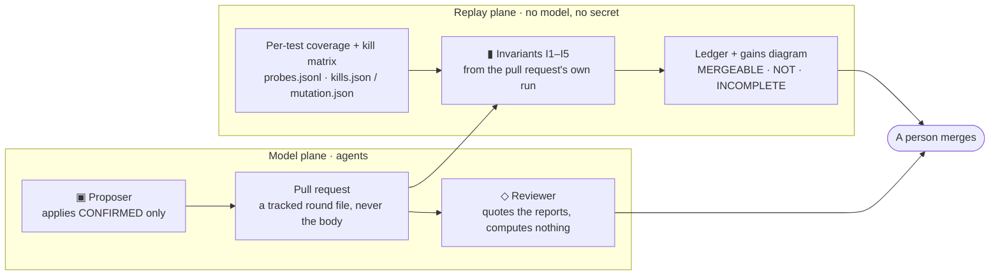

# AI in the loop, invariants in charge

_The plain-words version of what this repository does when an agent changes it, and the first thing
it governs this way: its own test suite. The contracts between the parts are in
[`tools/subsume/README.md`](../../tools/subsume/README.md); the decision is
[`docs/ci/ADR-test-subsumption.md`](../ci/ADR-test-subsumption.md); the argument is
[`docs/ci/GOVERNING-MACHINE-WRITTEN-CHANGE.md`](../ci/GOVERNING-MACHINE-WRITTEN-CHANGE.md) §14._

## The idea in one paragraph

Agents now write and remove code here. Nobody reads every line they produce, and the person who wrote
the passing test is often the same process that wrote the bug. So what keeps the system intact is not
the agent's judgement, and not a reviewer's stamina, but a small set of **invariants**: things that
must stay true after every change, checked by a machine from the change's own measurements, before a
person ever looks. An agent may propose anything. The invariants dispose. A person merges.

## The five invariants

|     | Invariant                              | What it means in plain words                                                                                                                                                    | Who checks it                                                                |
| :-- | :------------------------------------- | :------------------------------------------------------------------------------------------------------------------------------------------------------------------------------ | :--------------------------------------------------------------------------- |
| I1  | Coverage never drops on unchanged code | For every file, class and method the change did not touch, every line and branch the tests reached before is still reached. New code is judged by the ordinary coverage floors. | `invariant.mjs`, on the pull request's own per-test coverage                 |
| I2  | Kills are kept                         | Every deliberate defect (a _mutant_) the suite caught yesterday is still caught by a test that stays in the tier.                                                               | `invariant.mjs`, against the last governance run's kill matrix               |
| I3  | Green                                  | The suite passes — in the order it was written and in a random one.                                                                                                             | the pull request's runs                                                      |
| I4  | The numbers move with the code         | Every figure this repository publishes about itself matches the tree, in the same commit.                                                                                       | `check:published-numbers` (gate G15)                                         |
| I5  | The reviewer quotes                    | Every number in the reviewing agent's comment appears in a report the machine produced.                                                                                         | `pr-numbers-check.mjs`, after the comment is written and before it is posted |

## The loop, one picture

Two planes. The **model plane** is where the agents are: one proposes a change and opens a pull
request; one reads the reports and writes a review. The **replay plane** has no model in it and no
secret: it measures the change and replays the invariants. They meet at one place — a person.



Three voices appear on such a pull request, each with a fixed first line, so a reader knows who is
speaking before reading a number: `▣ Proposer — applies CONFIRMED only · never merges`,
`▮ Invariants — replay plane · no model · I1–I5`, `◇ Reviewer — quotes gate numbers only · never
approves`. Numbers come from the reports and nowhere else.

## The first instance: a redundant-test killer, explained

A test suite grows the way a hedge grows: nobody trims it, and after a while a pull request waits on
tests that add nothing. The obvious fix — delete tests that "look" redundant — is how suites lose the
one test that mattered. So the first thing governed by the invariants is the suite itself, and the
rule is deliberately strict.

**Two instruments, and both must agree.** Coverage says a test _walked past_ a line. Mutation
testing says whether a test would _notice_ if that line were wrong: a tool makes one small deliberate
change to the program (a **mutant** — `<` becomes `<=`, a condition is negated, a statement is
removed), runs the tests that reach it, and records who failed (**killed** it). Stryker does this for
the TypeScript here; PIT does it for the backend's Java. We keep the whole list of killers for every
mutant, not just the first, because the question is never "did someone catch it" but "would someone
_else_ have caught it".

**The rule.** A test may leave the pull-request tier only if every line and branch it covers is
covered by tests that stay, _and_ every mutant it kills is killed by tests that stay, _and_ the
mutation run actually exercised it against a mutant, _and_ it is not flaky. Nothing is deleted: the
test is rewritten `it(` → `subsumed(it)(`, which is the real `it` when `SUITE=nightly` and `it.skip`
otherwise, so the nightly still runs everything and the published test count stays true.

**A concrete pair, from the first round** (proposal run `local-2026-09-14b`): in
`src/app/core/demo/demo-fixtures.spec.ts`, the test _serves the persona for /users/me, role-aware via
localStorage_ reaches the same statements and branches as _signs the persona in on
/auth/firebase/login — the e-mail picks the persona_, and every mutant the first one kills the second
one kills too. The first leaves the tier with a marker naming the second; if someone later weakens
the second, invariant I2 on their pull request says so, because the mutants the pair used to kill
would go unkilled.

**What the machine checks before the door closes.** The governance pull request runs the full tier
on its own machine (the before), the reduced tier (the after), the reduced tier again in random order
(a kept test that only passed because a demoted one ran before it shows itself), and Stryker again
over the estate. Then one rule: tests or seconds lower, **and** none of coverage on unchanged code,
kills on unchanged code or mutation score lower, both runs green, the numbers consistent. Anything
unmeasured is INCOMPLETE; silence is never success. The ledger and a before → after diagram go into
the pull request beside the picture of who carries what, and the reviewer's comment lands after.

**How sure, and how much at a time.** The round policy takes only the surest candidates first —
an exact duplicate of a kept test in the same spec before a test with two carriers before one with
one — under a budget (a tenth of the tier's seconds, at most half of any spec), and never a test whose
name carries a scenario word (`edge`, `regression`, `null`, `timeout`…) until a person clears it.
Saturation is expected to take rounds, on purpose.

## What it found on its first day

Before demoting anything, the random-order run found two specs that passed only in the order they
were written — one read a fixture another had set up, one expected a seeded support thread unanswered
after another test had replied to it. Both were fixed on the base branch first. The re-measurement on
a GitHub runner then refused a backend round for reasons that were the two machines disagreeing, not
the round — which is why the before and the after are now measured on the same machine, and why a
mutant lost while every test that killed it stayed is charged to the machine, listed, and not held
against the round.

## Where to look

- The round's pull request: the ledger line, the gains diagram, the subsumption diagram, the
  reviewer's comment.
- `docs/testing/governance/round.json` on a governance branch: what left, what was declined and why.
- `docs/testing/measured-counts.json` → `jest.subsumed`: the demoted count, read back from the tree by
  `check:published-numbers`.
- The base artefacts of the last governance run on Pages: `subsume/latest/` (probes, maps, the kill
  matrix, the proposal), gzipped JSON.
- The workflows: `.github/workflows/ci-tests.yml` (the `invariants` job on every change),
  `test-governance-pr.yml` (the re-measurement on a governance branch), `ai-review.yml` (the reviewer,
  after a pipeline completes).

## Running a round yourself

```bash
# 1. the instruments, twice for the drift, on the same machine
SUBSUME_PROBES=1 npx jest --ci --coverage && node tools/subsume/merge-probes.mjs reports/subsume
cp reports/subsume/probes.jsonl base/ && cp reports/subsume/maps.json base/
SUBSUME_PROBES=1 npx jest --ci --coverage && node tools/subsume/merge-probes.mjs reports/subsume
cp reports/subsume/probes.jsonl base2/
npx stryker run stryker.estate.conf.json          # the whole-estate kill matrix, ~15 min
# 2. the proposal, the pack, the demotion
node tools/subsume/propose.mjs --repo frontend --probes base/probes.jsonl --maps base/maps.json \
  --mutation reports/mutation-estate/mutation.json --out reports/subsume --commit $(git rev-parse --short HEAD)
node tools/subsume/pack.mjs --report reports/subsume/subsume-report.json --probes base/probes.jsonl --probes2 base2/probes.jsonl --out reports/subsume
git checkout -b test-governance/round-N-<runId>
node tools/subsume/apply.mjs --repo frontend --pack reports/subsume/pack.json --round N --run-id <runId> --base-commit $(git rev-parse --short HEAD)
npm run measure:counts && npm run check:published-numbers
# 3. the pull request, with the label test-governance: the special job measures the rest
node tools/subsume/pr-body.mjs --round docs/testing/governance/round.json --pack reports/subsume/pack.json --report reports/subsume/subsume-report.json --out reports/subsume
```

## Reference marks, verified at the source

Traditional versus dominator mutation score, 88–99 % against 27–82 % on the Siemens suite — Ammann,
Delamaro & Offutt, ICST 2014. Pseudo-tested methods 9 % of 28,808 across 21 Java projects — Vera-Pérez
et al., EMSE 2019. Partly redundant tests 24 % across 15 Java projects — Vahabzadeh, Stocco & Mesbah,
ICSE 2018. Order-dependent tests about 0.65 % of human-written Java tests — Zhang et al., ISSTA 2014.
Flakiness at Google, 1.5 % of runs and about 16 % of tests — Micco, Google Testing Blog, 2016. Statement
coverage averaging 76 % across 47 coverage-tracking projects — Hilton, Bell & Marinov, ASE 2018.
