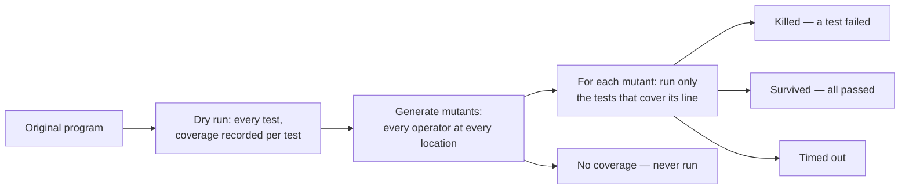
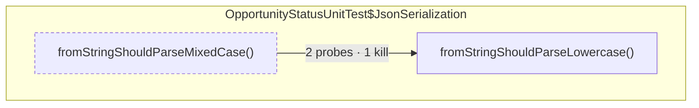
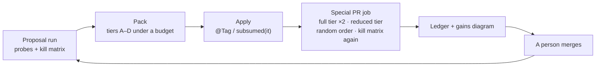

# Mutants, kills and carriers — a primer

_What mutation testing is, what Stryker and PIT actually do, and the math the test-governance loop
uses to decide which tests may leave the pull-request tier — told first as a story about a house and
its guards, then precisely, then with this estate's own numbers. A designed edition of this page is
[the shared primer](https://claude.ai/code/artifact/656cb5a6-7268-4d1e-926e-0e604f464d7c); the loop
it belongs to is [ai-in-the-loop.md](ai-in-the-loop.md)._

## 1. The one idea

**Like this.** A program is a house with many rooms. A test is a guard who walks through some rooms
and shouts if something is wrong. _Coverage_ only tells you which rooms a guard walked through; a
guard can walk through every room with eyes shut. _Mutation testing_ hires a prankster who moves one
piece of furniture — one small, deliberate change — and then the guards walk their rounds. If a guard
shouts, the prank was caught. If nobody shouts, the guards walked past a wrong room and said nothing.

**Precisely.** Coverage measures execution: a line ran while a test ran. Mutation testing measures
observation: a test fails when the program is deliberately wrong. A suite with 100 % line coverage and
no assertions has a mutation score near zero — which is why the governance loop never removes a test
on coverage alone.

## 2. The words

| Word                     | Like this                                                                                                                     | Precisely                                                         |
| :----------------------- | :---------------------------------------------------------------------------------------------------------------------------- | :---------------------------------------------------------------- |
| **Mutator**              | the prankster's rulebook: swap `<` for `<=`, turn a plus into a minus, make an `if` think the opposite, leave a statement out | a syntactic rewrite rule (mutation operator)                      |
| **Mutant**               | one house with exactly one prank applied; the prankster is not random — every rule, everywhere it fits, one at a time         | the program with one operator applied at one location             |
| **Killed**               | a guard shouted                                                                                                               | at least one test that passes on the original fails on the mutant |
| **Survived**             | every guard walked past and stayed quiet                                                                                      | every test passes on the mutant                                   |
| **No coverage**          | no guard ever enters that room                                                                                                | no test executes the mutated line, so nothing could fail          |
| **Timed out**            | the prank made a guard walk in circles forever                                                                                | the mutant loops; the runner gives up; counted as caught          |
| **Equivalent mutant**    | a prank that changes nothing (`i++` → `i += 1`)                                                                               | unkillable by construction; why 100 % is not a target             |
| **Pseudo-tested method** | a room every guard walks with eyes shut                                                                                       | its body can be replaced by a constant without any test failing   |

| Status      | PIT (Java)                  | Stryker (TypeScript)           | Counts as caught?                           |
| :---------- | :-------------------------- | :----------------------------- | :------------------------------------------ |
| killed      | `KILLED`                    | `Killed`                       | yes                                         |
| timed out   | `TIMED_OUT`                 | `Timeout`                      | yes                                         |
| survived    | `SURVIVED`                  | `Survived`                     | no                                          |
| no coverage | `NO_COVERAGE`               | `NoCoverage`                   | no — nothing ran it                         |
| error       | `MEMORY_ERROR`, `RUN_ERROR` | `RuntimeError`, `CompileError` | PIT yes; Stryker excludes it from the score |
| ignored     | —                           | `Ignored` (`ignoreStatic`)     | excluded                                    |

## 3. How one run works, and why it is slow

Before any prank, the guards walk once with a notebook (per-test coverage). For each prank only the
guards who visit that room are sent in. Normally the tool stops the moment one guard shouts ("bail").
**We turn that off** — `disableBail` for Stryker, `fullMutationMatrix` for PIT — because a guard may
only go home if _someone else_ would have shouted at every prank they catch. A bailed matrix lists one
killer per mutant and makes kill-subsumption vacuous; our loaders refuse one rather than warn.

## 4. Stryker and PIT, and which tiers they cover

**Stryker (frontend)** mutates the TypeScript source: one instrumented copy of each file holds all its
mutants behind a switch; one is activated at a time; Jest runs with per-test coverage; `mutation.json`
lists `status`, `coveredBy` and `killedBy` per mutant. It rewrites the working tree while it runs
(`inPlace`) — never edit during a run — and its mutant ids are positional, so two runs compare only at
the same commit. **PIT (backend)** mutates bytecode in the JVM, runs the unit suite, and with
`fullMutationMatrix` writes every killing test into the XML as `<killingTests>`; our `kills.json`
identifies a mutant by a hash of class, method, line and operator.

**Only the unit tier is mutated**, in both repositories. Integration, end-to-end and browser tiers
are never mutated — too slow to run thousands of times — so a test that lives only there is _outside
mutation scope_: SUSPECTED at most, never acted on. The published mutation badges are scoped runs; the
governance loop uses whole-estate configs (`stryker.estate.conf.json`, the `mutation-matrix` profile).

## 5. The two matrices

| Kill matrix       | t1  | t2  | t3  | t4  | status                                |
| :---------------- | :-: | :-: | :-: | :-: | :------------------------------------ |
| m1 `<` → `<=`     |  ×  |  ×  |     |     | killed by 2                           |
| m2 negate `if`    |  ×  |     |     |     | killed by 1 — t1 is its _sole killer_ |
| m3 `+` → `-`      |     |  ×  |  ×  |     | killed by 2                           |
| m4 return null    |     |     |     |     | survived (t3 covers it, stayed quiet) |
| m5 drop statement |     |     |     |     | no coverage                           |

K(t1) = {m1, m2}, K(t2) = {m1, m3}, K(t3) = {m3}, K(t4) = ∅. Traditional score: 3 of 5 = 60 %.

The **probe matrix** is the same grid for coverage: rows are _probes_ — the smallest unit the
instrument sees (a JaCoCo basic block; an Istanbul statement, function or branch path) — and a mark
means the test passed through. JaCoCo probes are booleans that stay flipped, so the backend listener
resets the agent after every test, keeps the union, and writes it back into the exec file at exit;
Istanbul counters are counts, so the Jest hook diffs them.

## 6. Mutation score, and the honest version of it

`score = caught / (caught + survived)` — but pranks are not equal. A chair upside down in the hallway
is caught by every guard; one book moved on the top shelf of the study only by the guard who reads.
Mutant A **dominates** B when every test that kills A also kills B (`K(A) ⊆ K(B)`): killing A implies
killing B. The _dominator_ mutants are those dominated by no other, and

`dominatorScore = killed dominators / (dominators + mutants nobody killed)`

Ammann, Delamaro and Offutt measured the two on the Siemens programs: traditional 88–99 %, dominator
27–82 %, with only 17 % of mutants carrying any distinguishing information. Ours: backend 39.93 %
traditional over 12,998 mutants, **18.8 %** dominator; frontend estate 37.7 % traditional, about 5 %
dominator (measured 2026-09-14).

## 7. Subsumption: when a guard may go home

A guard may leave the day shift only if every room they walk is walked by guards who stay, _and_
every prank they would shout at would be shouted at by guards who stay, _and_ they were on duty
during the prank night, _and_ they do not shout at random. Nobody is fired: they move to the night
shift, which walks with everyone.

`P(t) ⊆ ∪ P(S)  ∧  K(t) ⊆ ∪ K(S)  ∧  t ran against ≥ 1 mutant  ∧  t not flaky`

Each failed clause is a printed reason: `unique-probes`, `sole-killer`, `not-mutation-observed`,
`flaky`, plus `unobserved` (zero probes — an unobserved test is not a redundant one), `out-of-scope`,
and `kills-nothing` (coverage-carried, mutation had nothing to say; the last tier).

Demotion is an edit, not a deletion: `@Tag("subsumed")` on a JUnit method, `it(` → `subsumed(it)(`
in a Jest spec; the nightly runs everything.

## 8. Set cover: the cheapest crew that still watches everything

Twins are the trap: each twin is redundant given the other, and if both go home the room is empty.
So the question is the smallest crew, by seconds, that still walks every room and shouts at every
prank — weighted set cover over `U = probes ∪ killed mutants`, NP-hard. Two solvers, the cheaper
answer kept: **greedy** (best new units per second, then a second pass dropping any kept test every
unit of which two kept tests reach) and **exact** (reduce — drop uncoverable rows, merge identical
rows, force essential columns, drop dominated columns — then HiGHS solves the integer program and
returns a dual bound: the certificate that no crew could cost less). Backend: 2,921 columns forced,
7,343 dominated, optimal in 0.8 s; 4,066 of 10,576 unit tests could leave, 75.4 → 60.0 s. The round
policy takes far less than that per round, on purpose.

## 9. Our metrics

| Metric                           | Definition                                                               | Read it as                                                             |
| :------------------------------- | :----------------------------------------------------------------------- | :--------------------------------------------------------------------- |
| `covRed(t)`                      | `\|P(t) ∩ P(T∖t)\| / \|P(t)\|`                                           | the share of t's coverage the others also give                         |
| `killRed(t)`                     | `\|K(t) ∩ K(T∖t)\| / \|K(t)\|`; `killsNothing` when K(t) = ∅             | the share of t's kills the others also make                            |
| `R(t)`                           | 0 if t is the sole killer of any mutant, else `0.3·covRed + 0.7·killRed` | kills weighted over probes                                             |
| `redundantSeconds`               | `R(t) · s(t)`                                                            | the demotion priority                                                  |
| `sizeReduction`, `timeReduction` | `1 − after / before`                                                     | what a round gives back                                                |
| `probeLoss`, `killLoss`          | units covered or killed before and not after                             | zero by invariant, measured anyway                                     |
| `dominatorScore`                 | killed dominators / (dominators + unkilled)                              | the de-inflated mutation score                                         |
| `redundancyShare`                | `Σ R(t)·s(t) / Σ s(t)`                                                   | tier time that is individually redundant — not what can leave together |
| `removableTogether`              | the confirmed cover's complement                                         | what can leave in one round                                            |

## 10. The round: tiers, budget, invariants, ledger

Gates to enter any tier: CONFIRMED; mutation-observed; identical probes across two armed runs; a
carrier in the same class or spec; not name-flagged (`boundary`, `edge`, `regression`, `bug`, `race`,
`timeout`, `null`, `empty`… wait on the look-twice list until a person clears them).

| Tier | Evidence                                                                         |
| :--- | :------------------------------------------------------------------------------- |
| A    | exact duplicate: P ∪ K identical to a kept test in the same class, own kills > 0 |
| B    | kill-carried, own kills > 0, two or more carriers                                |
| C    | kill-carried, own kills > 0, one carrier                                         |
| D    | kills nothing; never taken while A–C are non-empty                               |

Budget: round 1 takes A downward until min(10 % of tier seconds, 300 tests), never more than half of
any class; a clean round doubles it, a failed re-measurement halves it. Invariants a pull request must
prove from its own run: I1 coverage never lower on unchanged code; I2 every base-killed mutant on
unchanged code still killed by a test that stays; I3 green, in declared and random order; I4 the
published numbers consistent; I5 every number in the reviewer's comment appears in a report. Merge
rule: tests or seconds lower **and** nothing the invariants guard lower; anything unmeasured is
INCOMPLETE.

## 11. What we measured (2026-09-14)

|                                       |        Backend (JUnit · PIT) |                               Frontend (Jest · Stryker) |
| :------------------------------------ | ---------------------------: | ------------------------------------------------------: |
| Tests in the pull-request tier before |                       10,576 |                                                   1,306 |
| Mutants in the whole-estate matrix    |                       12,998 |                                                   5,042 |
| Killed · survived · no coverage       |        5,190 · 2,009 · 5,796 |                                     1,893 · 795 · 2,346 |
| Traditional mutation score            |                      39.93 % |                                                 37.70 % |
| Dominator score                       |                       18.8 % |                                                   ≈ 5 % |
| CONFIRMED redundant (exact cover)     |                        2,861 |                                                     133 |
| Round 1 pack (A · B · C)              |          300 (221 · 44 · 35) |                                        96 (36 · 3 · 57) |
| Applied · declined as parameterised   |                    165 · 135 |                                                 74 · 22 |
| Tier after, on the box                | 10,411 tests · 75.4 → 72.4 s |                                             1,232 tests |
| Random order                          |                        green | green, after two order-dependent specs were fixed first |

These are dated observations of two runs; the gated figures are the demoted counts in each
repository's `measured-counts.json`.

## 12. What went wrong on the first day, and the rules it left

- A bailed matrix is worthless for this; the loader refuses it.
- Unobserved is not redundant; a test with zero probes or never exercised by mutation is kept.
- The before and the after must be measured on the same machine: a box-made baseline against a runner
  run refused a round for the two machines disagreeing (seconds, environment-dependent branches, one
  mutant killed on Windows and surviving on Linux under the same tests). The job now measures its own
  before; a kill lost while every killer stayed is charged to the machine and listed.
- Stryker's mutant ids are positional: a base matrix is made at the pull request's base commit.
- Random order finds what matrices cannot: two specs passed only in the order they were written.
- Generated names (`it.each` rows, template literals) are declined as `parameterized` / `generated`,
  never reported as lost.
- The picture in the pull request draws what the round demoted, not what the proposal offered.

## Reference marks, verified at the source

Traditional versus dominator score 88–99 % vs 27–82 % — Ammann, Delamaro & Offutt, ICST 2014.
Pseudo-tested methods 9 % of 28,808 over 21 Java projects, median 4 % — Vera-Pérez et al., EMSE 2019.
Partly redundant tests 24 % across 15 Java projects — Vahabzadeh, Stocco & Mesbah, ICSE 2018.
Order-dependent tests about 0.65 % of human-written Java tests — Zhang et al., ISSTA 2014; 50.5 % of
flaky tests order-dependent — Lam et al., ICST 2019. Flakiness at Google 1.5 % of runs, about 16 % of
tests — Micco, Google Testing Blog, 2016. Statement coverage averaging 76 % across 47 projects — Hilton,
Bell & Marinov, ASE 2018. No defensible norm exists for a "typical PIT score".
