```mermaid
flowchart LR
  subgraph n0["guide-hint"]
    direction LR
    n1["E-PROMISE — what the guide may promise about a…"]:::demoted
    n2["E-PROMISE — what the guide may promise about a…"]
    n1 -- "26 probes · 7 kills" --> n2
    n3["E-PROMISE — what the guide may promise about a…"]:::demoted
    n3 -- "26 probes · 7 kills" --> n2
    n4["E-PROMISE — what the guide may promise about a…"]:::demoted
    n4 -- "26 probes · 7 kills" --> n2
    n5["E-PROMISE — what the guide may promise about a…"]:::demoted
    n5 -- "26 probes · 7 kills" --> n2
    n6["… 35 more"]:::demoted
  end
  subgraph n7["sandbox-director.service"]
    direction LR
    n8["SandboxDirectorService a full load on an app ro…"]:::demoted
    n9["SandboxDirectorService a full load on the landi…"]
    n8 -- "70 probes · 19 kills" --> n9
    n10["SandboxDirectorService advance() walks every st…"]:::demoted
    n11["SandboxDirectorService next() — #quot;Dalej#quot; perform…"]
    n10 -- "195 probes · 40 kills" --> n11
    n12["SandboxDirectorService exit() closes any dialog…"]:::demoted
    n13["SandboxDirectorService exit() clears state, sig…"]
    n12 -- "179 probes · 10 kills" --> n13
    n14["SandboxDirectorService next() — #quot;Dalej#quot; perform…"]:::demoted
    n15["SandboxDirectorService next() — #quot;Dalej#quot; perform…"]
    n14 -- "244 probes · 67 kills" --> n15
    n16["… 13 more"]:::demoted
  end
  subgraph n17["error.interceptor"]
    direction LR
    n18["errorInterceptor on 401 from /auth/refresh-sess…"]:::demoted
    n19["errorInterceptor on 401 from /auth/firebase/log…"]
    n18 -- "24 probes · 7 kills" --> n19
    n20["errorInterceptor on 401 from /support/ticket/ac…"]:::demoted
    n20 -- "24 probes · 10 kills" --> n19
    n21["errorInterceptor on 401 from a /assets/ static…"]:::demoted
    n21 -- "24 probes · 11 kills" --> n19
    n22["errorInterceptor on 419 from /auth/refresh-sess…"]:::demoted
    n22 -- "24 probes · 7 kills" --> n19
    n23["… 4 more"]:::demoted
  end
  subgraph n24["demo-fixtures"]
    direction LR
    n25["demo fixtures answers /subscription/status with…"]:::demoted
    n26["demo fixtures plays the whole upgrade beat — co…"]
    n25 -- "56 probes · 15 kills" --> n26
    n27["demo fixtures answers /users/me with null while…"]:::demoted
    n28["demo fixtures sign-up takes the role from the f…"]
    n27 -- "54 probes · 9 kills" --> n28
    n29["demo fixtures company accept/decline round-trip…"]:::demoted
    n30["demo fixtures company accept/decline round-trip…"]
    n29 -- "99 probes · 40 kills" --> n30
    n31["demo fixtures pages campaigns through the share…"]:::demoted
    n31 -- "55 probes · 13 kills" --> n32
    n33["… 3 more"]:::demoted
  end
  subgraph n34["shell-status.service"]
    direction LR
    n35["ShellStatusService initial state starts with no…"]:::demoted
    n36["ShellStatusService trialOffer the nudge is not…"]
    n35 -- "22 probes · 8 kills" --> n36
    n37["ShellStatusService noteResponseHeaders does not…"]:::demoted
    n38["ShellStatusService noteResponseHeaders does not…"]
    n37 -- "21 probes · 3 kills" --> n38
    n39["ShellStatusService noteResponseHeaders flips em…"]:::demoted
    n39 -- "22 probes · 7 kills" --> n40
    n41["ShellStatusService noteResponseHeaders is stick…"]:::demoted
    n42["ShellStatusService clearConsent / clearEmailVer…"]
    n41 -- "23 probes · 5 kills" --> n42
    n43["… 2 more"]:::demoted
  end
  subgraph n44["shell-headers.interceptor"]
    direction LR
    n45["shellHeadersInterceptor does NOT update the ser…"]:::demoted
    n45 -- "22 probes · 3 kills" --> n40
    n46["shellHeadersInterceptor forwards X-Consent-Requ…"]:::demoted
    n46 -- "30 probes · 13 kills" --> n40
    n47["shellHeadersInterceptor honours sticky semantic…"]:::demoted
    n47 -- "31 probes · 12 kills" --> n40
    n48["shellHeadersInterceptor leaves the service unto…"]:::demoted
    n48 -- "29 probes · 8 kills" --> n40
  end
  n32["demo-fixtures.account :: demo fixtures — accoun…"]
  n40["shell-headers.interceptor :: shellHeadersInterc…"]
  classDef demoted stroke-dasharray: 4 3
```

| Class | Demoted | Carried by |
| --- | --- | --- |
| `step-up-context` | 4 | 1 tests |
| `theme.service` | 4 | 4 tests |
| `consent.service` | 3 | 5 tests |
| `seo-title.strategy` | 3 | 3 tests |
| `rate-limit-cache.interceptor` | 3 | 3 tests |
| `set-to-array.interceptor` | 3 | 1 tests |
| `step-up.interceptor` | 3 | 1 tests |
| `applied-opportunity.service` | 2 | 3 tests |
| `auth.guards` | 2 | 3 tests |
| `social-platform-config.service` | 2 | 1 tests |
| `transloco-loader` | 2 | 1 tests |
| `opportunity.service` | 2 | 1 tests |
| `rate-limit-state.service` | 2 | 3 tests |
| `user.service` | 2 | 2 tests |
| `process-map` | 1 | 1 tests |
| `address.service` | 1 | 1 tests |
| `cascade-delete.service` | 1 | 1 tests |
| `location-redirect.service` | 1 | 1 tests |
| `sandbox-auth.service` | 1 | 1 tests |
| `demo-fixtures.account` | 1 | 1 tests |
| `localized-date.pipe` | 1 | 1 tests |
| `paginator-intl` | 1 | 2 tests |
| `language.interceptor` | 1 | 1 tests |
| `legal-api.service` | 1 | 1 tests |
| `preferences.service` | 1 | 1 tests |
| `registry.service` | 1 | 1 tests |
| `step-up.service` | 1 | 1 tests |
| `upload.service` | 1 | 2 tests |
| `demo-export-zip` | 1 | 1 tests |
