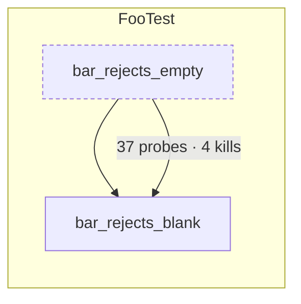

# subsume — the test population under invariants

The decision is [`docs/ci/ADR-test-subsumption.md`](../../docs/ci/ADR-test-subsumption.md); the
argument is [`docs/ci/GOVERNING-MACHINE-WRITTEN-CHANGE.md`](../../docs/ci/GOVERNING-MACHINE-WRITTEN-CHANGE.md)
§14. This page is the contract between the parts, written so that each part can be built and
verified on its own, by whoever builds it. Shapes marked _shipped_ are what the code writes today;
shapes marked _designed_ are what the next part must write or read. A designed shape may change
until its producer ships; a shipped one changes only with its consumer.

## Parts

| Part                   | Where                                                                                 | Status   | Verified by                                                                                   |
| ---------------------- | ------------------------------------------------------------------------------------- | -------- | --------------------------------------------------------------------------------------------- |
| Per-test probes, Jest  | `jest-probes.ts` (hook), `probe-diff.ts`, `merge-probes.mjs`, `check-probes.mjs`      | shipped  | `check-probes.mjs`: the union of a spec's per-test hits equals its final counters, every spec |
| Per-test probes, JUnit | backend `src/test/java/com/sm/instagram/platform/subsume/ProbeListener.java`          | designed | projection of all tests equals JaCoCo's own line and branch totals on sampled classes         |
| Kill matrix, frontend  | `stryker.conf.json` → `reports/mutation/mutation.json` with `disableBail: true`       | shipped  | every `KILLED` mutant lists ≥ 1 test in `killedBy`                                            |
| Kill matrix, backend   | backend PIT profile `mutation-matrix` → `tools/subsume/pit-matrix.mjs` → `kills.json` | designed | same                                                                                          |
| Core                   | `load.mjs` `project.mjs` `kills.mjs` `cluster.mjs` `subsume.mjs` `cover.mjs`          | designed | property tests (`fast-check`): no probe or kill lost, permutation-invariant, idempotent       |
| Proposer               | `propose.mjs`, `diagram.mjs`                                                          | designed | seeded violation 6                                                                            |
| Gate                   | `invariant.mjs` → `check:invariants`                                                  | designed | seeded violations 1–4                                                                         |
| Agents                 | `agent/role.md` (proposer), `agent/reviewer.md` (reviewer), `pr-numbers-check.mjs`    | written  | seeded violation 5; the first two pull requests                                               |

## One identity for a test

Every producer and consumer names a test the same way, or nothing joins:

- Jest: `<spec path relative to the repository root, forward slashes> :: <full test name as Jest reports it>`
  — e.g. `src/app/core/auth/auth.service.spec.ts :: AuthService login stores the session`.
  Module-level counters go to `<spec> :: (module load)`.
- JUnit: the platform's **unique id, verbatim** —
  `[engine:junit-jupiter]/[class:com.sm…TokenExchangeServiceUnitTest]/[nested-class:ClearSessionCookiesTests]/[method:shouldClearAllSessionCookies()]`
  with `/[test-template-invocation:#3]` for a parameterised invocation. That is the string PIT
  writes into `<killingTests>` (prefixed with the top-level class and a dot, which the parser
  strips), so the listener records it rather than assembling a prettier one; a display form is
  derived, never used as a key. `spec` is the binary class name, nested classes included, so a
  demotion tag has an address. Probes that flip before the first test or after the last go to
  `(plan setup)` and `(plan teardown)`.

## Artefacts

Local runs write to `reports/subsume/` (gitignored); the nightly publishes the same files, gzipped,
to `site/subsume/latest/` on Pages with history under `site/subsume/<run>/`.

### `probes.jsonl` — shipped (Jest)

One record per line, three kinds. Paths are repository-relative.

```jsonc
{"test":"src/app/x.spec.ts :: (module load)","spec":"src/app/x.spec.ts","hits":{"src/app/x.ts":{"s":[0,1],"f":[0],"b":[[0,0]]}}}
{"test":"src/app/x.spec.ts :: X does y","spec":"src/app/x.spec.ts","hits":{"src/app/x.ts":{"s":[4,5],"f":[2],"b":[[1,0],[1,1]]}}}
{"final":true,"spec":"src/app/x.spec.ts","totals":{"src/app/x.ts":{"s":12,"f":4,"b":6}}}
```

`s` statement ids, `f` function ids, `b` `[branch id, path index]` pairs — istanbul's ids for the
_transpiled_ file. A test that moved no counter still gets its line with `"hits":{}`. The `final`
record is per spec file and exists only so `check-probes.mjs` can prove the instrument.

### `maps.json` — shipped (Jest)

Per instrumented file: istanbul's `statementMap`, `fnMap`, `branchMap` (id → source positions in
the transpiled file) and `inputSourceMap`. The projection to TypeScript lines happens in `load.mjs`
through the source map — never by comparing to istanbul's own reports, which are already projected
and count different things.

### `probes.jsonl` + `classes.json` — designed (JUnit)

```jsonc
{
  "test": "com.sm...FooTest#bar",
  "spec": "com.sm...FooTest",
  "hits": { "com.sm...Foo": "<base64 of the probe bit array>" },
}
```

`classes.json`: `{"<fqcn>":{"file":"src/main/java/...","id":"<jacoco class id, hex>","probes":[{"method":"bar(Ljava/lang/String;)V","lines":[41,42],"branchLines":[42]}, ...]}}`
— index = probe id; a probe stands for a basic block, so it may cover several lines, and
`branchLines` are the lines whose branch counter that probe alone moves. Collected in-process from
`RT.getAgent().getExecutionData(true)` after every test — **with reset**, because JaCoCo probes
are booleans: once an earlier test has flipped one it stays flipped, so a diff of cumulative
snapshots would credit a line to the first test that reached it and to no other (istanbul's
counters are counts, which is why the Jest hook can diff instead). Resetting would leave the exec
file the agent writes at JVM exit holding only the last test, so the listener keeps the union of
everything it collected and appends it to `target/jacoco-unit.exec` before exit; the report merges
the blocks and comes out whole, and `exec-check.json` (`{"tests","classes","exec","missingFromExec":[]}`)
records that the file read back contains every probe of the union. The agent instruments only
`com.sm.instagram.platform.*` (`<includes>` in the pom), which keeps a snapshot around 100 KB. A
`{"final":true,"totals":{"<fqcn>":n}}` record closes the file, as for Jest. Measured
2026-09-14: 10,576 tests, 666 classes with hits, 39,653 probes mapped, self-check clean. About a
quarter of the hit classes map to no lines at all: JaCoCo filters Lombok-generated bodies out of
its reports, so their probes stay in the subsumption universe (a test that exercises them does
exercise something) but carry no weight in I1, which is measured in the lines JaCoCo reports.

### `kills.json` — designed (both)

```jsonc
{
  "schema": 1,
  "repo": "backend",
  "commit": "<sha>",
  "tool": "pitest 1.30.0",
  "generatedAt": "...",
  "mutants": {
    "<id>": {
      "file": "src/main/java/...",
      "fileSha": "<sha256 at run time>",
      "class": "...",
      "method": "...",
      "line": 88,
      "mutator": "...",
      "status": "KILLED",
      "killedBy": ["<test id>"],
      "coveredBy": ["<test id>"],
    },
  },
}
```

Backend: PIT with `fullMutationMatrix=true` + `exportLineCoverage=true`, XML → `<killingTests>`
(pipe-joined). Frontend: Stryker's `mutation.json` with `disableBail`, `killedBy` resolved through
`testFiles` to the identity above. `fileSha` is what lets the gate skip mutants whose code changed.

### `seconds` and `flaky.json`

Every test record carries `"seconds"`: the hook measures the test itself (`beforeEach` to
`afterEach` in Jest, `executionStarted` to `executionFinished` in JUnit), so no report has to be
joined back by a display name that may not round-trip. Pseudo-records carry `null`. The only
external input is the flaky window: `flaky.json` = `{"schema":1,"window":10,"tests":["<test id>",…]}`,
the tests that failed or flaked in the last ten runs per `tools/ci/flaky-report.mjs`; a flaky test
carries nothing for anyone else and is never demoted on its own record either.

### What "coverage" means in the projection

For Java, `classes.json` maps a probe to source lines and a method, so I1 is checked per file,
class and method in source lines. For Jest, the runtime ids index the transpiled file; but an
unchanged file has an identical statement, function and branch map on `main` and on the pull
request, so I1 compares the sets of covered statement ids, function ids and branch paths per file
and per function directly — no source-map decoding, and nothing to disagree with istanbul's own
line numbers. Lines appear in reports only where they are exact.

## The core, in one paragraph each

`load.mjs` reads the four artefacts into bitsets and projects Jest ids to source lines through the
source map. `project.mjs` turns any subset of tests into line and branch coverage per file, class
and method. `kills.mjs` turns a subset into the set of mutants it kills. `cluster.mjs` groups tests
with identical coverage vectors; a parameterised method is one unit. `subsume.mjs` decides: a test
`u` is subsumed by a set `S` when `probes(u) ⊆ ∪probes(S)`, `kills(u) ⊆ ∪kills(S)`, and `u` is not
the only non-flaky killer of any mutant. `cover.mjs` is greedy weighted set cover over probes ∪
mutants with seconds as weight and unique units per second as the order — the tests it never picks
are the candidates, each then re-checked individually by `subsume.mjs`.

## Reports

### `subsume-report.json`

```jsonc
{
  "schema": 1,
  "repo": "backend",
  "commit": "<sha>",
  "generatedAt": "...",
  "inputs": { "probes": "<sha256>", "kills": "<sha256>", "timings": "<sha256>", "window": 10 },
  "summary": {
    "tests": 11415,
    "units": 9101,
    "confirmed": 0,
    "suspected": 0,
    "kept": 9101,
    "probes": { "total": 0, "carriedAfter": 0 },
    "kills": { "total": 0, "carriedAfter": 0 },
    "prTierSeconds": { "before": 0, "after": 0 },
  },
  "candidates": [
    {
      "test": "...",
      "tier": "CONFIRMED",
      "unit": "com.sm...FooTest",
      "seconds": 0.011,
      "subsumedBy": ["..."],
      "why": {
        "probes": { "own": 37, "unique": 0 },
        "kills": { "own": 4, "unique": 0 },
        "soleKiller": false,
        "inMutationScope": true,
      },
    },
  ],
  "clusters": [{ "vector": "<sha16>", "members": ["..."], "representative": "..." }],
  "slowest": [{ "test": "...", "seconds": 1.9, "uniqueUnits": 2, "secondsPerUniqueUnit": 0.95 }],
}
```

Tiers: **CONFIRMED** = coverage-subsumed ∧ kill-subsumed ∧ not a sole killer; **SUSPECTED** =
coverage-subsumed but outside mutation scope or a sole killer inside the flaky window. Only
CONFIRMED is ever applied. `representative` = the fastest member of a cluster, then the best-named.

### `invariant-report.json`

```jsonc
{
  "schema": 1,
  "repo": "backend",
  "base": { "commit": "<sha>", "artefacts": "site/subsume/<run>/" },
  "head": { "commit": "<sha>" },
  "verdict": "PASS",
  "i1": {
    "status": "PASS",
    "unchangedFiles": 412,
    "checked": { "files": 412, "classes": 389, "methods": 3120 },
    "regressions": [
      {
        "file": "...",
        "method": "...",
        "lines": { "base": 10, "head": 9 },
        "branches": { "base": 4, "head": 4 },
      },
    ],
  },
  "i2": {
    "status": "PASS",
    "mutantsChecked": 2408,
    "skippedChangedCode": 0,
    "lost": [{ "mutant": "...", "killedByOnBase": ["..."], "reason": "test demoted" }],
  },
  "i3": { "status": "PASS", "suite": "junit", "tests": 11415, "failed": 0 },
  "i4": { "status": "PASS", "tool": "check-published-numbers" },
  "demoted": { "count": 0, "tests": [] },
  "incomplete": [],
}
```

`verdict` is `FAIL` if any invariant fails, `INCOMPLETE` if any input artefact is missing (a missing
`probes.jsonl` or `kills.json` on base is never a pass — silence is not success), else `PASS`.
Exit codes: 0 PASS, 1 FAIL, 2 INCOMPLETE.

### The step summary, exactly

```
Invariants: PASS — 214 tests demoted · coverage unchanged on 412 files, 389 classes, 3,120 methods · 2,408 mutants checked, 0 lost · suite green (11,415 tests) · published numbers consistent
```

One line, the same fields in the same order on every run, so a person recognises it at a glance and
a script can parse it.

### `diagram.md` — Mermaid, one level of abstraction

One `subgraph` per class that lost a test; inside it, demoted tests (dashed) point at the kept tests
that carry them; the edge label says what is carried. At most eight subgraphs in a comment — the
rest go in a table under it. Generated from `subsume-report.json` by `diagram.mjs`, never written
by hand.



### The pull-request body

Written by the proposer from the two reports and nothing else, in this order: one headline line
(demoted, probes carried, kills carried, PR-tier seconds before → after); an "Invariants" line
quoting I1–I4; a "What changed" table (class → demoted → carried by); "Not applied" (the SUSPECTED
count and the reason); "Reproduce" (the commands). `pr-numbers-check.mjs` extracts every integer
≥ 10 from the body and the reviewer's comment and fails unless each appears in one of the two
reports.

## Seeded violations — the gate is believed only after these are red

| #   | Break                                                           | Must be caught by                             |
| --- | --------------------------------------------------------------- | --------------------------------------------- |
| 1   | Remove one covered probe from the head matrix                   | I1 regression on that method                  |
| 2   | Remove the killing test of one mutant from the base kill matrix | I2 lost mutant                                |
| 3   | Mark the sole killer of a mutant flaky in `timings.json`        | propose: candidate demoted to SUSPECTED       |
| 4   | Permute the order of tests in `probes.jsonl`                    | identical report (byte for byte)              |
| 5   | Put a number in the pull-request body that is in neither report | `pr-numbers-check.mjs` red                    |
| 6   | Propose a test that owns a unique probe                         | `propose` refuses; it never reaches CONFIRMED |

## Commands

```bash
# frontend, under the pinned Node (.nvmrc)
SUBSUME_PROBES=1 npx jest --coverage        # per-test probes + coverage
node tools/subsume/merge-probes.mjs         # join the per-worker files
node tools/subsume/check-probes.mjs         # prove the instrument
npm run test:mutation                       # Stryker with the full kill matrix
```
