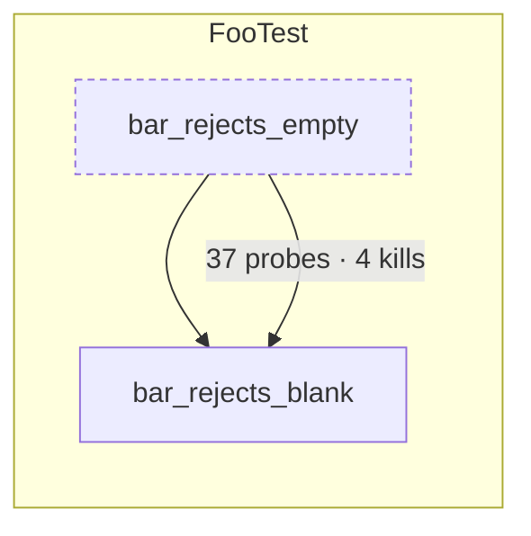

# subsume — the test population under invariants

The decision is [`docs/ci/ADR-test-subsumption.md`](../../docs/ci/ADR-test-subsumption.md); the
argument is [`docs/ci/GOVERNING-MACHINE-WRITTEN-CHANGE.md`](../../docs/ci/GOVERNING-MACHINE-WRITTEN-CHANGE.md)
§14. This page is the contract between the parts, written so that each part can be built and
verified on its own, by whoever builds it. Shapes marked _shipped_ are what the code writes today;
shapes marked _designed_ are what the next part must write or read. A designed shape may change
until its producer ships; a shipped one changes only with its consumer.

## Parts

| Part                   | Where                                                                                                                                              | Status  | Verified by                                                                                                            |
| ---------------------- | -------------------------------------------------------------------------------------------------------------------------------------------------- | ------- | ---------------------------------------------------------------------------------------------------------------------- |
| Per-test probes, Jest  | `jest-probes.ts` (hook), `probe-diff.ts`, `merge-probes.mjs`, `check-probes.mjs`                                                                   | shipped | `check-probes.mjs`: the union of a spec's per-test hits equals its final counters, every spec                          |
| Per-test probes, JUnit | backend `src/test/java/com/sm/instagram/platform/subsume/ProbeListener.java`                                                                       | shipped | the JaCoCo report of an armed run matches an unarmed run's, package for package and class for class; `exec-check.json` |
| Kill matrix, frontend  | `stryker.conf.json` → `reports/mutation/mutation.json` with `disableBail: true`                                                                    | shipped | every `KILLED` mutant lists ≥ 1 test in `killedBy`; a bailed report is refused                                         |
| Kill matrix, backend   | backend PIT profile `mutation-matrix` → `tools/subsume/pit-matrix.mjs` → `kills.json`                                                              | shipped | same; `fullMatrix: true` or refused                                                                                    |
| Core                   | `load.mjs` `project.mjs` `kills.mjs` `cluster.mjs` `subsume.mjs` `cover.mjs` `solve.mjs` `metrics.mjs`                                             | shipped | property tests (`fast-check`): no probe or kill lost, permutation-invariant, idempotent; exact cover certified         |
| Proposer               | `propose.mjs`, `diagram.mjs`                                                                                                                       | shipped | seeded violation 6; diagram verified rendered on GitHub                                                                |
| Gate                   | `invariant.mjs`; the `invariants` job in `ci-tests.yml` (every change); `test-governance-pr.yml` (a governance branch: `ledger.mjs`, `gains.mjs`)  | shipped | seeded violations 1, 2, 4; proven on real artefacts; the first backend round re-measured                               |
| Round                  | `pack.mjs` (what leaves this round, by tier), `apply.mjs` (the demotion edit, `round.json`), `pr-body.mjs` (title and body from the round's files) | shipped | specs; the first backend round: 300 packed, 165 applied, body from the ledger                                          |
| Agents                 | `agent/role.md` (proposer), `agent/reviewer.md` (reviewer), `pr-numbers-check.mjs`                                                                 | written | seeded violation 5; the first two pull requests                                                                        |

## One identity for a test

Every producer and consumer names a test the same way, or nothing joins:

- Jest: `<spec path relative to the repository root, forward slashes> :: <full test name as Jest reports it>`
  — e.g. `src/app/core/auth/auth.service.spec.ts :: AuthService login stores the session`.
  Module-level counters go to `<spec> :: (module load)`.
- JUnit: the platform's **unique id, verbatim** —
  `[engine:junit-jupiter]/[class:com.sm…TokenExchangeServiceUnitTest]/[nested-class:ClearSessionCookiesTests]/[method:shouldClearAllSessionCookies()]`
  with `/[test-template-invocation:#3]` for a parameterised invocation. That is the string PIT
  writes into `<killingTests>` (prefixed with the top-level class and a dot, which the parser
  strips), so the listener records it rather than assembling a prettier one; a display form is
  derived, never used as a key. `spec` is the binary class name, nested classes included, so a
  demotion tag has an address. Probes that flip before the first test or after the last go to
  `(plan setup)` and `(plan teardown)`.

## Artefacts

Local runs write to `reports/subsume/` (gitignored); the nightly publishes the same files, gzipped,
to `site/subsume/latest/` on Pages with history under `site/subsume/<run>/`.

### `probes.jsonl` — shipped (Jest)

One record per line, three kinds. Paths are repository-relative.

```jsonc
{"test":"src/app/x.spec.ts :: (module load)","spec":"src/app/x.spec.ts","hits":{"src/app/x.ts":{"s":[0,1],"f":[0],"b":[[0,0]]}}}
{"test":"src/app/x.spec.ts :: X does y","spec":"src/app/x.spec.ts","hits":{"src/app/x.ts":{"s":[4,5],"f":[2],"b":[[1,0],[1,1]]}}}
{"final":true,"spec":"src/app/x.spec.ts","totals":{"src/app/x.ts":{"s":12,"f":4,"b":6}}}
```

`s` statement ids, `f` function ids, `b` `[branch id, path index]` pairs — istanbul's ids for the
_transpiled_ file. A test that moved no counter still gets its line with `"hits":{}`. The `final`
record is per spec file and exists only so `check-probes.mjs` can prove the instrument.

### `maps.json` — shipped (Jest)

Per instrumented file: istanbul's `statementMap`, `fnMap`, `branchMap` (id → source positions in
the transpiled file) and `inputSourceMap`. The projection to TypeScript lines happens in `load.mjs`
through the source map — never by comparing to istanbul's own reports, which are already projected
and count different things.

### `probes.jsonl` + `classes.json` — designed (JUnit)

```jsonc
{
  "test": "com.sm...FooTest#bar",
  "spec": "com.sm...FooTest",
  "hits": { "com.sm...Foo": "<base64 of the probe bit array>" },
}
```

`classes.json`: `{"<fqcn>":{"file":"src/main/java/...","id":"<jacoco class id, hex>","probes":[{"method":"bar(Ljava/lang/String;)V","lines":[41,42],"branchLines":[42]}, ...]}}`
— index = probe id; a probe stands for a basic block, so it may cover several lines, and
`branchLines` are the lines whose branch counter that probe alone moves. Collected in-process from
`RT.getAgent().getExecutionData(true)` after every test — **with reset**, because JaCoCo probes
are booleans: once an earlier test has flipped one it stays flipped, so a diff of cumulative
snapshots would credit a line to the first test that reached it and to no other (istanbul's
counters are counts, which is why the Jest hook can diff instead). Resetting would leave the exec
file the agent writes at JVM exit holding only the last test, so the listener keeps the union of
everything it collected and appends it to `target/jacoco-unit.exec` before exit; the report merges
the blocks and comes out whole, and `exec-check.json` (`{"tests","classes","exec","missingFromExec":[]}`)
records that the file read back contains every probe of the union. The agent instruments only
`com.sm.instagram.*` (`<includes>` on the `prepare-agent` execution — at plugin level the report
goal reads the same parameter as class-file paths and silently empties the report), which keeps
a snapshot around 100 KB. A `{"final":true,"totals":{"<fqcn>":n}}` record closes the file, as for
Jest. Measured 2026-09-14: 10,576 tests, 674 classes with hits, self-check clean; the armed run's
JaCoCo report equals an unarmed run's in packages and classes and differs in five time-dependent
classes by a net 15 of 29,124 lines. About a
quarter of the hit classes map to no lines at all: JaCoCo filters Lombok-generated bodies out of
its reports, so their probes stay in the subsumption universe (a test that exercises them does
exercise something) but carry no weight in I1, which is measured in the lines JaCoCo reports.

### `kills.json` — designed (both)

```jsonc
{
  "schema": 1,
  "repo": "backend",
  "commit": "<sha>",
  "tool": "pitest 1.30.0",
  "generatedAt": "...",
  "mutants": {
    "<id>": {
      "file": "src/main/java/...",
      "fileSha": "<sha256 at run time>",
      "class": "...",
      "method": "...",
      "line": 88,
      "mutator": "...",
      "status": "KILLED",
      "killedBy": ["<test id>"],
      "coveredBy": ["<test id>"],
    },
  },
}
```

Backend: PIT with `fullMutationMatrix=true` + `exportLineCoverage=true`, XML → `<killingTests>`
(pipe-joined). Frontend: Stryker's `mutation.json` with `disableBail`, `killedBy` resolved through
`testFiles` to the identity above. `fileSha` is what lets the gate skip mutants whose code changed.

A matrix from a run that stopped at the first killer is **refused**, not warned about: the loader
requires `config.disableBail === true` in `mutation.json` and `fullMatrix: true` in `kills.json`
(set by `pit-matrix.mjs` only when every `KILLED` mutant names a killer). With one killer per
mutant every other test kills nothing, so "its kills are carried" is true of every test and means
nothing — the first frontend proposal was built on such a file (351 killed, 0 with two killers)
and confirmed twenty tests that kill nothing at all.

### `seconds` and `flaky.json`

Every test record carries `"seconds"`: the hook measures the test itself (`beforeEach` to
`afterEach` in Jest, `executionStarted` to `executionFinished` in JUnit), so no report has to be
joined back by a display name that may not round-trip. Pseudo-records carry `null`. The only
external input is the flaky window: `flaky.json` = `{"schema":1,"window":10,"tests":["<test id>",…]}`,
the tests that failed or flaked in the last ten runs per `tools/ci/flaky-report.mjs`; a flaky test
carries nothing for anyone else and is never demoted on its own record either.

### What "coverage" means in the projection

For Java, `classes.json` maps a probe to source lines and a method, so I1 is checked per file,
class and method in source lines. For Jest, the runtime ids index the transpiled file; but an
unchanged file has an identical statement, function and branch map on `main` and on the pull
request, so I1 compares the sets of covered statement ids, function ids and branch paths per file
and per function directly — no source-map decoding, and nothing to disagree with istanbul's own
line numbers. Lines appear in reports only where they are exact.

## The core, in one paragraph each

`load.mjs` reads the four artefacts into bitsets and projects Jest ids to source lines through the
source map. `project.mjs` turns any subset of tests into line and branch coverage per file, class
and method. `kills.mjs` turns a subset into the set of mutants it kills. `cluster.mjs` groups tests
with identical coverage vectors; a parameterised method is one unit. `subsume.mjs` decides: a test
`u` is subsumed by a set `S` when `probes(u) ⊆ ∪probes(S)`, `kills(u) ⊆ ∪kills(S)`, and `u` is not
the only non-flaky killer of any mutant. `cover.mjs` is greedy weighted set cover over probes ∪
mutants with seconds as weight and unique units per second as the order — the tests it never picks
are the candidates, each then re-checked individually by `subsume.mjs`.

## Reports

### `subsume-report.json`

```jsonc
{
  "schema": 1,
  "repo": "backend",
  "commit": "<sha>",
  "generatedAt": "...",
  "inputs": { "probes": "<sha256>", "kills": "<sha256>", "timings": "<sha256>", "window": 10 },
  "summary": {
    "tests": 11415,
    "units": 9101,
    "confirmed": 0,
    "suspected": 0,
    "kept": 9101,
    "probes": { "total": 0, "carriedAfter": 0 },
    "kills": { "total": 0, "carriedAfter": 0 },
    "prTierSeconds": { "before": 0, "after": 0 },
  },
  "candidates": [
    {
      "test": "...",
      "tier": "CONFIRMED",
      "unit": "com.sm...FooTest",
      "seconds": 0.011,
      "subsumedBy": ["..."],
      "why": {
        "probes": { "own": 37, "unique": 0 },
        "kills": { "own": 4, "unique": 0 },
        "soleKiller": false,
        "inMutationScope": true,
      },
    },
  ],
  "clusters": [{ "vector": "<sha16>", "members": ["..."], "representative": "..." }],
  "slowest": [{ "test": "...", "seconds": 1.9, "uniqueUnits": 2, "secondsPerUniqueUnit": 0.95 }],
}
```

Tiers: **CONFIRMED** = coverage-subsumed ∧ kill-subsumed ∧ inside mutation scope ∧ the kill
matrix ran the test against at least one mutant; **SUSPECTED** = coverage-subsumed but outside
mutation scope (`out-of-scope`), never run against a mutant (`not-mutation-observed` — it covers
only lines no mutant lives on, so kill-subsumption is vacuous), or a sole killer inside the flaky
window. A CONFIRMED test that kills nothing the matrix models carries `reason: "kills-nothing"`
and goes on the reviewer's _look twice_ list. Only CONFIRMED is ever applied. `representative` =
the fastest member of a cluster, then the best-named. The machine acts only where both
instruments have spoken — measured 2026-09-14 on the backend: of 4,066 coverage-and-kill-carried
tests, 1,205 had never been run against a mutant and became suspects.

### Redundancy metrics — what a reviewer may quote

Every candidate carries `redundancy` and the summary carries `metrics`, in the forms the
literature settled on (formulas and sources in `metrics.mjs`), flaky tests removed from every
union first:

| Per test                                                    | Meaning                                                                                        |
| ----------------------------------------------------------- | ---------------------------------------------------------------------------------------------- |
| `covRed` = \|P(t) ∩ P(T∖t)\| / \|P(t)\|                     | share of its coverage the other reliable tests also give (Koochakzadeh, Garousi & Maurer 2009) |
| `killRed` = \|K(t) ∩ K(T∖t)\| / \|K(t)\|                    | share of its kills the others also make; `killsNothing` when K(t) = ∅                          |
| `score` = 0 if a sole killer, else 0.3·covRed + 0.7·killRed | kills weighted over probes (Inozemtseva & Holmes 2014); null for flaky                         |
| `redundantSeconds` = score · seconds                        | the demotion priority                                                                          |

| Suite (`metrics`)                                              | Meaning                                                                                                                                                                                                        |
| -------------------------------------------------------------- | -------------------------------------------------------------------------------------------------------------------------------------------------------------------------------------------------------------- |
| `sizeReduction`, `timeReduction`                               | 1 − after/before (Rothermel et al. 1998)                                                                                                                                                                       |
| `probeLoss`, `killLoss`                                        | zero by invariant, measured anyway (Shi et al., FSE 2014)                                                                                                                                                      |
| `dominatorScore` before/after, `dominators`, `unkilledMutants` | killed dominator mutants over dominators plus every mutant nobody killed — the de-inflated mutation score (Ammann, Delamaro & Offutt 2014; Kurtz et al. 2016); the backend's 40 % raw PIT score is 18.8 % here |
| `redundancyShare` = Σ score·seconds / Σ seconds                | the share of tier time that is _individually_ redundant — each test against the rest, which is not what can go together (that is the cover's decision, stated as `removableTogether`)                          |
| `removableTogether`                                            | the confirmed set: tests and seconds that leave the tier in one round                                                                                                                                          |
| `fullyRedundant`, `soleKillers`, `flaky`                       | counts                                                                                                                                                                                                         |

What none of these measure is real-world loss (Shi et al., ISSTA 2018: up to 52 % of failed
builds missed by reductions such metrics called safe); that is the governance ledger's
failed-build proxy, tracked over rounds.

### The core: an exact cover, with a certificate

The kept set is the minimum-cost set of reliable tests that covers every probe and every killed
mutant — the integer programme of Black, Melachrinoudis & Kaeli (ICSE 2004) and Hsu & Orso's
MINTS (ICSE 2009) with both criteria as constraints and seconds as the objective, solved by
HiGHS (`highs@1.15.3`, MIT, WebAssembly) after the reductions that keep the optimum: identical
rows merge, a row with one coverer forces it, a test another covers at no greater cost is dropped
(Beasley 1987; Tallam & Gupta, PASTE 2005). Greedy cover stays the incumbent and the cheaper of
the two wins. The report says so under `solver`:

```jsonc
"solver": {
  "method": "mip",            // mip | reduction (nothing left to choose) | greedy (solver unavailable or slower)
  "status": "optimal",        // HiGHS model status; "timeLimit" means the gap below is real
  "greedyCost": 75.4, "incumbentCost": 60.0, "dualBound": 60.0, "gapPct": 0,
  "columns": 312, "distinctRows": 282, "forced": 2921, "dominatedDropped": 7343,
  "flakyOnly": 0,             // elements only a flaky test reaches — reported, never credited
  "timeLimit": 120, "gapLimit": 0.005, "nodes": 0, "seconds": 0.8
}
```

Measured 2026-09-14 on the backend's whole-estate matrix (10,576 tests, 21,497 probes, 5,189
kills): the reductions force 2,921 tests and drop 7,343, HiGHS proves the remaining 312 × 282
optimal in 0.8 s. The per-test judgement still runs on every test outside the core: the solver
decides, the invariants verify.

### `pack.json` — the round policy (`pack.mjs`)

What leaves the tier _this round_, from what the proposal says _may_ leave — by evidence tier,
never by a probability: **A** an exact duplicate of a kept test in the same class with own kills;
**B** kill-carried with own kills and two or more kept tests that each alone carry it; **C** one
such carrier; **D** kills nothing the matrix models. Gates before any tier: CONFIRMED; run by the
kill matrix; a carrier in the same class; probes identical across two armed runs when a second
`probes.jsonl` is given (else `provisional: true`); not name-flagged (`boundary`, `regression`,
`issue-`, `null`, `empty`, `invalid`, `timeout`, … wait on `lookTwice` until a person lists them in
`docs/testing/governance/cleared.json`). The budget — a share of tier seconds and a test count,
never more than half of any class — is spent from A downward; D is never taken while A–C hold
anything; `saturated` means A–C are empty at these gates. The ratchet that sets the budget
(double after a clean round, halve after a failed re-measurement, freeze the failing tier two
rounds) lives in the governance workflow, not here.

```jsonc
{
  "schema": 1,
  "repo": "backend",
  "commit": "<sha>",
  "budget": { "share": 0.1, "seconds": 7.5, "tests": 300, "classCap": 0.5 },
  "gates": {
    "determinism": "measured",
    "frozen": [],
    "excluded": { "look-twice": 12, "no-carrier-in-class": 3, "not-confirmed": 4418 },
  },
  "provisional": false,
  "tiers": { "A": { "available": 900, "seconds": 6.1, "taken": 210 }, "B": {}, "C": {}, "D": {} },
  "taken": [
    {
      "test": "<id>",
      "unit": "<class>",
      "tier": "A",
      "seconds": 0.02,
      "carriers": ["<id>"],
      "exactDuplicateOf": "<id>",
    },
  ],
  "lookTwice": [{ "test": "<id>", "unit": "<class>", "seconds": 0.1 }],
  "saturated": false,
  "forecast": {
    "A": { "tests": 690, "seconds": 4.2 },
    "B": {},
    "C": {},
    "D": {},
    "roundsToSaturationAtThisBudget": 3,
  },
}
```

### Demotion — `apply.mjs`, `round.json`

`apply.mjs --repo backend|frontend --pack pack.json --root <repo> --round N --run-id <id> --base-commit <sha> [--dry-run]`
demotes every test the pack names and deletes nothing. JUnit: `@Tag("subsumed")` above the
method's annotations, with `// subsumed-by: <carrier> (round N)`; the backend's `test` profile
excludes the tag (`-Dsubsume.excludedGroups=never` in the nightly runs everything). Jest: `it(` →
`subsumed(it)(` — the global from `setup-jest.ts` that is `it` under `SUITE=nightly` and `it.skip`
otherwise — with the same marker. It finds a test where its id says it lives (the nested-class
chain for JUnit, the describe chain for Jest) and refuses, naming the reason, a parameterised
invocation (`parameterized`: the method is one unit until instance 1b), a name that is not a
string literal (`dynamic-name`), an `it.skip`/`it.only`/`it.each` (`not-a-plain-it`), one already
demoted (`already`), one it cannot find (`not-found`, `file-missing`). It writes
`docs/testing/governance/round.json` — `{schema, repo, round, runId, baseCommit, proposalCommit,
demoted[], notApplied[], tiers, provisional}` — the tracked link between the governance branch
and the proposal run; the pull-request body is never the link.

### `governance-ledger.json`, `gains.md` — the measurement after the demotion

`ledger.mjs` reads the round file, the proposal run's report (before), this run's
`invariant-report.json`, suite result and wall seconds, the kill matrices before and after, and
the random-order result, and writes the ledger with one verdict: **MERGEABLE** when at least one
of tests or seconds went down and none of coverage on unchanged code, kills on unchanged code or
mutation score went down, both runs green and the published numbers consistent; **NOT-MERGEABLE**
otherwise; **INCOMPLETE** when anything is unmeasured, naming it. Exit 0 / 1 / 2. `gains.mjs` draws
the ledger as Mermaid — before → after, one row per measure, what went down beside what stayed
flat — and nothing else. The special pull-request job (`test-governance-pr.yml`) runs both.

### `invariant-report.json`

```jsonc
{
  "schema": 1,
  "repo": "backend",
  "base": { "commit": "<sha>", "artefacts": "site/subsume/<run>/" },
  "head": { "commit": "<sha>" },
  "verdict": "PASS",
  "i1": {
    "status": "PASS",
    "unchangedFiles": 412,
    "checked": { "files": 412, "classes": 389, "methods": 3120 },
    "regressions": [
      {
        "file": "...",
        "method": "...",
        "lines": { "base": 10, "head": 9 },
        "branches": { "base": 4, "head": 4 },
      },
    ],
  },
  "i2": {
    "status": "PASS",
    "mutantsChecked": 2408,
    "skippedChangedCode": 0,
    "lost": [{ "mutant": "...", "killedByOnBase": ["..."], "reason": "test demoted" }],
  },
  "i3": { "status": "PASS", "suite": "junit", "tests": 11415, "failed": 0 },
  "i4": { "status": "PASS", "tool": "check-published-numbers" },
  "demoted": { "count": 0, "tests": [] },
  "incomplete": [],
}
```

`verdict` is `FAIL` if any invariant fails, `INCOMPLETE` if any input artefact is missing (a missing
`probes.jsonl` or `kills.json` on base is never a pass — silence is not success), else `PASS`.
Exit codes: 0 PASS, 1 FAIL, 2 INCOMPLETE.

Two rules the first real round taught (backend, 2026-09-14). **Drift is set aside, not
reported as a lost test:** the proposal run performs two armed runs and publishes both; probes
that differ between them (`--base2`) are time- and network-dependent paths — cron jobs firing
during the run, a startup validator reaching a server; 11 probes in 3 classes on the backend —
and I1 leaves them out, naming them under `i1.unstable`. Without that rule the round read as
"coverage LOWER on 3 of 2,853 methods". **A container kill is kept while its class remains:** PIT
can name the killer of a mutant by a nested-class id with no `[method:…]` segment (a class-level
failure under the mutant), which the listener never records as a test; I2 counts such a kill as
kept while any test of that class is still in the tier (`i2.containerKillsKept`).

### The step summary, exactly

```
Invariants: PASS — 214 tests demoted · coverage unchanged on 412 files, 389 classes, 3,120 methods · 2,408 mutants checked, 0 lost · suite green (11,415 tests) · published numbers consistent
```

One line, the same fields in the same order on every run, so a person recognises it at a glance and
a script can parse it.

### `diagram.md` — Mermaid, one level of abstraction

One `subgraph` per class that lost a test; inside it, demoted tests (dashed) point at the kept tests
that carry them, left to right; the edge label says what is carried. A test inside its own class
box is named by its method or its Jest name, a carrier from another class by class and method,
every label cut at 48 characters (the full ids are in the report). At most six subgraphs of four
rows in a comment — the rest go in a table under it. Generated from `subsume-report.json` by
`diagram.mjs`, never written by hand; verified rendered on GitHub on 2026-09-14.



### The pull-request body

Written by the proposer from the two reports and nothing else, in this order: one headline line
(demoted, probes carried, kills carried, PR-tier seconds before → after); an "Invariants" line
quoting I1–I4; a "What changed" table (class → demoted → carried by); "Not applied" (the SUSPECTED
count and the reason); "Reproduce" (the commands). `pr-numbers-check.mjs` extracts every integer
≥ 10 from the body and the reviewer's comment and fails unless each appears in one of the two
reports.

## Seeded violations — the gate is believed only after these are red

| #   | Break                                                           | Must be caught by                             |
| --- | --------------------------------------------------------------- | --------------------------------------------- |
| 1   | Remove one covered probe from the head matrix                   | I1 regression on that method                  |
| 2   | Remove the killing test of one mutant from the base kill matrix | I2 lost mutant                                |
| 3   | Mark the sole killer of a mutant flaky in `timings.json`        | propose: candidate demoted to SUSPECTED       |
| 4   | Permute the order of tests in `probes.jsonl`                    | identical report (byte for byte)              |
| 5   | Put a number in the pull-request body that is in neither report | `pr-numbers-check.mjs` red                    |
| 6   | Propose a test that owns a unique probe                         | `propose` refuses; it never reaches CONFIRMED |

## Commands

```bash
# frontend, under the pinned Node (.nvmrc)
SUBSUME_PROBES=1 npx jest --coverage        # per-test probes + coverage
node tools/subsume/merge-probes.mjs         # join the per-worker files
node tools/subsume/check-probes.mjs         # prove the instrument
npm run test:mutation                       # Stryker with the full kill matrix
```
